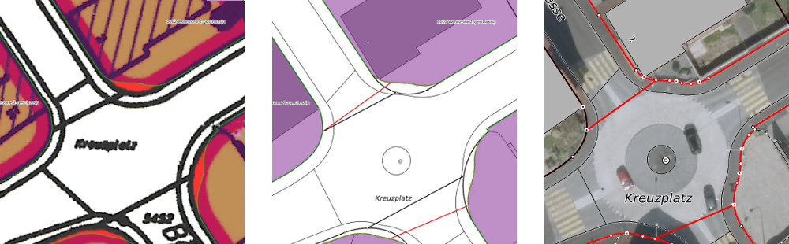

.. _ref_Objektkatalog:

Objektkatalog
============= 	

*	:ref:`Grundnutzung <ref_Gn2>`  
*	:ref:`überlagernde Festlegungen <ref_Ueb2>`
*	:ref:`Erschliessung <ref_Er2>`           	
*	:ref:`Beschreibung Grundnutzung <ref_Gn>`	
*	:ref:`Beschreibung überlagernde Festlegungen <ref_Ueb>`
*	:ref:`Beschreibung Erschliessungen <ref_Er>`

* 	:ref:`genindex`

.. _ref_Gn2:

:ref:`Grundnutzung <ref_Gn>`
----------------------------

+----------------------------------------------+------------------------------------------------------------------------------+-------------------------------+-------------------------------------------------------------+--------------------------------------------+-------------------+-------------------+-------------------+-------------------------------------------+
| **Bezeichnung Bund**                         | **Bezeichnung Kanton**                                                       | **Code kommunal**             | **Bezeichnung Gemeinde**                                    | **Verbindlichkeit**                        | :ref:`1 <ref_x1>` | :ref:`2 <ref_x2>` | :ref:`3 <ref_x3>` | Bemerkungen                               |
|                                              |                                                                              |                               |                                                             |                                            |                   |                   |                   |                                           |
|                                              |                                                                              |                               |                                                             |                                            |                   |                   |                   |                                           |
|                                              |                                                                              |                               |                                                             |                                            |                   |                   |                   |                                           |
|                                              |                                                                              |                               |                                                             |                                            |                   |                   |                   |                                           |
|                                              |                                                                              |                               |                                                             |                                            |                   |                   |                   |                                           |
+----------------------------------------------+------------------------------------------------------------------------------+-------------------------------+-------------------------------------------------------------+--------------------------------------------+-------------------+-------------------+-------------------+-------------------------------------------+
| Wohnzonen                                    | :ref:`Wohnzone 1 G <ref_WZ1>`                                                | :ref:`1101-1109 <ref_WZ1>`    | von der Gemeinde zu vergeben                                | :ref:`Nutzungsplan- festlegung <ref_NPFL>` |                   |                   | :ref:`3 <ref_x3>` |                                           |
|                                              +------------------------------------------------------------------------------+-------------------------------+-------------------------------------------------------------+--------------------------------------------+-------------------+-------------------+-------------------+-------------------------------------------+
|                                              | :ref:`Wohnzone 2 G <ref_WZ2>`                                                | :ref:`1111-1119 <ref_WZ2>`    | von der Gemeinde zu vergeben                                | :ref:`Nutzungsplan- festlegung <ref_NPFL>` |                   |                   | :ref:`3 <ref_x3>` |                                           |
|                                              +------------------------------------------------------------------------------+-------------------------------+-------------------------------------------------------------+--------------------------------------------+-------------------+-------------------+-------------------+-------------------------------------------+
|                                              | :ref:`Wohnzone 3 G <ref_WZ3>`                                                | :ref:`1121-1129 <ref_WZ3>`    | von der Gemeinde zu vergeben                                | :ref:`Nutzungsplan- festlegung <ref_NPFL>` |                   |                   | :ref:`3 <ref_x3>` |                                           |
|                                              +------------------------------------------------------------------------------+-------------------------------+-------------------------------------------------------------+--------------------------------------------+-------------------+-------------------+-------------------+-------------------------------------------+
|                                              | :ref:`Wohnzone 4 G <ref_WZ4>`                                                | :ref:`1131-1139 <ref_WZ4>`    | von der Gemeinde zu vergeben                                | :ref:`Nutzungsplan- festlegung <ref_NPFL>` |                   |                   | :ref:`3 <ref_x3>` |                                           |
|                                              +------------------------------------------------------------------------------+-------------------------------+-------------------------------------------------------------+--------------------------------------------+-------------------+-------------------+-------------------+-------------------------------------------+
|                                              | :ref:`Wohnzone 5 G <ref_WZ5>`                                                | :ref:`1141-1149 <ref_WZ5>`    | von der Gemeinde zu vergeben                                | :ref:`Nutzungsplan- festlegung <ref_NPFL>` |                   |                   | :ref:`3 <ref_x3>` |                                           |
|                                              +------------------------------------------------------------------------------+-------------------------------+-------------------------------------------------------------+--------------------------------------------+-------------------+-------------------+-------------------+-------------------------------------------+
|                                              | :ref:`Wohnzone 6 G <ref_WZ6>`                                                | :ref:`1151-1159 <ref_WZ6>`    | von der Gemeinde zu vergeben                                | :ref:`Nutzungsplan- festlegung <ref_NPFL>` |                   |                   | :ref:`3 <ref_x3>` |                                           |
|                                              +------------------------------------------------------------------------------+-------------------------------+-------------------------------------------------------------+--------------------------------------------+-------------------+-------------------+-------------------+-------------------------------------------+
|                                              | :ref:`Wohnzone 7 G und grösser <ref_WZ7>`                                    | :ref:`1161-1169 <ref_WZ7>`    | von der Gemeinde zu vergeben                                | :ref:`Nutzungsplan- festlegung <ref_NPFL>` |                   |                   | :ref:`3 <ref_x3>` |                                           |
|                                              +------------------------------------------------------------------------------+-------------------------------+-------------------------------------------------------------+--------------------------------------------+-------------------+-------------------+-------------------+-------------------------------------------+
|                                              | :ref:`Zone für Terrassenhäuser / Terrassensiedlung <ref_ZT>`                 | :ref:`1171-1179 <ref_ZT>`     | von der Gemeinde zu vergeben                                | :ref:`Nutzungsplan- festlegung <ref_NPFL>` |                   |                   | :ref:`3 <ref_x3>` |                                           |
+----------------------------------------------+------------------------------------------------------------------------------+-------------------------------+-------------------------------------------------------------+--------------------------------------------+-------------------+-------------------+-------------------+-------------------------------------------+
| Arbeitszonen                                 | :ref:`Gewerbezone ohne Wohnen <ref_GWZ>`                                     | :ref:`1201-1209 <ref_GWZ>`    | von der Gemeinde zu vergeben                                | :ref:`Nutzungsplan- festlegung <ref_NPFL>` |                   |                   | :ref:`3 <ref_x3>` |                                           |
|                                              +------------------------------------------------------------------------------+-------------------------------+-------------------------------------------------------------+--------------------------------------------+-------------------+-------------------+-------------------+-------------------------------------------+
|                                              | :ref:`Industriezone <ref_IZ>`                                                | :ref:`1211-1219 <ref_IZ>`     | von der Gemeinde zu vergeben                                | :ref:`Nutzungsplan- festlegung <ref_NPFL>` |                   |                   | :ref:`3 <ref_x3>` |                                           |
|                                              +------------------------------------------------------------------------------+-------------------------------+-------------------------------------------------------------+--------------------------------------------+-------------------+-------------------+-------------------+-------------------------------------------+
|                                              | :ref:`Arbeitszone <ref_AZ>`                                                  | :ref:`1221-1229 <ref_AZ>`     | von der Gemeinde zu vergeben                                | :ref:`Nutzungsplan- festlegung <ref_NPFL>` |                   |                   | :ref:`3 <ref_x3>` |                                           |
+----------------------------------------------+------------------------------------------------------------------------------+-------------------------------+-------------------------------------------------------------+--------------------------------------------+-------------------+-------------------+-------------------+-------------------------------------------+
| Mischzonen                                   | :ref:`Gewerbezone mit Wohnen / Mischzone <ref_WMZ>`                          | :ref:`1301-1309 <ref_WMZ>`    | von der Gemeinde zu vergeben                                | :ref:`Nutzungsplan- festlegung <ref_NPFL>` |                   |                   | :ref:`3 <ref_x3>` |                                           |
|                                              +------------------------------------------------------------------------------+-------------------------------+-------------------------------------------------------------+--------------------------------------------+-------------------+-------------------+-------------------+-------------------------------------------+
|                                              | :ref:`Gewerbezone mit Wohnen / Mischzone 2 G <ref_WMZ2>`                     | :ref:`1311-1319 <ref_WMZ2>`   | von der Gemeinde zu vergeben                                | :ref:`Nutzungsplan- festlegung <ref_NPFL>` |                   |                   | :ref:`3 <ref_x3>` |                                           |
|                                              +------------------------------------------------------------------------------+-------------------------------+-------------------------------------------------------------+--------------------------------------------+-------------------+-------------------+-------------------+-------------------------------------------+
|                                              | :ref:`Gewerbezone mit Wohnen / Mischzone 3 G <ref_WMZ3>`                     | :ref:`1321-1329 <ref_WMZ3>`   | von der Gemeinde zu vergeben                                | :ref:`Nutzungsplan- festlegung <ref_NPFL>` |                   |                   | :ref:`3 <ref_x3>` |                                           |
|                                              +------------------------------------------------------------------------------+-------------------------------+-------------------------------------------------------------+--------------------------------------------+-------------------+-------------------+-------------------+-------------------------------------------+
|                                              | :ref:`Gewerbezone mit Wohnen / Mischzone 4 G und grösser <ref_WMZ4>`         | :ref:`1331-1339 <ref_WMZ4>`   | von der Gemeinde zu vergeben                                | :ref:`Nutzungsplan- festlegung <ref_NPFL>` |                   |                   | :ref:`3 <ref_x3>` |                                           |
|                                              +------------------------------------------------------------------------------+-------------------------------+-------------------------------------------------------------+--------------------------------------------+-------------------+-------------------+-------------------+-------------------------------------------+
|                                              | :ref:`Zone für publikumsintensive Anlagen <ref_ZPUBA>`                       | :ref:`1341-1349 <ref_ZPUBA>`  | von der Gemeinde zu vergeben                                | :ref:`Nutzungsplan- festlegung <ref_NPFL>` |                   |                   | :ref:`3 <ref_x3>` |                                           |
+----------------------------------------------+------------------------------------------------------------------------------+-------------------------------+-------------------------------------------------------------+--------------------------------------------+-------------------+-------------------+-------------------+-------------------------------------------+
| Kernzonen                                    | :ref:`Kernzone  <ref_KZ>`                                                    | :ref:`1401-1409 <ref_KZ>`     | von der Gemeinde zu vergeben                                | :ref:`Nutzungsplan- festlegung <ref_NPFL>` |                   |                   | :ref:`3 <ref_x3>` |                                           |
+                                              +------------------------------------------------------------------------------+-------------------------------+-------------------------------------------------------------+--------------------------------------------+-------------------+-------------------+-------------------+-------------------------------------------+
|                                              | :ref:`Zentrumszone <ref_ZZ>`                                                 | :ref:`1411-1419 <ref_ZZ>`     | von der Gemeinde zu vergeben                                | :ref:`Nutzungsplan- festlegung <ref_NPFL>` |                   |                   | :ref:`3 <ref_x3>` |                                           |
+                                              +------------------------------------------------------------------------------+-------------------------------+-------------------------------------------------------------+--------------------------------------------+-------------------+-------------------+-------------------+-------------------------------------------+
|                                              | :ref:`Erhaltungszone <ref_EZ>`                                               | :ref:`1421-1429 <ref_EZ>`     | von der Gemeinde zu vergeben                                | :ref:`Nutzungsplan- festlegung <ref_NPFL>` |                   |                   | :ref:`3 <ref_x3>` |                                           |
+----------------------------------------------+------------------------------------------------------------------------------+-------------------------------+-------------------------------------------------------------+--------------------------------------------+-------------------+-------------------+-------------------+-------------------------------------------+
| Zone für öffentliche Nutzungen               | :ref:`Zone für öffentliche Bauten <ref_ZOEB>`                                | :ref:`1501-1509 <ref_ZOEB>`   | von der Gemeinde zu vergeben                                | :ref:`Nutzungsplan- festlegung <ref_NPFL>` |                   |                   | :ref:`3 <ref_x3>` |                                           |
+                                              +------------------------------------------------------------------------------+-------------------------------+-------------------------------------------------------------+--------------------------------------------+-------------------+-------------------+-------------------+-------------------------------------------+
|                                              | :ref:`Zone für öffentliche Anlagen <ref_ZOEA>`                               | :ref:`1511-1519 <ref_ZOEA>`   | von der Gemeinde zu vergeben                                | :ref:`Nutzungsplan- festlegung <ref_NPFL>` |                   |                   | :ref:`3 <ref_x3>` |                                           |
+----------------------------------------------+------------------------------------------------------------------------------+-------------------------------+-------------------------------------------------------------+--------------------------------------------+-------------------+-------------------+-------------------+-------------------------------------------+
| eingeschränkte Bauzonen                      | :ref:`Grün- und Freihaltezone (innerhalb Bauzone) <ref_GFZ>`                 | :ref:`1601-1609 <ref_GFZ>`    | von der Gemeinde zu vergeben                                | :ref:`Nutzungsplan- festlegung <ref_NPFL>` |                   |                   | :ref:`3 <ref_x3>` |                                           |
+                                              +------------------------------------------------------------------------------+-------------------------------+-------------------------------------------------------------+--------------------------------------------+-------------------+-------------------+-------------------+-------------------------------------------+
|                                              | :ref:`kommunale Uferschutzzone innerhalb Bauzone <ref_KOMUSZ>`               | :ref:`1611-1619 <ref_KOMUSZ>` | von der Gemeinde zu vergeben                                | :ref:`Nutzungsplan- festlegung <ref_NPFL>` |                   |                   | :ref:`3 <ref_x3>` |                                           |
+                                              +------------------------------------------------------------------------------+-------------------------------+-------------------------------------------------------------+--------------------------------------------+-------------------+-------------------+-------------------+-------------------------------------------+
|                                              | :ref:`Landwirtschaftliche Kernzone <ref_LWKZ>`                               | :ref:`1620 <ref_LWKZ>`        | Landwirtschaftliche Kernzone                                | :ref:`Nutzungsplan- festlegung <ref_NPFL>` |                   |                   | :ref:`3 <ref_x3>` |                                           |
+                                              +------------------------------------------------------------------------------+-------------------------------+-------------------------------------------------------------+--------------------------------------------+-------------------+-------------------+-------------------+-------------------------------------------+
|                                              | :ref:`Weilerzone <ref_WZ>`                                                   | :ref:`1631-1639 <ref_WZ>`     | von der Gemeinde zu vergeben                                | :ref:`Nutzungsplan- festlegung <ref_NPFL>` |                   |                   | :ref:`3 <ref_x3>` |                                           |
+                                              +------------------------------------------------------------------------------+-------------------------------+-------------------------------------------------------------+--------------------------------------------+-------------------+-------------------+-------------------+-------------------------------------------+
|                                              | :ref:`weitere eingeschränkte Bauzonen <ref_WEBZ>`                            | :ref:`1691-1699 <ref_WEBZ>`   | von der Gemeinde zu vergeben                                | :ref:`Nutzungsplan- festlegung <ref_NPFL>` |                   |                   | :ref:`3 <ref_x3>` |                                           |
+----------------------------------------------+------------------------------------------------------------------------------+-------------------------------+-------------------------------------------------------------+--------------------------------------------+-------------------+-------------------+-------------------+-------------------------------------------+
| Tourismus- und Freizeitzonen                 | :ref:`Zone für Freizeit und Erholung <ref_ZFE>`                              | :ref:`1701-1709 <ref_ZFE>`    | von der Gemeinde zu vergeben                                | :ref:`Nutzungsplan- festlegung <ref_NPFL>` |                   |                   | :ref:`3 <ref_x3>` |                                           |
+----------------------------------------------+------------------------------------------------------------------------------+-------------------------------+-------------------------------------------------------------+--------------------------------------------+-------------------+-------------------+-------------------+-------------------------------------------+
| Verkehrszonen innerhalb Baugebiet            | :ref:`Verkehrszone Strasse <ref_VZS>`                                        | :ref:`1800 <ref_VZS>`         | Verkehrszone Strasse                                        | :ref:`orientierend <ref_ORIE>`             |                   |                   | :ref:`3 <ref_x3>` |                                           |
+                                              +------------------------------------------------------------------------------+-------------------------------+-------------------------------------------------------------+--------------------------------------------+-------------------+-------------------+-------------------+-------------------------------------------+
|                                              | :ref:`Verkehrszone Bahnareal <ref_VZB>`                                      | :ref:`1810 <ref_VZB>`         | Verkehrszone Bahnareal                                      | :ref:`orientierend <ref_ORIE>`             |                   |                   | :ref:`3 <ref_x3>` |                                           |
+                                              +------------------------------------------------------------------------------+-------------------------------+-------------------------------------------------------------+--------------------------------------------+-------------------+-------------------+-------------------+-------------------------------------------+
|                                              | :ref:`Verkehrszone Flugplatzareal <ref_VZF>`                                 | :ref:`1820 <ref_VZF>`         | Verkehrszone Flugplatzareal                                 | :ref:`orientierend <ref_ORIE>`             |                   |                   | :ref:`3 <ref_x3>` |                                           |
+                                              +------------------------------------------------------------------------------+-------------------------------+-------------------------------------------------------------+--------------------------------------------+-------------------+-------------------+-------------------+-------------------------------------------+
|                                              | :ref:`weitere Verkehrszonen <ref_WZV>`                                       | :ref:`1891-1899 <ref_WZV>`    | von der Gemeinde zu vergeben                                | :ref:`orientierend <ref_ORIE>`             |                   |                   | :ref:`3 <ref_x3>` |                                           |
+----------------------------------------------+------------------------------------------------------------------------------+-------------------------------+-------------------------------------------------------------+--------------------------------------------+-------------------+-------------------+-------------------+-------------------------------------------+
| weitere Bauzonen                             | :ref:`Spezialzone <ref_SZ>`                                                  | :ref:`1901-1919 <ref_SZ>`     | von der Gemeinde zu vergeben                                | :ref:`Nutzungsplan- festlegung <ref_NPFL>` |                   |                   | :ref:`3 <ref_x3>` |                                           |
+----------------------------------------------+------------------------------------------------------------------------------+-------------------------------+-------------------------------------------------------------+--------------------------------------------+-------------------+-------------------+-------------------+-------------------------------------------+
| allgemeine Landwirt- schaftszone             | :ref:`Landwirtschaftszone <ref_LWZ>`                                         | :ref:`2100 <ref_LWZ>`         | Landwirtschaftszone                                         | :ref:`Nutzungsplan- festlegung <ref_NPFL>` |                   |                   | :ref:`3 <ref_x3>` |                                           |
+----------------------------------------------+------------------------------------------------------------------------------+-------------------------------+-------------------------------------------------------------+--------------------------------------------+-------------------+-------------------+-------------------+-------------------------------------------+
| Spezialland- wirtschafts- zonen              | :ref:`Spezielle Landwirtschaftszone <ref_SLWZ>`                              | :ref:`2201-2209 <ref_SLWZ>`   | von der Gemeinde zu vergeben                                | :ref:`Nutzungsplan- festlegung <ref_NPFL>` |                   |                   | :ref:`3 <ref_x3>` |                                           |
+----------------------------------------------+------------------------------------------------------------------------------+-------------------------------+-------------------------------------------------------------+--------------------------------------------+-------------------+-------------------+-------------------+-------------------------------------------+
| Rebbauzonen                                  | :ref:`Rebbauzone <ref_RBZ>`                                                  | :ref:`2301-2309 <ref_RBZ>`    | von der Gemeinde zu vergeben                                | :ref:`Nutzungsplan- festlegung <ref_NPFL>` |                   |                   | :ref:`3 <ref_x3>` |                                           |
+----------------------------------------------+------------------------------------------------------------------------------+-------------------------------+-------------------------------------------------------------+--------------------------------------------+-------------------+-------------------+-------------------+-------------------------------------------+
| weitere Landwirtschafts- zonen               | :ref:`weitere Landwirtschaftszonen <ref_WLWZ>`                               | :ref:`2901-2909 <ref_WLWZ>`   | von der Gemeinde zu vergeben                                | :ref:`Nutzungsplan- festlegung <ref_NPFL>` |                   |                   | :ref:`3 <ref_x3>` |                                           |
+----------------------------------------------+------------------------------------------------------------------------------+-------------------------------+-------------------------------------------------------------+--------------------------------------------+-------------------+-------------------+-------------------+-------------------------------------------+
| Schutzzonen für Lebensräume und Landschaften | :ref:`kommunale Naturschutzzone <ref_KNSZ>`                                  | :ref:`3101-3109 <ref_KNSZ>`   | von der Gemeinde zu vergeben                                | :ref:`Nutzungsplan- festlegung <ref_NPFL>` |                   |                   | :ref:`3 <ref_x3>` |                                           |
+                                              +------------------------------------------------------------------------------+-------------------------------+-------------------------------------------------------------+--------------------------------------------+-------------------+-------------------+-------------------+-------------------------------------------+
|                                              | :ref:`Waldrandschutzzone <ref_WRSZ>`                                         | :ref:`3111-3119 <ref_WRSZ>`   | von der Gemeinde zu vergeben                                | :ref:`Nutzungsplan- festlegung <ref_NPFL>` |                   |                   | :ref:`3 <ref_x3>` |                                           |
+                                              +------------------------------------------------------------------------------+-------------------------------+-------------------------------------------------------------+--------------------------------------------+-------------------+-------------------+-------------------+-------------------------------------------+
|                                              | :ref:`weitere Schutzzonen für Lebensräume und Landschaften <ref_WSZLL>`      | :ref:`3191-3199 <ref_WSZLL>`  | von der Gemeinde/Kanton zu vergeben                         | :ref:`Nutzungsplan- festlegung <ref_NPFL>` |                   |                   | :ref:`3 <ref_x3>` |                                           |
+----------------------------------------------+------------------------------------------------------------------------------+-------------------------------+-------------------------------------------------------------+--------------------------------------------+-------------------+-------------------+-------------------+-------------------------------------------+
| Zonen für Gewässer und ihre Ufer             | :ref:`Gewässer <ref_GEW>`                                                    | :ref:`3200 <ref_GEW>`         | Gewässer                                                    | :ref:`orientierend <ref_ORIE>`             |                   |                   | :ref:`3 <ref_x3>` |                                           |
+                                              +------------------------------------------------------------------------------+-------------------------------+-------------------------------------------------------------+--------------------------------------------+-------------------+-------------------+-------------------+-------------------------------------------+
|                                              | :ref:`weitere Zonen für Gewässer und ihre Ufer <ref_WZGU>`                   | :ref:`3291-3299 <ref_WZGU>`   | von der Gemeinde/Kanton zu vergeben                         | :ref:`Nutzungsplan- festlegung <ref_NPFL>` |                   |                   | :ref:`3 <ref_x3>` |                                           |
+----------------------------------------------+------------------------------------------------------------------------------+-------------------------------+-------------------------------------------------------------+--------------------------------------------+-------------------+-------------------+-------------------+-------------------------------------------+
| weitere Schutzzonen ausserhalb der Bauzonen  | :ref:`weitere Schutzzonen ausserhalb Bauzonen <ref_WSZAB>`                   | :ref:`3901-3909 <ref_WSZAB>`  | von der Gemeinde zu vergeben                                | :ref:`Nutzungsplan- festlegung <ref_NPFL>` |                   |                   | :ref:`3 <ref_x3>` |                                           |
+----------------------------------------------+------------------------------------------------------------------------------+-------------------------------+-------------------------------------------------------------+--------------------------------------------+-------------------+-------------------+-------------------+-------------------------------------------+
| Zonen für Kleinsiedlungen                    | Zonen für Kleinsiedlungen sind im Planungs- und Baugesetz des Kantons Solothurn nicht vorgesehen.                                                                                                                       |                   |                   |                   |                                           |
+----------------------------------------------+------------------------------------------------------------------------------+-------------------------------+-------------------------------------------------------------+--------------------------------------------+-------------------+-------------------+-------------------+-------------------------------------------+
| Verkehrsflächen ausserhalb Baugebiet         | :ref:`Verkehrsfläche Strasse <ref_VFS>`                                      | :ref:`4200 <ref_VFS>`         | Verkehrsfläche Strasse                                      | :ref:`orientierend <ref_ORIE>`             |                   |                   | :ref:`3 <ref_x3>` |                                           |
+                                              +------------------------------------------------------------------------------+-------------------------------+-------------------------------------------------------------+--------------------------------------------+-------------------+-------------------+-------------------+-------------------------------------------+
|                                              | :ref:`Verkehrsfläche Bahnareal <ref_VFB>`                                    | :ref:`4210 <ref_VFB>`         | Verkehrsfläche Bahnareal                                    | :ref:`orientierend <ref_ORIE>`             |                   |                   | :ref:`3 <ref_x3>` |                                           |
+                                              +------------------------------------------------------------------------------+-------------------------------+-------------------------------------------------------------+--------------------------------------------+-------------------+-------------------+-------------------+-------------------------------------------+
|                                              | :ref:`Verkehrsfläche Flugplatzareal <ref_VFF>`                               | :ref:`4220 <ref_VFF>`         | Verkehrsfläche Flugplatzareal                               | :ref:`orientierend <ref_ORIE>`             |                   |                   | :ref:`3 <ref_x3>` |                                           |
+                                              +------------------------------------------------------------------------------+-------------------------------+-------------------------------------------------------------+--------------------------------------------+-------------------+-------------------+-------------------+-------------------------------------------+
|                                              | :ref:`weitere Verkehrsflächen <ref_WVF>`                                     | :ref:`4291-4299 <ref_WVF>`    | von Gemeinde zu vergeben                                    | :ref:`orientierend <ref_ORIE>`             |                   |                   | :ref:`3 <ref_x3>` |                                           |
+----------------------------------------------+------------------------------------------------------------------------------+-------------------------------+-------------------------------------------------------------+--------------------------------------------+-------------------+-------------------+-------------------+-------------------------------------------+
| Reservezonen nach Art. 18 Abs. 2 RPG         | :ref:`Reservezone Wohnzone, Mischzone, Kernzone und Zentrumszone  <ref_RZW>` | :ref:`4300 <ref_RZW>`         | Reservezone Wohnzone, Mischzone, Kernzone und Zentrumszone  | :ref:`Nutzungsplan- festlegung <ref_NPFL>` |                   |                   | :ref:`3 <ref_x3>` |                                           |
+                                              +------------------------------------------------------------------------------+-------------------------------+-------------------------------------------------------------+--------------------------------------------+-------------------+-------------------+-------------------+-------------------------------------------+
|                                              | :ref:`Reservezone Arbeiten <ref_RZA>`                                        | :ref:`4310 <ref_RZA>`         | Reservezone Arbeiten                                        | :ref:`Nutzungsplan- festlegung <ref_NPFL>` |                   |                   | :ref:`3 <ref_x3>` |                                           |
+                                              +------------------------------------------------------------------------------+-------------------------------+-------------------------------------------------------------+--------------------------------------------+-------------------+-------------------+-------------------+-------------------------------------------+
|                                              | :ref:`Reservezone OeBA <ref_RZOEB>`                                          | :ref:`4320 <ref_RZOEB>`       | Reservezone OeBA                                            | :ref:`Nutzungsplan- festlegung <ref_NPFL>` |                   |                   | :ref:`3 <ref_x3>` |                                           |
+                                              +------------------------------------------------------------------------------+-------------------------------+-------------------------------------------------------------+--------------------------------------------+-------------------+-------------------+-------------------+-------------------------------------------+
|                                              | :ref:`Reservezone <ref_RZ>`                                                  | :ref:`4391-4399 <ref_RZ>`     | Reservezone                                                 | :ref:`Nutzungsplan- festlegung <ref_NPFL>` |                   |                   | :ref:`3 <ref_x3>` |                                           |
+----------------------------------------------+------------------------------------------------------------------------------+-------------------------------+-------------------------------------------------------------+--------------------------------------------+-------------------+-------------------+-------------------+-------------------------------------------+
| Wald                                         | :ref:`Wald <ref_WALD>`                                                       | :ref:`4400 <ref_WALD>`        | Wald                                                        | :ref:`orientierend <ref_ORIE>`             |                   |                   | :ref:`3 <ref_x3>` |                                           |
+----------------------------------------------+------------------------------------------------------------------------------+-------------------------------+-------------------------------------------------------------+--------------------------------------------+-------------------+-------------------+-------------------+-------------------------------------------+
| weitere Bauzonen nach Art. 18 Abs. 1 RPG     | :ref:`Golfzone <ref_GZ>`                                                     | :ref:`4901-4909 <ref_GZ>`     | von der Gemeinde zu vergeben                                | :ref:`Nutzungsplan- festlegung <ref_NPFL>` |                   |                   | :ref:`3 <ref_x3>` |                                           |
+ ausserhalb Bauzonen                          +------------------------------------------------------------------------------+-------------------------------+-------------------------------------------------------------+--------------------------------------------+-------------------+-------------------+-------------------+-------------------------------------------+
|                                              | :ref:`Abbauzone <ref_ABZ>`                                                   | :ref:`4911-4919 <ref_ABZ>`    | von der Gemeinde zu vergeben                                | :ref:`Nutzungsplan- festlegung <ref_NPFL>` |                   |                   | :ref:`3 <ref_x3>` |                                           |
+                                              +------------------------------------------------------------------------------+-------------------------------+-------------------------------------------------------------+--------------------------------------------+-------------------+-------------------+-------------------+-------------------------------------------+
|                                              | :ref:`Deponiezone <ref_DZ>`                                                  | :ref:`4921-4929 <ref_DZ>`     | von der Gemeinde zu vergeben                                | :ref:`Nutzungsplan- festlegung <ref_NPFL>` |                   |                   | :ref:`3 <ref_x3>` |                                           |
+                                              +------------------------------------------------------------------------------+-------------------------------+-------------------------------------------------------------+--------------------------------------------+-------------------+-------------------+-------------------+-------------------------------------------+
|                                              | :ref:`weitere Bauzonen nach Art. 18 RPG ausserhalb Bauzonen <ref_WBZ>`       | :ref:`4991-4999 <ref_WBZ>`    | von der Gemeinde zu vergeben                                | :ref:`Nutzungsplan- festlegung <ref_NPFL>` |                   |                   | :ref:`3 <ref_x3>` |                                           |
+----------------------------------------------+------------------------------------------------------------------------------+-------------------------------+-------------------------------------------------------------+--------------------------------------------+-------------------+-------------------+-------------------+-------------------------------------------+

.. _ref_Ueb2:

:ref:`überlagernde Festlegungen<ref_Ueb>` 
-----------------------------------------

+-----------------------------------------------------------+--------------------------------------------------------------------------+-------------------------------+------------------------------------------------+-----------------------------------------------------------------------+-------------------+-------------------+-------------------+-------------------------------------------+
| **Bezeichnung Bund**                                      | **Bezeichnung Kanton**                                                   | **Code kommunal**             | **Bezeichnung Gemeinde**                       | **Verbindlichkeit**                                                   | :ref:`1 <ref_x1>` | :ref:`2 <ref_x2>` | :ref:`3 <ref_x3>` | Bemerkungen                               |
|                                                           |                                                                          |                               |                                                |                                                                       |                   |                   |                   |                                           |
+-----------------------------------------------------------+--------------------------------------------------------------------------+-------------------------------+------------------------------------------------+-----------------------------------------------------------------------+-------------------+-------------------+-------------------+-------------------------------------------+
| überlagernde Ortsbild- schutzzonen                        | :ref:`überlagernde Ortsbildschutzzone <ref_UEOBSZ>`                      | :ref:`5101-5109 <ref_UEOBSZ>` | von der Gemeinde zu vergeben                   | :ref:`Nutzungsplan- festlegung <ref_NPFL>`                            |                   |                   | :ref:`3 <ref_x3>` |                                           |
+-----------------------------------------------------------+--------------------------------------------------------------------------+-------------------------------+------------------------------------------------+-----------------------------------------------------------------------+-------------------+-------------------+-------------------+-------------------------------------------+
| überlagernde Schutzzonen für Lebensräume und Landschaften | :ref:`BLN Gebiet <ref_BLN>`                                              | :ref:`5200 <ref_BLN>`         | BLN Gebiet                                     | :ref:`hinweisend <ref_HWD>`                                           | :ref:`1 <ref_x1>` |                   |                   |                                           |
+                                                           +--------------------------------------------------------------------------+-------------------------------+------------------------------------------------+-----------------------------------------------------------------------+-------------------+-------------------+-------------------+-------------------------------------------+
|                                                           | :ref:`Juraschutzzone <ref_JSZ>`                                          | :ref:`5210 <ref_JSZ>`         | Juraschutzzone                                 | :ref:`wegleitend <ref_WLD>`                                           |                   |                   |                   |                                           |
+                                                           +--------------------------------------------------------------------------+-------------------------------+------------------------------------------------+-----------------------------------------------------------------------+-------------------+-------------------+-------------------+-------------------------------------------+
|                                                           | :ref:`Naturreservat inkl. Geotope <ref_NR>`                              | :ref:`5220 <ref_NR>`          | Naturreservat  inkl. Geotope                   | :ref:`orientierend <ref_ORIE>`                                        | :ref:`1 <ref_x1>` |                   |                   |                                           |
+                                                           +--------------------------------------------------------------------------+-------------------------------+------------------------------------------------+-----------------------------------------------------------------------+-------------------+-------------------+-------------------+-------------------------------------------+
|                                                           | :ref:`Landschaftsschutz- zone <ref_LSZ>`                                 | :ref:`5231-5239 <ref_LSZ>`    | von der Gemeinde zu vergeben                   | :ref:`Nutzungsplan- festlegung <ref_NPFL>`                            |                   |                   | :ref:`3 <ref_x3>` |                                           |
+                                                           +--------------------------------------------------------------------------+-------------------------------+------------------------------------------------+-----------------------------------------------------------------------+-------------------+-------------------+-------------------+-------------------------------------------+
|                                                           | :ref:`Siedlungstrenn- gürtel von kommunaler Bedeutung <ref_STGKOM>`      | :ref:`5240 <ref_STGKOM>`      | Siedlungstrenngürtel von kommunaler Bedeutung  | :ref:`wegleitend <ref_WLD>`                                           |                   |                   |                   |                                           |
+                                                           +--------------------------------------------------------------------------+-------------------------------+------------------------------------------------+-----------------------------------------------------------------------+-------------------+-------------------+-------------------+-------------------------------------------+
|                                                           | :ref:`Siedlungstrenn- gürtel von kantonaler Bedeutung <ref_STGKT>`       | :ref:`5250 <ref_STGKT>`       | Siedlungstrenngürtel von kantonaler Bedeutung  | :ref:`wegleitend <ref_WLD>`                                           |                   |                   |                   |                                           |
+                                                           +--------------------------------------------------------------------------+-------------------------------+------------------------------------------------+-----------------------------------------------------------------------+-------------------+-------------------+-------------------+-------------------------------------------+
|                                                           | :ref:`kantonale Landwirtschafts- und Schutzzone Witi  <ref_WITI>`        | :ref:`5260 <ref_WITI>`        | kantonale Landwirtschafts- und Schutzzone Witi | :ref:`orientierend <ref_ORIE>`                                        | :ref:`1 <ref_x1>` |                   |                   |                                           |
+                                                           +--------------------------------------------------------------------------+-------------------------------+------------------------------------------------+-----------------------------------------------------------------------+-------------------+-------------------+-------------------+-------------------------------------------+
|                                                           | :ref:`kantonale Uferschutzzone  <ref_KTUSZ2>`                            | :ref:`5270 <ref_KTUSZ2>`      | kantonale Uferschutzzone                       | :ref:`wegleitend <ref_WLD>`                                           |                   |                   |                   |                                           |
+                                                           +--------------------------------------------------------------------------+-------------------------------+------------------------------------------------+-----------------------------------------------------------------------+-------------------+-------------------+-------------------+-------------------------------------------+
|                                                           | :ref:`kommunale Uferschutzzone ausserhalb Bauzonen <ref_KOUSZ>`          | :ref:`5281-5289 <ref_KOUSZ>`  | von der Gemeinde zu vergeben                   | :ref:`Nutzungsplan- festlegung <ref_NPFL>`                            |                   |                   | :ref:`3 <ref_x3>` |                                           |
+                                                           +--------------------------------------------------------------------------+-------------------------------+------------------------------------------------+-----------------------------------------------------------------------+-------------------+-------------------+-------------------+-------------------------------------------+
|                                                           | :ref:`weitere Schutzzonen für Lebensräume und Landschaften <ref_WSZLL2>` | :ref:`5291-5299 <ref_WSZLL2>` | von der Gemeinde/Kanton zu vergeben            | :ref:`Nutzungsplan- festlegung <ref_NPFL>`                            |                   |                   | :ref:`3 <ref_x3>` |                                           |
+-----------------------------------------------------------+--------------------------------------------------------------------------+-------------------------------+------------------------------------------------+-----------------------------------------------------------------------+-------------------+-------------------+-------------------+-------------------------------------------+
| überlagernde Gefahrenzonen                                | :ref:`Naturgefahren erhebliche Gefährdung <ref_NG1>`                     | :ref:`5300 <ref_NG1>`         | erhebliche Gefährdung, synoptisch              | :ref:`Nutzungsplan- festlegung <ref_NPFL>`                            |                   |                   |                   | separater Plan gemäss eigenem Datenmodell |
+                                                           +--------------------------------------------------------------------------+-------------------------------+------------------------------------------------+-----------------------------------------------------------------------+-------------------+-------------------+-------------------+-------------------------------------------+
|                                                           | :ref:`Naturgefahren mittlere Gefährdung <ref_NG2>`                       | :ref:`5310 <ref_NG2>`         | mittlere Gefährdung, synoptisch                | :ref:`Nutzungsplan- festlegung <ref_NPFL>`                            |                   |                   |                   | separater Plan gemäss eigenem Datenmodell |
+                                                           +--------------------------------------------------------------------------+-------------------------------+------------------------------------------------+-----------------------------------------------------------------------+-------------------+-------------------+-------------------+-------------------------------------------+
|                                                           | :ref:`Naturgefahren geringe Gefährdung <ref_NG3>`                        | :ref:`5320 <ref_NG3>`         | geringe Gefährdung, synoptisch                 | :ref:`Nutzungsplan- festlegung <ref_NPFL>`                            |                   |                   |                   | separater Plan gemäss eigenem Datenmodell |
+                                                           +--------------------------------------------------------------------------+-------------------------------+------------------------------------------------+-----------------------------------------------------------------------+-------------------+-------------------+-------------------+-------------------------------------------+
|                                                           | :ref:`Naturgefahren Restgefährdung <ref_NG4>`                            | :ref:`5330 <ref_NG4>`         | Restgefährdung, synoptisch                     | :ref:`Nutzungsplan- festlegung <ref_NPFL>`                            |                   |                   |                   | separater Plan gemäss eigenem Datenmodell |
+-----------------------------------------------------------+--------------------------------------------------------------------------+-------------------------------+------------------------------------------------+-----------------------------------------------------------------------+-------------------+-------------------+-------------------+-------------------------------------------+
| weitere überlagernde Nutzungszonen                        | :ref:`Hofstattzone/ Freihaltezone <ref_HSZ>`                             | :ref:`5901-5909 <ref_HSZ>`    | von der Gemeinde zu vergeben                   | :ref:`Nutzungsplan- festlegung <ref_NPFL>`                            |                   |                   | :ref:`3 <ref_x3>` |                                           |
+                                                           +--------------------------------------------------------------------------+-------------------------------+------------------------------------------------+-----------------------------------------------------------------------+-------------------+-------------------+-------------------+-------------------------------------------+
|                                                           | :ref:`Bauliche Einschränkungen <ref_BE>`                                 | :ref:`5911-5919 <ref_BE>`     | von der Gemeinde zu vergeben                   | :ref:`Nutzungsplan- festlegung <ref_NPFL>`                            |                   |                   | :ref:`3 <ref_x3>` |                                           |
+                                                           +--------------------------------------------------------------------------+-------------------------------+------------------------------------------------+-----------------------------------------------------------------------+-------------------+-------------------+-------------------+-------------------------------------------+
|                                                           | :ref:`Hecken, Feldgehölz und Ufergehölz <ref_HFU>`                       | :ref:`5921 <ref_HFU>`         | Hecken                                         | :ref:`Nutzungsplan- festlegung <ref_NPFL>`                            |                   |                   | :ref:`3 <ref_x3>` |                                           |
+                                                           +                                                                          +-------------------------------+------------------------------------------------+-----------------------------------------------------------------------+-------------------+-------------------+-------------------+-------------------------------------------+
|                                                           |                                                                          | :ref:`5922 <ref_HFU>`         | Feldgehölz                                     | :ref:`Nutzungsplan- festlegung <ref_NPFL>`                            |                   |                   | :ref:`3 <ref_x3>` |                                           |
+                                                           +                                                                          +-------------------------------+------------------------------------------------+-----------------------------------------------------------------------+-------------------+-------------------+-------------------+-------------------------------------------+
|                                                           |                                                                          | :ref:`5923-5929 <ref_HFU>`    | von der Gemeinde zu vergeben                   | :ref:`Nutzungsplan- festlegung <ref_NPFL>`                            |                   |                   | :ref:`3 <ref_x3>` |                                           |
+                                                           +--------------------------------------------------------------------------+-------------------------------+------------------------------------------------+-----------------------------------------------------------------------+-------------------+-------------------+-------------------+-------------------------------------------+
|                                                           | :ref:`Grundwasser- schutzzone S1 <ref_GWSZ1>`                            | :ref:`5930 <ref_GWSZ1>`       | Grundwasserschutzzone S1                       | :ref:`orientierend <ref_ORIE>`                                        | :ref:`1 <ref_x1>` |                   |                   |                                           |
+                                                           +--------------------------------------------------------------------------+-------------------------------+------------------------------------------------+-----------------------------------------------------------------------+-------------------+-------------------+-------------------+-------------------------------------------+
|                                                           | :ref:`Grundwasser- schutzzone S2 <ref_GWSZ2>`                            | :ref:`5940 <ref_GWSZ2>`       | Grundwasserschutzzone S2                       | :ref:`orientierend <ref_ORIE>`                                        | :ref:`1 <ref_x1>` |                   |                   |                                           |
+                                                           +--------------------------------------------------------------------------+-------------------------------+------------------------------------------------+-----------------------------------------------------------------------+-------------------+-------------------+-------------------+-------------------------------------------+
|                                                           | :ref:`Grundwasser- schutzzone S3 <ref_GWSZ3>`                            | :ref:`5950 <ref_GWSZ3>`       | Grundwasserschutzzone S3                       | :ref:`orientierend <ref_ORIE>`                                        | :ref:`1 <ref_x1>` |                   |                   |                                           |
+                                                           +--------------------------------------------------------------------------+-------------------------------+------------------------------------------------+-----------------------------------------------------------------------+-------------------+-------------------+-------------------+-------------------------------------------+
|                                                           | :ref:`Grundwasser- schutzareal <ref_GWSA>`                               | :ref:`5960 <ref_GWSA>`        | Grundwasserschutzareal                         | :ref:`orientierend <ref_ORIE>`                                        | :ref:`1 <ref_x1>` |                   |                   |                                           |
+                                                           +--------------------------------------------------------------------------+-------------------------------+------------------------------------------------+-----------------------------------------------------------------------+-------------------+-------------------+-------------------+-------------------------------------------+
|                                                           | :ref:`weitere überlagernde Nutzungszonen <ref_WUENZ>`                    | :ref:`5991-5999 <ref_WUENZ>`  | von der Gemeinde zu vergeben                   | :ref:`Nutzungsplan- festlegung <ref_NPFL>`                            |                   |                   | :ref:`3 <ref_x3>` |                                           |
+-----------------------------------------------------------+--------------------------------------------------------------------------+-------------------------------+------------------------------------------------+-----------------------------------------------------------------------+-------------------+-------------------+-------------------+-------------------------------------------+
| Bereiche rechtsgültiger Sondernutzungs- pläne             | :ref:`Perimeter kantonaler Nutzungsplan <ref_PKNP>`                      | :ref:`6100 <ref_PKNP>`        | Perimeter kantonaler Nutzungsplan              | :ref:`orientierend <ref_ORIE>`                                        | :ref:`13 <ref_4>` |                   | :ref:`13 <ref_4>` | Erhebung planspezifisch nach Absprache    |
+                                                           +--------------------------------------------------------------------------+-------------------------------+------------------------------------------------+-----------------------------------------------------------------------+-------------------+-------------------+-------------------+-------------------------------------------+
|                                                           | :ref:`Perimeter kommunaler Gestaltungsplan <ref_PKGP>`                   | :ref:`6110 <ref_PKGP>`        | Perimeter kommunaler Gestaltungsplan           | :ref:`Nutzungsplan- festlegung <ref_ORIE>`                            |                   |                   | :ref:`3 <ref_x3>` |                                           |
+-----------------------------------------------------------+--------------------------------------------------------------------------+-------------------------------+------------------------------------------------+-----------------------------------------------------------------------+-------------------+-------------------+-------------------+-------------------------------------------+
| Bereiche mit Sondernutzungs- planpflicht                  | :ref:`Perimeter Gestaltungsplanpflicht <ref_PGPP>`                       | :ref:`6200 <ref_PGPP>`        | Perimeter Gestaltungsplanpflicht               | :ref:`Nutzungsplan- festlegung <ref_NPFL>`                            |                   |                   | :ref:`3 <ref_x3>` |                                           |
+-----------------------------------------------------------+--------------------------------------------------------------------------+-------------------------------+------------------------------------------------+-----------------------------------------------------------------------+-------------------+-------------------+-------------------+-------------------------------------------+
| Lärmempfindlich- keitsstufen                              | :ref:`Empfindlichkeits- stufe I <ref_ES1>`                               | :ref:`6800 <ref_ES1>`         | Empfindlichkeitsstufe I                        | :ref:`Nutzungsplan- festlegung <ref_NPFL>`                            |                   |                   | :ref:`3 <ref_x3>` |                                           |
+                                                           +--------------------------------------------------------------------------+-------------------------------+------------------------------------------------+-----------------------------------------------------------------------+-------------------+-------------------+-------------------+-------------------------------------------+
|                                                           | :ref:`Empfindlichkeits- stufe II <ref_ES2>`                              | :ref:`6810 <ref_ES2>`         | Empfindlichkeitsstufe II                       | :ref:`Nutzungsplan- festlegung <ref_NPFL>`                            |                   |                   | :ref:`3 <ref_x3>` |                                           |
+                                                           +--------------------------------------------------------------------------+-------------------------------+------------------------------------------------+-----------------------------------------------------------------------+-------------------+-------------------+-------------------+-------------------------------------------+
|                                                           | :ref:`Empfindlichkeits- stufe II aufgestuft <ref_ES2+>`                  | :ref:`6820 <ref_ES2+>`        | Empfindlichkeitsstufe II aufgestuft            | :ref:`Nutzungsplan- festlegung <ref_NPFL>`                            |                   |                   | :ref:`3 <ref_x3>` |                                           |
+                                                           +--------------------------------------------------------------------------+-------------------------------+------------------------------------------------+-----------------------------------------------------------------------+-------------------+-------------------+-------------------+-------------------------------------------+
|                                                           | :ref:`Empfindlichkeits- stufe III <ref_ES3>`                             | :ref:`6830 <ref_ES3>`         | Empfindlichkeitsstufe III                      | :ref:`Nutzungsplan- festlegung <ref_NPFL>`                            |                   |                   | :ref:`3 <ref_x3>` |                                           |
+                                                           +--------------------------------------------------------------------------+-------------------------------+------------------------------------------------+-----------------------------------------------------------------------+-------------------+-------------------+-------------------+-------------------------------------------+
|                                                           | :ref:`Empfindlichkeits- stufe III aufgestuft <ref_ES3+>`                 | :ref:`6840 <ref_ES3+>`        | Empfindlichkeitsstufe III aufgestuft           | :ref:`Nutzungsplan- festlegung <ref_NPFL>`                            |                   |                   | :ref:`3 <ref_x3>` |                                           |
+                                                           +--------------------------------------------------------------------------+-------------------------------+------------------------------------------------+-----------------------------------------------------------------------+-------------------+-------------------+-------------------+-------------------------------------------+
|                                                           | :ref:`Empfindlichkeits- stufe IV <ref_ES4>`                              | :ref:`6850 <ref_ES4>`         | Empfindlichkeitsstufe IV                       | :ref:`Nutzungsplan- festlegung <ref_NPFL>`                            |                   |                   | :ref:`3 <ref_x3>` |                                           |
+                                                           +--------------------------------------------------------------------------+-------------------------------+------------------------------------------------+-----------------------------------------------------------------------+-------------------+-------------------+-------------------+-------------------------------------------+
|                                                           | :ref:`keine Empfindlichkeits- stufe <ref_KES>`                           | :ref:`6860 <ref_KES>`         | keine Empfindlichkeitsstufe                    | :ref:`Nutzungsplan festlegung <ref_NPFL>`                             |                   |                   | :ref:`3 <ref_x3>` |                                           |
+-----------------------------------------------------------+--------------------------------------------------------------------------+-------------------------------+------------------------------------------------+-----------------------------------------------------------------------+-------------------+-------------------+-------------------+-------------------------------------------+
| weitere flächenhafte Festlegungen NP                      | :ref:`kantonales Vorranggebiet Natur und Landschaft  <ref_KTVNL>`        | :ref:`6900 <ref_KTVNL>`       | kantonales Vorranggebiet Natur und Landschaft  | :ref:`orientierend <ref_ORIE>`                                        |                   |                   |                   |                                           |
+                                                           +--------------------------------------------------------------------------+-------------------------------+------------------------------------------------+-----------------------------------------------------------------------+-------------------+-------------------+-------------------+-------------------------------------------+
|                                                           | :ref:`kommunales Vorranggebiet Natur und Landschaft  <ref_KOMVNL>`       | :ref:`6911-6919 <ref_KOMVNL>` | kommunales Vorranggebiet Natur und Landschaft  | :ref:`Nutzungsplan- festlegung <ref_NPFL>`                            |                   |                   | :ref:`3 <ref_x3>` |                                           |
+                                                           +--------------------------------------------------------------------------+-------------------------------+------------------------------------------------+-----------------------------------------------------------------------+-------------------+-------------------+-------------------+-------------------------------------------+
|                                                           | :ref:`Planungszone <ref_PZ>`                                             | :ref:`6921-6929 <ref_PZ>`     | von der Gemeinde zu vergeben                   | :ref:`Nutzungsplan- festlegung <ref_NPFL>`                            |                   |                   | :ref:`3 <ref_x3>` |                                           |
+                                                           +--------------------------------------------------------------------------+-------------------------------+------------------------------------------------+-----------------------------------------------------------------------+-------------------+-------------------+-------------------+-------------------------------------------+
|                                                           | :ref:`weitere flächenbezogene Festlegungen NP <ref_WFBFNP>`              | :ref:`6991-6999 <ref_WFBFNP>` | von der Gemeinde zu vergeben                   | :ref:`Nutzungsplan- festlegung / orientierend / hinweisend <ref_ALL>` | :ref:`13 <ref_4>` |                   | :ref:`13 <ref_4>` | z.B. Archäologische Fundstellen, etc.     |
+                                                           +--------------------------------------------------------------------------+-------------------------------+------------------------------------------------+-----------------------------------------------------------------------+-------------------+-------------------+-------------------+-------------------------------------------+
|                                                           | :ref:`geologisches Objekt <ref_GO2>`                                     | :ref:`8120 <ref_GO2>`         | geologisches Objekt                            | :ref:`hinweisend <ref_HWD>`                                           |                   |                   |                   |                                           |
+                                                           +--------------------------------------------------------------------------+-------------------------------+------------------------------------------------+-----------------------------------------------------------------------+-------------------+-------------------+-------------------+-------------------------------------------+
|                                                           | :ref:`Naturobjekt  <ref_NO2>`                                            | :ref:`8130 <ref_NO2>`         | Naturobjekt                                    | :ref:`Nutzungsplan- festlegung <ref_NPFL>`                            |                   |                   | :ref:`3 <ref_x3>` |                                           |
+                                                           +--------------------------------------------------------------------------+-------------------------------+------------------------------------------------+-----------------------------------------------------------------------+-------------------+-------------------+-------------------+-------------------------------------------+
|                                                           | :ref:`kantonal geschütztes Kulturobjekt <ref_KTGKO2>`                    | :ref:`8200 <ref_KTGKO2>`      | kantonal geschütztes Kulturobjekt              | :ref:`orientierend <ref_ORIE>`                                        |                   |                   | :ref:`3 <ref_x3>` |                                           |
+                                                           +--------------------------------------------------------------------------+-------------------------------+------------------------------------------------+-----------------------------------------------------------------------+-------------------+-------------------+-------------------+-------------------------------------------+
|                                                           | :ref:`kommunal geschütztes Kulturobjekt <ref_KOGKO2>`                    | :ref:`8210 <ref_KOGKO2>`      | kommunal geschütztes Kulturobjekt              | :ref:`Nutzungsplan- festlegung <ref_NPFL>`                            | :ref:`13 <ref_4>` |                   | :ref:`13 <ref_4>` | z.B. Archäologische Fundstellen, etc.     |
+                                                           +--------------------------------------------------------------------------+-------------------------------+------------------------------------------------+-----------------------------------------------------------------------+-------------------+-------------------+-------------------+-------------------------------------------+
|                                                           | :ref:`schützenswertes Kulturobjekt <ref_SKO2>`                           | :ref:`8220 <ref_SKO2>`        | schützenswertes Kulturobjekt                   | :ref:`Nutzungsplan- festlegung <ref_NPFL>`                            | :ref:`1 <ref_x1>` |                   |                   |                                           |
+                                                           +--------------------------------------------------------------------------+-------------------------------+------------------------------------------------+-----------------------------------------------------------------------+-------------------+-------------------+-------------------+-------------------------------------------+
|                                                           | :ref:`erhaltenswertes Kulturobjekt <ref_EKO2>`                           | :ref:`8230 <ref_EKO2>`        | erhaltenswertes Kulturobjekt                   | :ref:`Nutzungsplan- festlegung <ref_NPFL>`                            | :ref:`1 <ref_x1>` |                   |                   |                                           |
+-----------------------------------------------------------+--------------------------------------------------------------------------+-------------------------------+------------------------------------------------+-----------------------------------------------------------------------+-------------------+-------------------+-------------------+-------------------------------------------+
| weitere linienbezogene Festlegungen NP                    | :ref:`Wanderweg <ref_WW>`                                                | :ref:`7900 <ref_WW>`          | Wanderweg                                      | :ref:`hinweisend <ref_HWD>`                                           | :ref:`1 <ref_x1>` |                   |                   |                                           |
+                                                           +--------------------------------------------------------------------------+-------------------------------+------------------------------------------------+-----------------------------------------------------------------------+-------------------+-------------------+-------------------+-------------------------------------------+
|                                                           | :ref:`historische Verkehrsweg <ref_HVW>`                                 | :ref:`7910 <ref_HVW>`         | historische Verkehrsweg                        | :ref:`hinweisend <ref_HWD>`                                           | :ref:`1 <ref_x1>` |                   |                   |                                           |
+                                                           +--------------------------------------------------------------------------+-------------------------------+------------------------------------------------+-----------------------------------------------------------------------+-------------------+-------------------+-------------------+-------------------------------------------+
|                                                           | :ref:`Waldgrenze <ref_WG>`                                               | :ref:`7920 <ref_WG>`          | Waldgrenze                                     | :ref:`orientierend <ref_ORIE>`                                        | :ref:`1 <ref_x1>` |                   |                   |                                           |
+                                                           +--------------------------------------------------------------------------+-------------------------------+------------------------------------------------+-----------------------------------------------------------------------+-------------------+-------------------+-------------------+-------------------------------------------+
|                                                           | :ref:`negative Waldfeststellung <ref_NWF>`                               | :ref:`7930 <ref_NWF>`         | negative Waldfeststellung                      | :ref:`orientierend <ref_ORIE>`                                        | :ref:`1 <ref_x1>` |                   |                   |                                           |
+                                                           +--------------------------------------------------------------------------+-------------------------------+------------------------------------------------+-----------------------------------------------------------------------+-------------------+-------------------+-------------------+-------------------------------------------+
|                                                           | :ref:`eingedolte Gewässer <ref_EGEW>`                                    | :ref:`7991 <ref_EGEW>`        | eingedolte Gewässer                            | :ref:`orientierend <ref_ORIE>`                                        |                   |                   | :ref:`3 <ref_x3>` |                                           |
+                                                           +--------------------------------------------------------------------------+-------------------------------+------------------------------------------------+-----------------------------------------------------------------------+-------------------+-------------------+-------------------+-------------------------------------------+
|                                                           | :ref:`weitere linienbezogene Festlegungen NP <ref_WLFLNP>`               | :ref:`7992-7999 <ref_WLFLNP>` | von der Gemeinde zu vergeben                   | :ref:`Nutzungsplan- festlegung / orientierend / hinweisend <ref_ALL>` | :ref:`13 <ref_4>` |                   | :ref:`13 <ref_4>` | z.B. Velorouten                           |
+-----------------------------------------------------------+--------------------------------------------------------------------------+-------------------------------+------------------------------------------------+-----------------------------------------------------------------------+-------------------+-------------------+-------------------+-------------------------------------------+
| Naturobjekte                                              | :ref:`geschützter Einzelbaum <ref_GEB>`                                  | :ref:`8100 <ref_GEB>`         | geschützter Einzelbaum                         | :ref:`Nutzungsplan- festlegung <ref_NPFL>`                            |                   |                   | :ref:`3 <ref_x3>` |                                           |
+                                                           +--------------------------------------------------------------------------+-------------------------------+------------------------------------------------+-----------------------------------------------------------------------+-------------------+-------------------+-------------------+-------------------------------------------+
|                                                           | :ref:`erhaltenswerter Einzelbaum <ref_EWEB>`                             | :ref:`8110 <ref_EWEB>`        | erhaltenswerter Einzelbaum                     | :ref:`Nutzungsplan- festlegung <ref_NPFL>`                            |                   |                   | :ref:`3 <ref_x3>` |                                           |
+                                                           +--------------------------------------------------------------------------+-------------------------------+------------------------------------------------+-----------------------------------------------------------------------+-------------------+-------------------+-------------------+-------------------------------------------+
|                                                           | :ref:`geologisches Objekt <ref_GO>`                                      | :ref:`8120 <ref_GO>`          | geologisches Objekt                            | :ref:`hinweisend <ref_HWD>`                                           | :ref:`1 <ref_x1>` |                   |                   |                                           |
+                                                           +--------------------------------------------------------------------------+-------------------------------+------------------------------------------------+-----------------------------------------------------------------------+-------------------+-------------------+-------------------+-------------------------------------------+
|                                                           | :ref:`Naturobjekt <ref_NO>`                                              | :ref:`8130 <ref_NO>`          | Naturobjekt                                    | :ref:`Nutzungsplan- festlegung <ref_NPFL>`                            |                   |                   | :ref:`3 <ref_x3>` |                                           |
+-----------------------------------------------------------+--------------------------------------------------------------------------+-------------------------------+------------------------------------------------+-----------------------------------------------------------------------+-------------------+-------------------+-------------------+-------------------------------------------+
| Kulturobjekte                                             | :ref:`kantonal geschütztes Kulturobjekt <ref_KTGKO>`                     | :ref:`8200 <ref_KTGKO>`       | kantonal geschütztes Kulturobjekt              | :ref:`orientierend <ref_ORIE>`                                        | :ref:`13 <ref_4>` |                   | :ref:`13 <ref_4>` |                                           |
+                                                           +--------------------------------------------------------------------------+-------------------------------+------------------------------------------------+-----------------------------------------------------------------------+-------------------+-------------------+-------------------+-------------------------------------------+
|                                                           | :ref:`kommunal geschütztes Kulturobjekt <ref_KOGKO>`                     | :ref:`8210 <ref_KOGKO>`       | kommunal geschütztes Kulturobjekt              | :ref:`Nutzungsplan- festlegung <ref_NPFL>`                            |                   |                   | :ref:`3 <ref_x3>` |                                           |
+                                                           +--------------------------------------------------------------------------+-------------------------------+------------------------------------------------+-----------------------------------------------------------------------+-------------------+-------------------+-------------------+-------------------------------------------+
|                                                           | :ref:`schützenswertes Kulturobjekt <ref_SKO>`                            | :ref:`8220 <ref_SKO>`         | schützenswertes Kulturobjekt                   | :ref:`Nutzungsplan- festlegung <ref_NPFL>`                            |                   |                   | :ref:`3 <ref_x3>` |                                           |
+                                                           +--------------------------------------------------------------------------+-------------------------------+------------------------------------------------+-----------------------------------------------------------------------+-------------------+-------------------+-------------------+-------------------------------------------+
|                                                           | :ref:`erhaltenswertes Kulturobjekt <ref_EKO>`                            | :ref:`8230 <ref_EKO>`         | erhaltenswertes Kulturobjekt                   | :ref:`Nutzungsplan- festlegung <ref_NPFL>`                            |                   |                   | :ref:`3 <ref_x3>` |                                           |
+-----------------------------------------------------------+--------------------------------------------------------------------------+-------------------------------+------------------------------------------------+-----------------------------------------------------------------------+-------------------+-------------------+-------------------+-------------------------------------------+
| weitere punktbezogene Festlegungen NP                     | :ref:`weitere punktbezogene Festlegungen NP <ref_WPFNP>`                 | :ref:`8991-8999 <ref_WPFNP>`  | von der Gemeinde zu vergeben                   | :ref:`Nutzungsplan- festlegung / orientierend / hinweisend <ref_ALL>` |                   |                   | :ref:`3 <ref_x3>` |                                           |
+-----------------------------------------------------------+--------------------------------------------------------------------------+-------------------------------+------------------------------------------------+-----------------------------------------------------------------------+-------------------+-------------------+-------------------+-------------------------------------------+

.. _ref_Er2:

:ref:`Erschliessung <ref_Er>`
-----------------------------

+-------------------------------------+---------------------------------------------------------------+-------------------------------+-------------------------------------+---------------------------------------------------------------+-------------------+-------------------+-------------------+-------------------------------------------+
| **Bezeichnung Bund**                | **Bezeichnung Kanton**                                        | **Code kommunal**             | **Bezeichnung Gemeinde**            | **Verbindlichkeit**                                           | :ref:`1 <ref_x1>` | :ref:`2 <ref_x2>` | :ref:`3 <ref_x3>` | Bemerkungen                               |
|                                     |                                                               |                               |                                     |                                                               |                   |                   |                   |                                           |
+-------------------------------------+---------------------------------------------------------------+-------------------------------+-------------------------------------+---------------------------------------------------------------+-------------------+-------------------+-------------------+-------------------------------------------+
| Strassen- und allg. Verkehrsflächen | :ref:`Nationalstrasse <ref_NS>`                               | :ref:`5600 <ref_NS>`          | Nationalstrasse                     | :ref:`orientierend <ref_ORI2>`                                |                   |                   | :ref:`3 <ref_x3>` |                                           |
+                                     +---------------------------------------------------------------+-------------------------------+-------------------------------------+---------------------------------------------------------------+-------------------+-------------------+-------------------+-------------------------------------------+
|                                     | :ref:`Kantonsstrasse <ref_KS>`                                | :ref:`5610 <ref_KS>`          | Kantonsstrasse                      | :ref:`orientierend <ref_ORI2>`                                |                   |                   | :ref:`3 <ref_x3>` |                                           |
+                                     +---------------------------------------------------------------+-------------------------------+-------------------------------------+---------------------------------------------------------------+-------------------+-------------------+-------------------+-------------------------------------------+
|                                     | :ref:`Sammelstrasse kommunal <ref_SSKOM>`                     | :ref:`5620 <ref_SSKOM>`       | Sammelstrasse kommunal              | :ref:`Nutzungsplan- festlegung <ref_NPF2>`                    |                   |                   | :ref:`3 <ref_x3>` |                                           |
+                                     +---------------------------------------------------------------+-------------------------------+-------------------------------------+---------------------------------------------------------------+-------------------+-------------------+-------------------+-------------------------------------------+
|                                     | :ref:`Erschliessungsstrasse kommunal <ref_ESKOM>`             | :ref:`5630 <ref_ESKOM>`       | Erschliessungsstrasse kommunal      | :ref:`Nutzungsplan- festlegung <ref_NPF2>`                    |                   |                   | :ref:`3 <ref_x3>` |                                           |
+                                     +---------------------------------------------------------------+-------------------------------+-------------------------------------+---------------------------------------------------------------+-------------------+-------------------+-------------------+-------------------------------------------+
|                                     | :ref:`Flurweg mit Erschliessungsfunktion <ref_FWEF>`          | :ref:`5640 <ref_FWEF>`        | Flurweg mit Erschliessungsfunktion  | :ref:`Nutzungsplan- festlegung <ref_NPF2>`                    |                   |                   | :ref:`3 <ref_x3>` |                                           |
+                                     +---------------------------------------------------------------+-------------------------------+-------------------------------------+---------------------------------------------------------------+-------------------+-------------------+-------------------+-------------------------------------------+
|                                     | :ref:`Flurweg ohne Erschliessungsfunktion <ref_FWES>`         | :ref:`5650 <ref_FWES>`        | Flurweg ohne Erschliessungsfunktion | :ref:`hinweisend <ref_HW2>`                                   |                   |                   | :ref:`3 <ref_x3>` |                                           |
+                                     +---------------------------------------------------------------+-------------------------------+-------------------------------------+---------------------------------------------------------------+-------------------+-------------------+-------------------+-------------------------------------------+
|                                     | :ref:`private Erschliessungsstrasse <ref_PES>`                | :ref:`5660 <ref_PES>`         | private Erschliessungsstrasse       | :ref:`Nutzungsplan- festlegung <ref_NPF2>`                    |                   |                   | :ref:`3 <ref_x3>` |                                           |
+                                     +---------------------------------------------------------------+-------------------------------+-------------------------------------+---------------------------------------------------------------+-------------------+-------------------+-------------------+-------------------------------------------+
|                                     | :ref:`unklassierte Strasse <ref_US>`                          | :ref:`5670 <ref_US>`          | unklassierte Strasse                | :ref:`Nutzungsplan- festlegung <ref_NPF2>`                    |                   |                   | :ref:`3 <ref_x3>` |                                           |
+                                     +---------------------------------------------------------------+-------------------------------+-------------------------------------+---------------------------------------------------------------+-------------------+-------------------+-------------------+-------------------------------------------+
|                                     | :ref:`Strassenbankett, Verkehrsinsel <ref_SB>`                | :ref:`5680 <ref_SB>`          | Strassenbankett, Verkehrsinsel      | :ref:`Nutzungsplan- festlegung / orientierend <ref_NPF2ORIE>` |                   |                   | :ref:`3 <ref_x3>` |                                           |
+                                     +---------------------------------------------------------------+-------------------------------+-------------------------------------+---------------------------------------------------------------+-------------------+-------------------+-------------------+-------------------------------------------+
|                                     | :ref:`übrige Verkehrsflächen <ref_UEVF>`                      | :ref:`5691 <ref_SZO>`         | Sichtzone                           | :ref:`Nutzungsplan- festlegung / orientierend <ref_NPF2ORIE>` |                   |                   | :ref:`3 <ref_x3>` |                                           |
+                                     +                                                               +-------------------------------+-------------------------------------+---------------------------------------------------------------+-------------------+-------------------+-------------------+-------------------------------------------+
|                                     |                                                               | :ref:`5692-5699 <ref_UEVF>`   | von der Gemeinde zu vergeben        | :ref:`Nutzungsplan- festlegung / orientierend <ref_NPF2ORIE>` |                   |                   | :ref:`3 <ref_x3>` |                                           |
+-------------------------------------+---------------------------------------------------------------+-------------------------------+-------------------------------------+---------------------------------------------------------------+-------------------+-------------------+-------------------+-------------------------------------------+
| Langsam-verkehrsflächen             | :ref:`Gehweg, Trottoir <ref_GW>`                              | :ref:`5700 <ref_GW>`          | Gehweg, Trottoir                    | :ref:`Nutzungsplan- festlegung <ref_NPF2>`                    |                   |                   | :ref:`3 <ref_x3>` |                                           |
+                                     +---------------------------------------------------------------+-------------------------------+-------------------------------------+---------------------------------------------------------------+-------------------+-------------------+-------------------+-------------------------------------------+
|                                     | :ref:`Fussweg <ref_FW>`                                       | :ref:`5710 <ref_FW>`          | Fussweg                             | :ref:`Nutzungsplan- festlegung <ref_NPF2>`                    |                   |                   | :ref:`3 <ref_x3>` |                                           |
+                                     +---------------------------------------------------------------+-------------------------------+-------------------------------------+---------------------------------------------------------------+-------------------+-------------------+-------------------+-------------------------------------------+
|                                     | :ref:`Radweg <ref_RW>`                                        | :ref:`5720 <ref_RW>`          | Radweg                              | :ref:`Nutzungsplan- festlegung <ref_NPF2>`                    |                   |                   | :ref:`3 <ref_x3>` |                                           |
+                                     +---------------------------------------------------------------+-------------------------------+-------------------------------------+---------------------------------------------------------------+-------------------+-------------------+-------------------+-------------------------------------------+
|                                     | :ref:`Fuss- und Radweg <ref_FRW>`                             | :ref:`5730 <ref_FRW>`         | Fuss- und Radweg                    | :ref:`Nutzungsplan- festlegung <ref_NPF2>`                    |                   |                   | :ref:`3 <ref_x3>` |                                           |
+                                     +---------------------------------------------------------------+-------------------------------+-------------------------------------+---------------------------------------------------------------+-------------------+-------------------+-------------------+-------------------------------------------+
|                                     | :ref:`Grünstreifen, Rabatte <ref_GSR>`                        | :ref:`5740 <ref_GSR>`         | Grünstreifen, Rabatte               | :ref:`Nutzungsplan- festlegung / orientierend <ref_NPF2ORIE>` |                   |                   | :ref:`3 <ref_x3>` |                                           |
+                                     +---------------------------------------------------------------+-------------------------------+-------------------------------------+---------------------------------------------------------------+-------------------+-------------------+-------------------+-------------------------------------------+
|                                     | :ref:`übrige Flächen Langsamverkehr <ref_UEFLV>`              | :ref:`5791-5799 <ref_UEFLV>`  | von der Gemeinde zu vergeben        | :ref:`Nutzungsplan- festlegung / orientierend <ref_NPF2ORIE>` |                   |                   | :ref:`3 <ref_x3>` |                                           |
+-------------------------------------+---------------------------------------------------------------+-------------------------------+-------------------------------------+---------------------------------------------------------------+-------------------+-------------------+-------------------+-------------------------------------------+
| nationale und kantonale Baulinien   | :ref:`nationale Baulinie  <ref_NBL>`                          | :ref:`7101-7109 <ref_NBL>`    | vom Kanton zu vergeben              | :ref:`orientierend <ref_ORI2>`                                | :ref:`1 <ref_x1>` |                   |                   |                                           |
+                                     +---------------------------------------------------------------+-------------------------------+-------------------------------------+---------------------------------------------------------------+-------------------+-------------------+-------------------+-------------------------------------------+
|                                     | :ref:`Baulinie Strasse kantonal <ref_BLSKT>`                  | :ref:`7110 <ref_BLSKT>`       | Baulinie Strasse kantonal           | :ref:`orientierend <ref_ORI2>`                                | :ref:`1 <ref_x1>` |                   |                   |                                           |
+                                     +---------------------------------------------------------------+-------------------------------+-------------------------------------+---------------------------------------------------------------+-------------------+-------------------+-------------------+-------------------------------------------+
|                                     | :ref:`Vorbaulinie kantonal <ref_VBLKT>`                       | :ref:`7120 <ref_VBLKT>`       | Vorbaulinie kantonal                | :ref:`orientierend <ref_ORI2>`                                | :ref:`1 <ref_x1>` |                   |                   |                                           |
+                                     +---------------------------------------------------------------+-------------------------------+-------------------------------------+---------------------------------------------------------------+-------------------+-------------------+-------------------+-------------------------------------------+
|                                     | :ref:`Gestaltungsbaulinie kantonal <ref_GBLKT>`               | :ref:`7130 <ref_GBLKT>`       | Gestaltungsbaulinie kantonal        | :ref:`orientierend <ref_ORI2>`                                | :ref:`1 <ref_x1>` |                   |                   |                                           |
+                                     +---------------------------------------------------------------+-------------------------------+-------------------------------------+---------------------------------------------------------------+-------------------+-------------------+-------------------+-------------------------------------------+
|                                     | :ref:`Rückwärtige Baulinie kantonal <ref_RWBLKT>`             | :ref:`7140 <ref_RWBLKT>`      | Rückwärtige Baulinie kantonal       | :ref:`orientierend <ref_ORI2>`                                | :ref:`1 <ref_x1>` |                   |                   |                                           |
+                                     +---------------------------------------------------------------+-------------------------------+-------------------------------------+---------------------------------------------------------------+-------------------+-------------------+-------------------+-------------------------------------------+
|                                     | :ref:`Baulinie Infrastruktur kantonal <ref_BLIKT>`            | :ref:`7150 <ref_BLIKT>`       | Baulinie Infrastruktur kantonal     | :ref:`orientierend <ref_ORI2>`                                | :ref:`1 <ref_x1>` |                   |                   |                                           |
+                                     +---------------------------------------------------------------+-------------------------------+-------------------------------------+---------------------------------------------------------------+-------------------+-------------------+-------------------+-------------------------------------------+
|                                     | :ref:`weitere nationale und kantonale Baulinien <ref_WNKTBL>` | :ref:`7191-7199 <ref_WNKTBL>` | vom Kanton zu vergeben              | :ref:`orientierend <ref_ORI2>`                                | :ref:`1 <ref_x1>` |                   |                   |                                           |
+-------------------------------------+---------------------------------------------------------------+-------------------------------+-------------------------------------+---------------------------------------------------------------+-------------------+-------------------+-------------------+-------------------------------------------+
| kommunale Baulinien                 | :ref:`Baulinie Strasse <ref_BLS>`                             | :ref:`7200 <ref_BLS>`         | Baulinie Strasse                    | :ref:`Nutzungsplan- festlegung <ref_NPF2>`                    |                   |                   | :ref:`3 <ref_x3>` |                                           |
+                                     +---------------------------------------------------------------+-------------------------------+-------------------------------------+---------------------------------------------------------------+-------------------+-------------------+-------------------+-------------------------------------------+
|                                     | :ref:`Vorbaulinie <ref_VBL>`                                  | :ref:`7210 <ref_VBL>`         | Vorbaulinie                         | :ref:`Nutzungsplan- festlegung <ref_NPF2>`                    |                   |                   | :ref:`3 <ref_x3>` |                                           |
+                                     +---------------------------------------------------------------+-------------------------------+-------------------------------------+---------------------------------------------------------------+-------------------+-------------------+-------------------+-------------------------------------------+
|                                     | :ref:`Gestaltungsbaulinie <ref_GBL>`                          | :ref:`7220 <ref_GBL>`         | Gestaltungsbaulinie                 | :ref:`Nutzungsplan- festlegung <ref_NPF2>`                    |                   |                   | :ref:`3 <ref_x3>` |                                           |
+                                     +---------------------------------------------------------------+-------------------------------+-------------------------------------+---------------------------------------------------------------+-------------------+-------------------+-------------------+-------------------------------------------+
|                                     | :ref:`Rückwärtige Baulinie <ref_RWBL>`                        | :ref:`7230 <ref_RWBL>`        | Rückwärtige Baulinie                | :ref:`Nutzungsplan- festlegung <ref_NPF2>`                    |                   |                   | :ref:`3 <ref_x3>` |                                           |
+                                     +---------------------------------------------------------------+-------------------------------+-------------------------------------+---------------------------------------------------------------+-------------------+-------------------+-------------------+-------------------------------------------+
|                                     | :ref:`Baulinie Infrastruktur  <ref_BLI>`                      | :ref:`7240 <ref_BLI>`         | Baulinie Infrastruktur              | :ref:`Nutzungsplan- festlegung <ref_NPF2>`                    |                   |                   | :ref:`3 <ref_x3>` |                                           |
+                                     +---------------------------------------------------------------+-------------------------------+-------------------------------------+---------------------------------------------------------------+-------------------+-------------------+-------------------+-------------------------------------------+
|                                     | :ref:`Waldabstandslinie <ref_WAL>`                            | :ref:`7250 <ref_WAL>`         | Waldabstandslinie                   | :ref:`Nutzungsplan- festlegung <ref_NPF2>`                    |                   |                   | :ref:`3 <ref_x3>` |                                           |
+                                     +---------------------------------------------------------------+-------------------------------+-------------------------------------+---------------------------------------------------------------+-------------------+-------------------+-------------------+-------------------------------------------+
|                                     | :ref:`Baulinie Hecke <ref_BLH>`                               | :ref:`7260 <ref_BLH>`         | Baulinie Hecke                      | :ref:`Nutzungsplan- festlegung <ref_NPF2>`                    |                   |                   | :ref:`3 <ref_x3>` |                                           |
+                                     +---------------------------------------------------------------+-------------------------------+-------------------------------------+---------------------------------------------------------------+-------------------+-------------------+-------------------+-------------------------------------------+
|                                     | :ref:`Baulinie Gewässer <ref_BLGW>`                           | :ref:`7270 <ref_BLGW>`        | Baulinie Gewässer                   | :ref:`Nutzungsplan- festlegung <ref_NPF2>`                    |                   |                   | :ref:`3 <ref_x3>` |                                           |
+                                     +---------------------------------------------------------------+-------------------------------+-------------------------------------+---------------------------------------------------------------+-------------------+-------------------+-------------------+-------------------------------------------+
|                                     | :ref:`Immissionsstreifen <ref_IS>`                            | :ref:`7280 <ref_IS>`          | Immissionsstreifen                  | :ref:`Nutzungsplan- festlegung <ref_NPF2>`                    |                   |                   | :ref:`3 <ref_x3>` |                                           |
+                                     +---------------------------------------------------------------+-------------------------------+-------------------------------------+---------------------------------------------------------------+-------------------+-------------------+-------------------+-------------------------------------------+
|                                     | :ref:`weitere kommunale Baulinien <ref_WKOMBL>`               | :ref:`7291-7299 <ref_WKOMBL>` | weitere kommunale Baulinien         | :ref:`Nutzungsplan- festlegung <ref_NPF2>`                    |                   |                   | :ref:`3 <ref_x3>` |                                           |
+-------------------------------------+---------------------------------------------------------------+-------------------------------+-------------------------------------+---------------------------------------------------------------+-------------------+-------------------+-------------------+-------------------------------------------+
| weitere linienbezogene Objekte EP   | :ref:`weitere linienbezogene Objekte EP <ref_WLBOEP>`         | :ref:`7891-7899 <ref_WLBOEP>` | von der Gemeinde zu vergeben        | :ref:`Nutzungsplan- festlegung / orientierend <ref_NPF2ORIE>` |                   | :ref:`2 <ref_x2>` |                   |                                           |
+-------------------------------------+---------------------------------------------------------------+-------------------------------+-------------------------------------+---------------------------------------------------------------+-------------------+-------------------+-------------------+-------------------------------------------+
| weitere punktbezogene  Objekte EP   | :ref:`weitere punktbezogene Objekte EP <ref_WPBOEP>`          | :ref:`8891-8899 <ref_WPBOEP>` | von der Gemeinde zu vergeben        | :ref:`Nutzungsplan- festlegung / orientierend <ref_NPF2ORIE>` |                   | :ref:`2 <ref_x2>` |                   |                                           |
+-------------------------------------+---------------------------------------------------------------+-------------------------------+-------------------------------------+---------------------------------------------------------------+-------------------+-------------------+-------------------+-------------------------------------------+

.. _ref_x1:
.. _ref_x2:
.. _ref_x3:
.. _ref_4:

1, 13: Datenabgabe / -erhebung Kanton

2:     Datenabgabe mit Anpassungsauftrag 

3, 13: von der Gemeinde zu erheben

.. _ref_Gn:

Beschreibung Grundnutzungen
---------------------------

zurück zum :ref:`Objektkatalog <ref_Objektkatalog>`
^^^^^^^^^^^^^^^^^^^^^^^^^^^^^^^^^^^^^^^^^^^^^^^^^^^

.. _ref_WZ1:

.. index:: Wohnzonen

1101-1109 Wohnzone 1 G
''''''''''''''''''''''
Zone für Wohnbauten und nichtstörende Gewerbe- und Dienstleistungsbetriebe, max. 1 Vollgeschoss

.. _ref_WZ2:

1111-1119 Wohnzone 2 G
''''''''''''''''''''''
Zone für Wohnbauten und nichtstörende Gewerbe- und Dienstleistungsbetriebe, max. 2 Vollgeschosse

.. _ref_WZ3:

1121-1129 Wohnzone 3 G
''''''''''''''''''''''
Zone für Wohnbauten und nichtstörende Gewerbe- und Dienstleistungsbetriebe, max. 3 Vollgeschosse

.. _ref_WZ4:

1131-1139 Wohnzone 4 G
''''''''''''''''''''''
Zone für Wohnbauten und nichtstörende Gewerbe- und Dienstleistungsbetriebe, max. 4 Vollgeschoss

.. _ref_WZ5:

1141-1149 Wohnzone 5 G
''''''''''''''''''''''
Zone für Wohnbauten und nichtstörende Gewerbe- und Dienstleistungsbetriebe, max. 5 Vollgeschoss

.. _ref_WZ6:

1151-1159 Wohnzone 6 G
'''''''''''''''''''''''
Zone für Wohnbauten und nichtstörende Gewerbe- und Dienstleistungsbetriebe, max. 6 Vollgeschoss 

.. _ref_WZ7:

1161-1169 Wohnzone 7 G und grösser
''''''''''''''''''''''''''''''''''
Zone für Wohnbauten und nichtstörende Gewerbe- und Dienstleistungsbetriebe, ab 7 Vollgeschoss

.. _ref_ZT:

1171-1179 Zone für Terrassenhäuser / Terrassensiedlung
'''''''''''''''''''''''''''''''''''''''''''''''''''''' 
Zone für Wohnbauten und nichtstörende Gewerbe- und Dienstleistungsbetriebe in Terrassenbauweise

.. _ref_GWZ:

.. index:: Arbeitszonen

1201-1209 Gewerbezonen ohne Wohnen
''''''''''''''''''''''''''''''''''
Zone für mässig störende Gewerbebetriebe, nur betriebsnotwendige Wohnungen

.. _ref_IZ:

1211-1219 Industriezone
'''''''''''''''''''''''
Zone für Industriebetriebe und betriebsnotwendige Wohnungen

.. _ref_AZ:

1221-1229 Arbeitszone
'''''''''''''''''''''
Zone für nicht oder mässig störende Dienstleistungs-, Gewerbe- und Industriebetriebe

.. _ref_WMZ:

.. index:: Mischzonen

1301-1309 Gewerbezone mit Wohnen / Mischzone
''''''''''''''''''''''''''''''''''''''''''''
Zone für mässig störende Gewerbebetriebe und Wohnnutzungen, welche über betriebsnotwendige Wohnungen hinausgeht

.. _ref_WMZ2:

1311-1319 Gewerbezone mit Wohnen / Mischzone 2 G
''''''''''''''''''''''''''''''''''''''''''''''''
Zone für mässig störende Gewerbebetriebe und Wohnnutzungen, welche über betriebsnotwendige Wohnungen hinausgeht, max. 2 Vollgeschosse

.. _ref_WMZ3:

1321-1329 Gewerbezone mit Wohnen / Mischzone 3 G
''''''''''''''''''''''''''''''''''''''''''''''''
Zone für mässig störende Gewerbebetriebe und Wohnnutzungen, welche über betriebsnotwendige Wohnungen hinausgeht, max. 3 Vollgeschosse

.. _ref_WMZ4:

1331-1339 Gewerbezone mit Wohnen / Mischzone 4 G und grösser
''''''''''''''''''''''''''''''''''''''''''''''''''''''''''''
Zone für mässig störende Gewerbebetriebe und Wohnnutzungen, welche über betriebsnotwendige Wohnungen hinausgeht, ab 4 Vollgeschosse

.. _ref_ZPUBA:

1341-1349 Zone für publikumsintensive Anlagen
'''''''''''''''''''''''''''''''''''''''''''''
Zone für publikumsintensive Anlagen (mehr als 1‘500 Fahrten/Tag)

.. _ref_KZ:

.. index:: Mischzonen

1401-1409 Kernzone
''''''''''''''''''
Zone für Ortsteile, die als Zentren bereits bestehen oder als solche neu gebildet werden. Zone für öffentliche Bauten, Geschäfts-, Wohnbauten und teils für nicht störende oder mässig störende Gewerbe- und Dienstleistungsbetriebe.

.. _ref_ZZ:

1411-1419 Zentrumszone
''''''''''''''''''''''
Zone für Ortsteile, die als Zentren bereits bestehen oder als solche neu gebildet werden. Zone für öffentliche Bauten, Geschäfts-, Wohnbauten und teils für nicht störende oder mässig störende Gewerbe- und Dienstleistungsbetriebe.

.. _ref_EZ:

1421-1429 Erhaltungszone
''''''''''''''''''''''''
Zone für den Erhalt von historisch bedeutender Bausubstanz. U.a. bei  Ortsbildschutzzone, die  als Grundnutzung definiert ist, anzuwenden.

.. _ref_ZOEB:

.. index:: Zone für öffentliche Nutzungen

1501-1509 Zone für öffentliche Bauten
'''''''''''''''''''''''''''''''''''''
Zone für öffentliche oder öffentlichen Zwecken dienenden Bauten 

.. _ref_ZOEA:

1511-1519 Zone für öffentliche Anlagen
''''''''''''''''''''''''''''''''''''''
Zone für öffentliche oder öffentlichen Zwecken Anlagen.

.. _ref_GFZ:

.. index:: eingeschränkte Bauzonen

1601-1609 Grün- und Freihaltezone innerhalb Bauzone
'''''''''''''''''''''''''''''''''''''''''''''''''''
Zone, welche weitgehend vor einer Überbauung mit Bauten und Anlagen freizuhalten ist und die zur Siedlungsqualität beiträgt.

.. _ref_KOMUSZ:

1611-1619 kommunale Uferschutzzone innerhalb Bauzone
''''''''''''''''''''''''''''''''''''''''''''''''''''
Kommunale Zone für den Schutz von Ufern innerhalb der Bauzone

Damit keine Uferschutzexklaven entstehen haben wir folgende Lösung gefunden.
Die Uferschutzzone welche an eine Bauzone grenzt ist eine kommunale Uferschutzzone innerhalb Bauzone 1611 – 1619. :ref:`Gewässer <ref_GEW>` sind ausserhalb der Bauzone. Die der Bauzone abgewandten Seite, sind entweder eine der Landwirtschaft überlagerten Fläche :ref:`kantonale Uferschutzzone 5270 <ref_KTUSZ2>`, :ref:`kommunale Uferschutzzone ausserhalb der Bauzone 5281-5289 <ref_KOUSZ>` oder eine :ref:`weitere Zone für Gewässer und ihre Ufer 3291-3299 <ref_WZGU>`.   

.. _ref_LWKZ:

1620 Landwirtschaftliche Kernzone
'''''''''''''''''''''''''''''''''
Zone zur Sicherung des Bestandes und der Nutzung der Landwirtschaftsbetriebe im Siedlungsgebiet

.. _ref_WZ:

1631-1639 Weilerzone
''''''''''''''''''''
Zone, welche ein weitgehend überbautes Gebiet von geschlossenen Gebäudegruppen in einer ganzjährig bewohnten Kleinsiedlung umfasst, welche keine nennenswerte Entwicklung aufweist.

.. _ref_WEBZ:

1691-1699 weitere eingeschränkte Bauzonen
'''''''''''''''''''''''''''''''''''''''''
Bauzonen mit gewissen Einschränkungen

.. _ref_ZFE:

.. index:: Tourismus- und Freizeitzonen

1701-1709 Zone für Freizeit und Erholung
''''''''''''''''''''''''''''''''''''''''
Zone für Bauten und Anlagen für den, Tourismus, die  Freizeit und Erholung

.. _ref_VZS:

.. index:: Verkehrszonen innterhalb Baugebiet

1800 Verkehrszone Strasse (innerhalb Bauzone)
'''''''''''''''''''''''''''''''''''''''''''''
In der Regel die übrig geblieben Fläche in der Bauzone welche keiner anderen Grundnutzung zugewiesen wird.

*	Innerhalb der Bauzone sind die Strassen grundsätzlich nach Parzellengrenze der :ref:`AV - Liegenschaften <ref_AV>` zu erfassen. Folglich kann ein Konflikt zum Grundsatz, dass die rechtsgültige Situation abgebildet werden soll entstehen.

Beispiel Kreisel in Kappel. Hier wird die neue Situation abgebildet. Ein genehmigtes Strassenprojekt ist Voraussetzung dafür, dass die Änderungen in der AV eingespiesen werden. Die Abweichung zum Grundsatz wird in kauf genommen, dafür sind die Pläne aktueller und der Aufwand für eine Ortsplanung oder Revision wird minimiert. 

Die angrenzenden W2 Zonen erhalten die Bemerkung **Abweichung zur rechtsgültigen Situation** (Bemerkung nicht der Strasse anhängen).

.. _img_1800A:

   Beispiel Kreisel Kappel: Ist die Nutzungszone an den "neuen" Kreisel anzupassen? links - rechtskräfitger Bauzonenplan mit angepasster W2 (grün), mitte - `AV - schwarz-weiss mit angepasster W2 (grün) <https://geoweb.so.ch/rest/qgis/webgisLauncher.wsgi?uuid=3314616b-06d0-4471-9474-c6246f62a828>`_ , rechts - `Orthophoto mit AV - schwarz-weiss <https://geoweb.so.ch/rest/qgis/webgisLauncher.wsgi?uuid=26df5463-d771-4726-81fc-f19ec5f1ffb5>`_ .
   

*	*Abgrenzung Verkehrsfläche Strasse:* Die Bodenbedeckung der amtlichen Vermessung kennt Trottoir und Verkehrsinseln. Gehören sie vorbehaltlos zur Verkehrsfläche Strasse? Bei den Zonencodes 180 und 420 ist keine Differenzierung erforderlich; **Die Unterscheidung erfolgt ausschliesslich über die** :ref:`Erschliessungsplanung <ref_Erschliessung>`.

.. _ref_VZB:

1810 Verkehrszone Bahnareal
'''''''''''''''''''''''''''
Zone, welche die Verkehrsflächen des Bahnareals umfasst

.. _ref_VZF:

1820 Verkehrszone Flugplatzareal (innerhalb Bauzone)
''''''''''''''''''''''''''''''''''''''''''''''''''''
Zone, welche die Verkehrsflächen des Flugplatzareals innerhalb der Bauzone umfasst

.. _ref_WZV:

1891-1899 weitere Verkehrszonen (innerhalb Bauzone)
'''''''''''''''''''''''''''''''''''''''''''''''''''
Zone, welche weitere Verkehrsflächen innerhalb der Bauzone umfasst

.. _ref_SZ:

.. index:: weitere Bauzonen

1901-1909 Spezialzonen
''''''''''''''''''''''
Weitere Bauzonen für Nutzungen mit speziellen Vorschriften, welche keiner gängigen Zonenart zugeordnet werden können. Ist zurückhaltend anzuwenden.

.. _ref_LWZ:

.. index:: Landwirtschaftszone

2100 Landwirtschaftszone
''''''''''''''''''''''''
Zone für die landwirtschaftliche Nutzung oder den produzierenden Gartenbau ausserhalb des Siedlungsgebietes

*	Abgrenzung Gewässer: siehe :ref:`Gewässer <ref_GEW>`

*	Abgrenzung Verkehrsflächen: siehe :ref:`Verkehrsflächen <ref_VFS>`

*	Abgrenzung Wald: siehe :ref:`Wald <ref_WALD>`

.. _ref_SLWZ:

.. index:: Speziallandschaftszonen

2201-2209 Spezielle Landwirtschaftszonen
''''''''''''''''''''''''''''''''''''''''
Zone in der nebst der landwirtschaftlichen Nutzungen oder dem produzierenden Gartenbau auch Bauten und Anlagen zulässig sind, welche über die innere Aufstockung hinausgehen und der boden-unabhängigen Produktion von verwertbaren Erzeugnissen aus Tierhaltung und Pflanzenbau dienen.

.. _ref_RBZ:

.. index:: Rebbauzonen

2301-2309 Rebbauzonen
'''''''''''''''''''''
Zone für den Rebbau

.. _ref_WLWZ:

.. index:: weitere Landwirtschaftszonen

2901-2909 weitere Landwirtschaftszonen
''''''''''''''''''''''''''''''''''''''
Weitere Zonen für die landwirtschaftliche Nutzung oder den produzierenden Gartenbau ausserhalb des Siedlung

.. _ref_KNSZ:

.. index:: Schutzzonen für Lebensräume und Landschaften

3101-3109 kommunale Naturschutzzone
'''''''''''''''''''''''''''''''''''
Zone von kommunaler Bedeutung zum Schutz von Naturobjekten und ihrer Umgebung oder Gebieten von besonderer Bedeutung

.. _ref_WRSZ:

.. index:: Waldrandschutzzone, Waldgrenze, Waldfestlegungsplan

3111-3119 Waldrandschutzzone
''''''''''''''''''''''''''''
Zone zum Schutz des Waldes vor Beeinträchtigung durch Bauten und bauliche Anlagen oder zum Schutz derer durch Beeinträchtigung durch den Wald.

*	Massgebend für die Abgrenzung zwischen :ref:`Wald <ref_WALD>` und Waldrandschutzzone ist der **Waldfestlegungsplan** und die dort festgehaltene Waldgrenze.

.. _ref_WSZLL:

3191-3199 weitere Schutzzonen für Lebensräume und Landschaften
''''''''''''''''''''''''''''''''''''''''''''''''''''''''''''''
Zone für den Schutz weiterer Lebensräume und Landschaften

.. _ref_GEW:

.. index:: Zonen für Gewässer und ihre Ufer

3200 Gewässer
'''''''''''''
Fliessendes oder stehendes Gewässer gemäss amtlicher Vermessung

*	In  der :ref:`AV - Bodenbedeckung <ref_AV-B>` als Fläche ausgeschiedene Gewässer sind immer zu erfassen. Linienförmige Gewässer der :ref:`AV - Bodenbedeckung <ref_AV-B>` hingegen nicht. Folglich wird es meist andere Gewässerverläufe geben als im rechtsgültigen Plan (keine Bemerkung, ist bei allen Gewässern so). Die Uferschutzzonen (:ref:`161 <ref_komusz>`, :ref:`329 <ref_wzgu>`, :ref:`527 <ref_ktusz2>` oder :ref:`528 <ref_kousz>`) beiben in ihrem ursprünglichen Ausmass bestehen (Abgrenzung zu Siedlungsbereich, Landwirtschaft oder Wald bleibt gleich; Abgrenzung Gewässer- Uferschutzzone wird abweichend zum rechtgültigen Plan sein). 

.. _img_320:

   Beispiel Büsserach, Gewässer anpassen:  links - rechtskräfitger Bauzonenplan mit :ref:`AV - Bodenbedeckung <ref_AV-B>` (schwarz), rechts - Gewässer digitalisiert (grün)

*	Wenn es der rechtsgültige Plan vorgibt, werden :ref:`eingedolte Gewässer <ref_EGEW>` als weitere linienbezogene Festlegungen NP erfasst (siehe :ref:`7991 eingedolte Gewässer <ref_EGEW>`). Falls eingedolte Gewässer auf den Plänen nicht erfasst sind, aber auf der :ref:`AV - Bodenbedeckung <ref_AV-B>` ausgewiesen werden so ist die Erfassung fakultativ. Eingedolte Gewässer werden über die :ref:`AV - WMS schwarz-weiss <ref_AV-WMS>` in der Webkarte als orientierende Inhalte eingeblentet.

.. _ref_WZGU:

3291-3299 weitere Zonen für Gewässer und ihre Ufer
''''''''''''''''''''''''''''''''''''''''''''''''''
Weitere Zonen für Gewässer und ihre Ufer

.. _ref_WSZAB:

.. index:: weitere Schutzzonen ausserhalb Bauzonen

3901-3909 weitere Schutzzonen ausserhalb Bauzonen
'''''''''''''''''''''''''''''''''''''''''''''''''
Weitere Zonen zum Schutz von bestimmten Objekten und ihrer Umgebung oder Gebieten von besonderer Bedeutung ausserhalb der Bauzone

.. _ref_VFS:

.. index:: Verkehrsflächen ausserhalb Baugebiet, Abgrenzung Verkehrsfläche Strasse

4200 Verkehrsfläche Strasse
'''''''''''''''''''''''''''
*	Ausserhalb der Bauzone sollen nur die vom :ref:`AV - Liegenschaften <ref_AV-L>` abgebildeten Strassen müssen erfasst werden. Diese werden über den Hintergrundlayer :ref:`AV - WMS schwarz - weiss <ref_AV-WMS>` eingeblendet. Bei grösseren Abweichungen wird aus der :ref:`AV - Bodenbedeckung  <ref_AV-L>` die genaue Abgrenzung übernommen. 

**Fall 1**: bestehende Erschliessung in :ref:`AV - Liegenschaften <ref_AV-L>` nicht ausgeschieden, in :ref:`AV - Bodenbedeckung <ref_AV-B>` jedoch als Weg markiert.
Weg wird nicht erfasst, jedoch über die Hintergrundkarte im WebGIS eingeblendet. Im Zweifelsfall an den Gesamtplan halten

**Fall 2a**: noch nicht ausgeführte Erschliessung muss erfasst werden wenn es im Gesamtplan ausgewiesen wurde (für das Beispiel Seusethof bei Selzach gilt 2a).

**Fall 2b**: noch nicht ausgeführte Erschliessung muss nicht erfasst werden wenn es im Gesamtplan nicht ausgewiesen wurde.

**Fall 3**: grössere Abweichung von der :ref:`AV - Liegenschaften <ref_AV-L>` von der aktuellen Situation. In diesem Fall die :ref:`AV - Bodenbedeckung <ref_AV-B>` verwenden.

.. _img_1800B:

   Beispiel Seusethof  bei Selzach: :ref:`AV - Liegenschaften <ref_AV-L>` (magenta), :ref:`AV - Bodenbedeckung <ref_AV-B>` (farbig mit schwarzen Linien).

*	*Abgrenzung Verkehrsfläche Strasse:* Die Bodenbedeckung der amtlichen Vermessung kennt Trottoir und Verkehrsinseln. Bei den Zonencodes 180 und 420 ist keine Differenzierung erforderlich; Die Unterscheidung erfolgt ausschliesslich über die :ref:`Erschliessungsplanung <ref_Erschliessung>`. 

.. _ref_VFB:

4210 Verkehrsfläche Bahnareal
'''''''''''''''''''''''''''''
Verkehrsfläche des Bahnareals, die keiner Zone zugewiesen sind

.. _ref_VFF:

4220 Verkehrsfläche Flugplatzareal
''''''''''''''''''''''''''''''''''
Verkehrsfläche des Flugplatzareals, die keiner Zone zugewiesen sind

.. _ref_WVF:

4291-4299 weitere Verkehrsflächen
'''''''''''''''''''''''''''''''''
weitere Verkehrsflächen, die keiner Zone zugewiesen sind

.. _ref_RZW:

.. index:: Reservezonen nach Art. 18

4300 Reservezone Wohnzone, Mischzone, Kernzone und Zentrumszone
'''''''''''''''''''''''''''''''''''''''''''''''''''''''''''''''
Land, das aus siedlungspolitischen Gründen für eine spätere Überbauung in Frage kommt, wobei die voraussichtliche Nutzung Wohnen / Misch- / Kern- Zentrumszone sein wird

.. _ref_RZA:

4310 Reservezone Arbeiten
'''''''''''''''''''''''''
Land, das aus siedlungspolitischen Gründen für eine spätere Überbauung in Frage kommt, wobei die voraussichtliche Nutzung Gewerbe/Industrie/Arbeiten sein wird

.. _ref_RZOEB:

4320 Reservezone OeBA
'''''''''''''''''''''
Land, das aus siedlungspolitischen Gründen für eine spätere Überbauung in Frage kommt, wobei die voraussichtliche Nutzung öffentliche Bauten und Anlagen sein wird

.. _ref_RZ:

4391-4399 Reservezone
'''''''''''''''''''''
Land, das aus siedlungspolitischen Gründen für eine spätere Überbauung in Frage kommt

.. _ref_WALD:

.. index:: Wald

4400 Wald
'''''''''
Wald; innerhalb Bauzone gemäss Waldfeststellung, ausserhalb Bauzone gemäss amtlicher Vermessung

Ausserhalb der Bauzone gilt der dynamische Waldbegriff, dort wo eine Waldfeststellung vorhanden ist, der statische. Es ist deshalb davon auszugehen, dass ausserhalb Bauzone die :ref:`AV - Liegenschaften <ref_AV-L>` bezüglich Wald aktueller ist als der Gesamtplan der Gemeinde. Bei der Digitalisierung ist deshalb grundsätzlich und mit Ausnahme von Bereichen mit Waldfeststellung die :ref:`AV - Liegenschaften <ref_AV-L>` zu berücksichtigen. Auf die Standartbemerkung wird verzichtet.

*	Abgrenzung Gewässer: siehe :ref:`Gewässer <ref_GEW>`
*	Abgrenzung Verkehrsflächen: siehe :ref:`Verkehrsflächen <ref_VFS>`

.. _ref_GZ:

.. index:: Reservezonen nach Art. 18 RPG ausserhalb Bauzonen

4901-4919 Golfzone
''''''''''''''''''
Zone für Golfanlagen

Oft an die zeitliche Dauer der bezeichneten Nutzung gekoppelt, mit Rückführung in die Landwirtschaftszone oder Wald nach Abschluss / Wegfall der Sondernutzung.

.. _ref_ABZ:

4911-4919 Abbauzone
'''''''''''''''''''
Zone für Abbaugebiete

Oft an die zeitliche Dauer der bezeichneten Nutzung gekoppelt, mit Rückführung in die Landwirtschaftszone oder Wald nach Abschluss / Wegfall der Sondernutzung.

.. _ref_DZ:

4921-4929 Deponiezone
'''''''''''''''''''''
Zone für Deponien

Oft an die zeitliche Dauer der bezeichneten Nutzung gekoppelt, mit Rückführung in die Landwirtschaftszone oder Wald nach Abschluss / Wegfall der Sondernutzung.

.. _ref_WBZ:

4991-4999 weitere Bauzonen nach Art. 18 RPG ausserhalb Bauzonen
'''''''''''''''''''''''''''''''''''''''''''''''''''''''''''''''
weitere Bauzonen nach Art. 18 Abs. 1 RPG ausserhalb Bauzonen

Oft an die zeitliche Dauer der bezeichneten Nutzung gekoppelt, mit Rückführung in die Landwirtschaftszone oder Wald nach Abschluss / Wegfall der Sondernutzung.  

.. _ref_Ueb:

Beschreibung überlagernde Festlegungen 
--------------------------------------
zurück zum :ref:`Objektkatalog <ref_Objektkatalog>`
^^^^^^^^^^^^^^^^^^^^^^^^^^^^^^^^^^^^^^^^^^^^^^^^^^^

.. _ref_UEOBSZ:

.. index:: überlagernde Schutzzonen

5101-5109 überlagernde Ortsbildschutzzone
'''''''''''''''''''''''''''''''''''''''''
Überlagernd Zone zum Schutz, Erhalt oder Aufwertung historisch wertvoller Ortsbilder, -teile und Areale und deren Umgebung.

In einzelnen Gemeinden ist die Ortsbildschutzzone als Grundnutzung definiert. In diesen Fällen ist sie der :ref:`Erhaltungszone <ref_EZ>` zuzuweisen.

.. _ref_BLN:

.. index:: überlagernde Schutzzonen Lebebensräume und Landschaften

5200 BLN Gebiet
'''''''''''''''
Landschaften, die entweder schweizweit einzigartig sind, einen charakteristischen Landschaftstyp vertreten oder aufgrund ihrer Ruhe, Ungestörtheit oder ausserordentlichen Schönheit eine besondere Attraktivität aufweisen.

*	kantonaler Datensatz. Muss nicht erhoben werden.
*	aneinandergrenzende BLN-Gebiete dürfen nicht verschmolzen werden. Betrifft die Gemeinden Wisen und Kienberg.

.. _ref_JSZ:

5210 Juraschutzzone
'''''''''''''''''''
überlagernde Zone zum Schutze von Gebieten von besonderer Schönheit und Eigenart

.. _ref_NR:

5220 Naturreservat inkl. Geotope
''''''''''''''''''''''''''''''''
Mit Schutzverfügungen oder Nutzungsplänen geschützte Gebiete oder Objekte zur Erhaltung und Aufwertung von Lebensräumen (Biotope), Landschaftsformen sowie erdgeschichtlicher Zeugnisse (Geotope)

*	kantonaler Datensatz. Muss nicht erhoben werden.

.. _ref_LSZ:

5231-5239 Landschaftsschutzzone
'''''''''''''''''''''''''''''''
Überlagernde Zone zur Erhaltung und Aufwertung von unverbauten Landschaften, Gebiete von besonderer Schöneheit und empfindlichen Landschaftskammern

.. _ref_STGKOM:

5240 Siedlungstrenngürtel von kommunaler Bedeutung
''''''''''''''''''''''''''''''''''''''''''''''''''
Überlagernde kommunale Zone zur langfristigen Sicherung zusammenhängender Landschaftsräume und zur Verhinderung des Zusammenwachsens von Siedlungen oder deren Ausdehnung in charakteristischen unverbauten Landschaftskammern

*	kantonaler Datensatz. Muss nicht erhoben werden.

.. _ref_STGKT:

5250 Siedlungstrenngürtel von kantonaler Bedeutung
''''''''''''''''''''''''''''''''''''''''''''''''''
Überlagernde kantonale Zone zur langfristigen Sicherung grösserer zusammenhängender Landschaftsräume und zur Verhinderung des Zusammenwachsens von Siedlungen oder deren Ausdehnung in charakteristischen unverbauten Landschaftskammern

*	kantonaler Datensatz. Muss nicht erhoben werden.

.. _ref_WITI:

5260 kantonale Landwirtschafts- und Schutzzone Witi
'''''''''''''''''''''''''''''''''''''''''''''''''''
Zone von kantonaler Bedeutung für die landwirtschaftliche Nutzung und gleichzeitigen Schutz des Gebietes Witi zwischen Grenchen und Solothurn

*	kantonaler Datensatz. Muss nicht erhoben werden.

.. _ref_KTUSZ2:

.. index:: abgrenzung Uferschutzzone, Uferschutzzone

5270 kantonale Uferschutzzone
'''''''''''''''''''''''''''''

*	kantonaler Datensatz. Muss nicht erhoben werden.
*	*Abgrenzung Uferschutzzone:* bsp. die Uferschutzzone ist 10 m parallel zum :ref:`Gewässer <ref_GEW>` definiert. Der 10 m breite Streifen überlagert die :ref:`Verkehrsfläche Strasse <ref_VFS>`. **Priorität liegt bei der Strassenfläche**.

.. _ref_KOUSZ:

5281-5289 kommunale Uferschutzzone ausserhalb Bauzonen
''''''''''''''''''''''''''''''''''''''''''''''''''''''

*	*Abgrenzung Uferschutzzone:* bsp. die Uferschutzzone ist 10 m parallel zum :ref:`Gewässer <ref_GEW>` definiert. Der 10 m breite Streifen überlagert die :ref:`Verkehrsfläche Strasse <ref_VFS>`. **Priorität liegt bei der Strassenfläche**.
*	*Rechtsgültige Situation aus dem Gesamtplan übernehmen* auch wenn in der :ref:`AV <ref_AV>` kein Gewässer ausgeschieden ist (weder BB Gewässer noch EO eingedoltes Gewässer). 

.. _ref_WSZLL2:

5291-5299 weitere Schutzzonen für Lebensräume und Landschaften
''''''''''''''''''''''''''''''''''''''''''''''''''''''''''''''
Weitere Zonen zum Schutz von bestimmten Objekten und ihrer Umgebung oder Gebieten von besonderer Bedeutung ausserhalb der Bauzone

.. _ref_NG1:

.. index:: überlagernde Gefahrenzonen

5300 Naturgefahren erhebliche Gefährdung
''''''''''''''''''''''''''''''''''''''''
Gebiete, welche - basierend auf der Gefahrenkarte - durch Rutsch / Wasser / Steinschlag erheblich bedroht sind (Verbotsbereich)

*	kantonaler Datensatz. Muss nicht erhoben werden.

.. _ref_NG2:

5310 Naturgefahren mittlere Gefährdung
''''''''''''''''''''''''''''''''''''''
Gebiete, welche - basierend auf der Gefahrenkarte - durch Rutsch / Wasser / Steinschlag bedroht sind (Gebotsbereich)

*	kantonaler Datensatz. Muss nicht erhoben werden.

.. _ref_NG3:

5320 Naturgefahren geringe Gefährdung
'''''''''''''''''''''''''''''''''''''
Gebiete, welche - basierend auf der Gefahrenkarte - durch Rutsch / Wasser  / Steinschlag bedroht sind (Hinweisbereich)

*	kantonaler Datensatz. Muss nicht erhoben werden.

.. _ref_NG4:

5330 Naturgefahren Restgefährdung
'''''''''''''''''''''''''''''''''
Gebiete, welche - basierend auf der Gefahrenkarte - durch Rutsch / Wasser  / Steinschlag bedroht sind (Hinweisbereich)

*	kantonaler Datensatz. Muss nicht erhoben werden.

.. _ref_HSZ:

.. index:: weitere überlagernde Nutzungszonen

5901-5909 Hofstattzone / Freihaltezone
''''''''''''''''''''''''''''''''''''''
Zone, welche weitgehend vor einer Überbauung mit Bauten und Anlagen freizuhalten ist und die zur Siedlungsqualität beiträgt.

.. _ref_BE:

5911-5919 Bauliche Einschränkungen
''''''''''''''''''''''''''''''''''
Zone mit baulicher Einschränkung

.. _ref_HFU:

5921-5929 Hecken, Feldgehölz, Ufergehölz
''''''''''''''''''''''''''''''''''''''''
Hecke nach Heckenrichtlinie, Feldgehölz nach Natur- und Heimatschutzverordnung 

Hecken, Feldgehölze, Ufergehölz ist eine überlagerte Ebene; Die Abgrenzung von Wald, Feldgehölzen (Definition siehe `§ 7 der kantonalen Waldverordnung <https://bgs.so.ch/frontend/versions/3309>`_ ) und Hecken ist Sache der Ortsplanung.

Hecken

*	Der Code 5921 ist für Hecken frei zu halten.

Feldgehölz

*	Der Code 5922 ist für Feldgehölze frei zu halten.
*	Feldgehölze sind bei der Ersterfassung  als :ref:`Wald <ref_WALD>` zu erfassen. Dies, weil Feldgehölze rechtlich dem :ref:`Wald <ref_WALD>` gleichgestellt sind und somit eine Grundnutzung darstellen. 
*	Feldgehölze sind in der Ortsplanung doppelt zu erfassen: in der Grundnutzung als :ref:`Wald <ref_WALD>` und in der überlagerten Nutzung als Feldgehölz mit dem kommunalen Code 5922.

Ufergehölz 

*	«Ufergehölz» ist ein rechtlich nicht definierter Begriff. Ufergehölze sind rechtlich dem Wald, den Feldgehölzen oder den Hecken zuzuordnen. Ufervegetation im Sinne von `Art. 21 / 22 der eidg. Natur- und heimatschutzverordnung <https://www.admin.ch/opc/de/classified-compilation/19910005/index.html#a21a>`_ respektive `§ 32 Gesetz über Wasser, Boden und Abfall <https://bgs.so.ch/frontend/versions/3270>`_ ist keine eigene Flächenkategorie im Objektkatalog.

.. _ref_GWSZ1:

5930 Grundwasserschutzzone S1
'''''''''''''''''''''''''''''
Die Zone S1 dient dem Schutz der Fassungsanlagen sowie deren unmittelbaren Umgebung, ferner - bei stark heterogenen Karst- und Kluft-Grundwasserleitern - dem Schutz der unmittelbaren Umgebung geologischer Strukturen, bei denen Oberflächenwasser konzentriert in den Untergrund gelangt (Schluckstellen).

*	kantonaler Datensatz. Muss nicht erhoben werden.

.. _ref_GWSZ2:

5940 Grundwasserschutzzone S2
'''''''''''''''''''''''''''''
Die Zone S2 soll verhindern, dass Krankheitserreger sowie Stoffe, die Wasser verunreinigen können, in solchen Mengen in die Fassungsanlagen gelangen, dass sie die Trinkwassernutzung gefährden, ferner soll der Grundwasserzufluss durch unterirdische Anlagen nicht behindert werden.  

*	kantonaler Datensatz. Muss nicht erhoben werden.

.. _ref_GWSZ3:

5950 Grundwasserschutzzone S3
'''''''''''''''''''''''''''''
Die Zone S3 (weitere Schutzzone) dient als Pufferzone um die Zone S2. Sie gewährleistet den Schutz vor Anlagen und Tätigkeiten, die ein besonderes Risiko für das Grundwasser darstellen und soll ermöglichen, dass bei unmittelbar drohender Gefahr (z. B. Unfall mit Gefahrengut) für die erforderlichen Interventions- oder Sanierungsmassnahmen genügend Zeit und Raum zur Verfügung stehen.

*	kantonaler Datensatz. Muss nicht erhoben werden.

.. _ref_GWSA:

5960 Grundwasserschutzareal
'''''''''''''''''''''''''''
Grundwasserschutzareale sind Gebiete, welche im Hinblick auf eine künftige Grundwassernutzung zu Trinkwasserzwecken freigehalten und wo der Schutz des Grundwassers vorsorglich sichergestellt wird. In diesen Arealen dürfen keine Bauten und Anlagen erstellt werden, welche die künftige Grundwassernutzung beeinträchtigen können.

*	kantonaler Datensatz. Muss nicht erhoben werden.

.. _ref_GWSH:

.. 59?? Grundwasserschutzzone Sh
.. '''''''''''''''''''''''''''''
.. Die Zonen Sh und Sm sollen bei stark heterogenen Karst- und Kluft-Grundwasserleitern verhindern, dass das Grundwasser durch den Bau und Betrieb von Anlagen und das Ausbringen von Stoffen verunreinigt wird sowie die Hydrodynamik des Grundwassers durch bauliche Eingriffe beeinträchtigt wird. Die Zone Sh umfasst die Gebiete von hoher Vulnerabilität im Einzugsgebiet einer Grundwasserfassung.

.. *	kantonaler Datensatz. Muss nicht erhoben werden.

.. _ref_GWSM:

.. 59?? Grundwasserschutzzone Sm
.. '''''''''''''''''''''''''''''
.. Die Zonen Sh und Sm sollen bei stark heterogenen Karst- und Kluft-Grundwasserleitern verhindern, dass das Grundwasser durch den Bau und Betrieb von Anlagen und das Ausbringen von Stoffen verunreinigt wird sowie die Hydrodynamik des Grundwassers durch bauliche Eingriffe beeinträchtigt wird. Die Zone Sm umfasst die Gebiete von mindestens mittlerer Vulnerabilität im Einzugsgebiet einer Grundwasserfassung.

.. *	kantonaler Datensatz. Muss nicht erhoben werden.

.. _ref_WUENZ:

5991-5999 weitere überlagernde Nutzungszonen
''''''''''''''''''''''''''''''''''''''''''''
Weitere überlagernde Nutzungszonen

.. _ref_PKNP:

.. index:: Bereiche Rechsgültige Sondernutzngspläne

6100 Perimeter kantonaler Nutzungsplan
''''''''''''''''''''''''''''''''''''''
Gebiet, in dem ein kantonaler Nutzungsplan rechtsgültig ist.

.. _ref_PKGP:

6110 Perimeter kommunaler Gestaltungsplan
'''''''''''''''''''''''''''''''''''''''''
Gebiet, in dem ein kommunaler Nutzungsplan rechtsgültig ist.

.. *	Bei Gestaltungsplänen, die teilweise überarbeitet werden, ist jeweils nur derjenige Teilperimeter zu erfassen, der den rechtskräftigen Zustand abbildet; bei teilaufgehobenen Plänen umfasst der Perimeter also nur noch den nicht aufgehobenen Teil. 
.. *	Ein Gestaltungsplan kann einen anderen Gestaltungsplan nicht überlagern.  

..    Beispiel Dulliken Gestaltungsplan Langmatt: links - Gebietsgrenze des Gestaltungsplanes `84-65-P <https://geoweb.so.ch/zonenplaene/Zonenplaene_pdf/84-Dulliken/Plaene/84-65-P.pdf>`_ (rot), Gebietsgrenze des Gestaltungsplanes `84-75-P <https://geoweb.so.ch/zonenplaene/Zonenplaene_pdf/84-Dulliken/Plaene/84-75-P.pdf>`_ (schwarz); rechts - Umsetzung der Teilaufhebung des Gestaltungsplans. Der Perimeter des Gestaltungsplans 65 (rote Fläche) ist anzupassen (Perimeter wird kleiner, altes RRB Datum bleibt bestehen).

.. _ref_PGPP:

.. index:: Bereiche mit Sondernutzngsplanpflicht

6200 Perimeter Gestaltungsplanpflicht
'''''''''''''''''''''''''''''''''''''
Gebiet, für dessen Bebauung ein Gestaltungsplan erstellt und vom Regierungsrat genehmigt werden muss

.. _ref_ES1:

.. index:: Lärmempfindlichkeitsstufen, Empfindlichkeitsstufen

6800 Empfindlichkeitsstufe I
''''''''''''''''''''''''''''
Gebiete mit Lärmempfindlichkeitsstufe I (nicht störende Nutzungen)

*	Verkehrsflächen besitzen keine Lärmempfindlichkeitsstufen, weder innerhalb, noch ausserhalb des Baugebietes

.. _ref_ES2:

6810 Empfindlichkeitsstufe II
'''''''''''''''''''''''''''''
Gebiete mit Lärmempfindlichkeitsstufe II (nicht störende Nutzungen)

.. _ref_ES2+:

6820 Empfindlichkeitsstufe II aufgestuft
''''''''''''''''''''''''''''''''''''''''
Gebiete mit Lärmempfindlichkeitsstufe II (nicht störende Nutzungen), welche um eine Empfindlichkeitsstufe angehoben werden

.. _ref_ES3:

6830 Empfindlichkeitsstufe III
''''''''''''''''''''''''''''''

*	gilt für die :ref:`Landwirtschaftszone <ref_LWZ>` ausserhalb des Siedlungsgebiets.
*	gilt für :ref:`Reservezonen <ref_RZW>` 

.. _ref_ES3+:

6840 Empfindlichkeitsstufe III aufgestuft
'''''''''''''''''''''''''''''''''''''''''
Gebiete mit Lärmempfindlichkeitsstufe III (nicht störende Nutzungen), welche um eine Empfindlichkeitsstufe angehoben werden

.. _ref_ES4:

6850 Empfindlichkeitsstufe IV
''''''''''''''''''''''''''''''
Gebiete mit Lärmempfindlichkeitsstufe IV (stark störende Nutzungen)

.. _ref_KES:

6860 keine Empfindlichkeitsstufe 
''''''''''''''''''''''''''''''''
Gebiete ohne Lärmempfindlichkeitsstufe

*	wird auf alle Zonen angewendet, für die keine Empfindlichkeitsstufe nach `Art. 43 LVS <https://www.admin.ch/opc/de/classified-compilation/19860372/index.html#a43>`_. vorgesehen ist. 
*	:ref:`Verkehrsflächen <ref_VFS>` besitzen keine Lämempfindlichkeitsstufen, weder innerhalb, noch ausserhalb des Baugebietes.

.. _ref_KTVNL:

.. index:: weitere flächenhafte Festlegungen NP

6900 kantonales Vorranggebiet Natur und Landschaft
''''''''''''''''''''''''''''''''''''''''''''''''''
Gebiet von kantonaler Bedeutung zur Erhaltung und Aufwertung von Landschaften und Lebensräumen schützenswerter Tiere und Pflanzen

*	kantonaler Datensatz. Muss nicht erhoben werden.

.. _ref_KOMVNL:

6911-6919 kommunales Vorranggebiet Natur und Landschaft
'''''''''''''''''''''''''''''''''''''''''''''''''''''''
Gebiet von kommunaler Bedeutung zur Erhaltung und Aufwertung von Landschaften und Lebensräumen schützenswerter Tiere und Pflanzen.

.. _ref_PZ:

6921-6929 Planungszone
''''''''''''''''''''''
Genau bezeichnete Gebiete, in denen keine baulichen Veränderungen oder sonstigen Vorkehren getroffen werden dürfen, die einer laufenden Planung widersprechen.

.. _ref_WFBFNP:

6991-6999 weitere flächenbezogene Festlegungen NP
'''''''''''''''''''''''''''''''''''''''''''''''''
weitere flächenhafte Festlegungen
Dies sind z.B. geschützte archäologische Fundstellen.

.. _ref_GO2:

8120 geologisches Objekt
''''''''''''''''''''''''
geologisches Objekt

*	Kantonaler Datensatz. Muss nicht erhoben werden.
*	Kann als überlagernde Fläche oder :ref:`Punkt <ref_GO>` erfasst werden.

.. _ref_NO2:

8130 Naturobjekt
''''''''''''''''
Naturobjekt

*	Kann als überlagernde Fläche oder :ref:`Punkt <ref_NO>` erfasst werden.

.. _ref_KTGKO2:

8200 kantonal geschütztes Kulturobjekt
''''''''''''''''''''''''''''''''''''''
Mit Regierungsratsbeschluss geschütztes Kulturobjekt

*	kann als überlagernde Fläche (z.B. bei Gebäude)  oder :ref:`Punkt <ref_KTGKO>` (z.B. für Wegkreuz) erfasst werden

.. _ref_KOGKO2:

8210 kommunal geschütztes Kulturobjekt
''''''''''''''''''''''''''''''''''''''
Mit kommunalem Beschluss geschütztes Kulturobjekt

*	kann als überlagernde Fläche (z.B. bei Gebäude)  oder :ref:`Punkt <ref_KOGKO>` (z.B. für Wegkreuz) erfasst werden

.. _ref_SKO2:

8220 schützenswertes Kulturobjekt
'''''''''''''''''''''''''''''''''
Mit kommunalem Beschluss als schützenswert eingestuftes Kulturobjekt

*	kann als überlagernde Fläche (z.B. bei Gebäude)  oder :ref:`Punkt <ref_SKO>` (z.B. für Wegkreuz) erfasst werden

.. _ref_EKO2:

8230 erhaltenswertes Kulturobjekt
'''''''''''''''''''''''''''''''''
Mit kommunalem Beschluss als erhaltenswert eingestuftes Kulturobjekt

*	kann als überlagernde Fläche (z.B. bei Gebäude)  oder :ref:`Punkt <ref_EKO>` (z.B. für Wegkreuz) erfasst werden

.. _ref_WW:

.. index:: weitere linienbezogene Festlegungen NP

7900 Wanderweg
''''''''''''''
Wanderweg gemäss Inventar Wanderwege

*	kantonaler Datensatz. Muss nicht erhoben werden.

.. _ref_HVW:

7910 historischer Verkehrsweg
'''''''''''''''''''''''''''''
historische Verkehrswege gemäss kantonalem Inventarplan

*	kantonaler Datensatz. Muss nicht erhoben werden.

.. _ref_WG:

7920 Waldgrenze
'''''''''''''''
Grenze des Waldes gemäss Waldfeststellung

*	kantonaler Datensatz. Muss nicht erhoben werden.

.. _ref_NWF:

7930 negative Waldfeststellung
''''''''''''''''''''''''''''''
Festgestellte Flächen, die nicht als Wald gelten

*	kantonaler Datensatz. Muss nicht erhoben werden.

.. _ref_EGEW:

7991 eingedolte Gewässer
''''''''''''''''''''''''
unterirdische künstliche Gewässerführung 

*	Eingedolte Gewässer werden aus darstellerischer Notwendigkeit immer als Linie statt einer Fläche erfasst (einer Fläche kann keine Richtung zugewiesen werden, was voraussetzung ist für die gewohnte blau geschrichelte Symbolik). 

.. _ref_WLFLNP:

7992-7999 weitere linienbezogene Festlegungen
'''''''''''''''''''''''''''''''''''''''''''''
weitere linienbezogene Festlegungen

*	Der Code 5691 ist für Sichtzonen frei zu halten.
*	Hochspannungsleitungen sind nicht zu erfassen. Diese wurden bereits über die :ref:`AV <ref_AV>` erfasst und werden auch über diese dargestellt.

.. _ref_GEB:

.. index:: Naturobjekte

8100 geschützter Einzelbaum
'''''''''''''''''''''''''''
kommunal geschützter Einzelbaum

.. _ref_EWEB:

8110 erhaltenswerter Einzelbaum
'''''''''''''''''''''''''''''''
kommunal erhaltenswerter Einzelbaum

.. _ref_GO:

8120 geologisches Objekt
''''''''''''''''''''''''
geologisches Objekt

*	Kantonaler Datensatz. Muss nicht erhoben werden.
*	kann als :ref:`überlagernde Fläche <ref_GO2>` oder Punkt erfasst werden

.. _ref_NO:

8130 Naturobjekt
''''''''''''''''
Naturobjekt

*	kann als :ref:`überlagernde Fläche <ref_NO2>` oder Punkt erfasst werden

.. _ref_KTGKO:

.. index:: Kulturobjekte

8200 kantonal geschütztes Kulturobjekt
''''''''''''''''''''''''''''''''''''''
Mit Regierungsratsbeschluss geschütztes Kulturobjekt

*	kann als :ref:`überlagernde Fläche <ref_NO2>` (z.B. bei Gebäude)  oder Punkt (z.B. für Wegkreuz) erfasst werden

.. _ref_KOGKO:

8210 kommunal geschütztes Kulturobjekt
''''''''''''''''''''''''''''''''''''''
Mit kommunalem Beschluss geschütztes Kulturobjekt

*	kann als :ref:`überlagernde Fläche <ref_KOGKO2>` (z.B. bei Gebäude)  oder Punkt (z.B. für Wegkreuz) erfasst werden

.. _ref_SKO:

8220 schützenswertes Kulturobjekt
'''''''''''''''''''''''''''''''''
Mit kommunalem Beschluss als schützenswert eingestuftes Kulturobjekt
Kulturobjekt können als überlagernde Fläche (z.B. bei Gebäude)  oder Punkt (z.B. für Wegkreuz) erfasst werden

.. _ref_EKO:

8230 erhaltenswertes Kulturobjekt
'''''''''''''''''''''''''''''''''
Mit kommunalem Beschluss als erhaltenswert eingestuftes Kulturobjekt

*	kann als :ref:`überlagernde Fläche <ref_EKO2>` (z.B. bei Gebäude)  oder Punkt (z.B. für Wegkreuz) erfasst werden

.. _ref_WPFNP:

.. index:: weitere punktbezogene Festlegungen NP

8991-8999 weitere punktbezogene Festlegungen NP
'''''''''''''''''''''''''''''''''''''''''''''''
weitere punktbezogene Festlegungen NP
Dies sind z.B. geschützte archäologische Fundstellen.

.. _ref_Er:
              
Beschreibung Erschliessungen  
---------------------------- 
zurück zum :ref:`Objektkatalog <ref_Objektkatalog>`
^^^^^^^^^^^^^^^^^^^^^^^^^^^^^^^^^^^^^^^^^^^^^^^^^^^

Die Fläche der Erschliessung (Flächen innerhalb der Bauzone sowie Flächen mit Erschliessungsplan) muss grundsätzlich gleich gross sein wie die Flächen der Verkehrszonen (:ref:`180 <ref_VZS>`, :ref:`181 <ref_VZB>`, :ref:`182 <ref_VZF>`, :ref:`189 <ref_WZV>`) und Verkehrsflächen (:ref:`420 <ref_VFS>`, :ref:`421 <ref_VFB>`, :ref:`422 <ref_VFF>`, :ref:`420 <ref_WVF>`) der Grundnutzung.

Wurde z.B. der Strassenverlauf auf einem Erschliessungsplan geändert (zb. neuer Kreisel statt Kreuzung, neubau Trottoir), so ist die Grundnutzung an den neueren Erschliessungsplan anzupassen. Im Perimeter aller Erschliessungspläne muss die Fläche der Verkehrsflächen der Grundflächen gleich sein, wie jene der Erschliessung. Existiert in einem Bereich des BZP kein Erschliessungsplan, so gibt es logischerweise kein Überlagerung (und folglich können sie auch nicht gleich gross sein).

Für sämtliche Pläne gilt die Feststellung, dass jeweils nur Genehmigungsinhalte zu übernehmen sind.

Bei Kantonalen Strassenplänen gilt:

*	Es wird lediglich die :ref:`5610 Kantonsstrasse <ref_KS>` und die :ref:`7110 Baulinien Strasse kantonal <ref_BLSKT>`, :ref:`7120 Vorbaulinien kantonal <ref_VBLKT>` und :ref:`7130 Gestaltungsbaulinien kantonal  <ref_GBLKT>` erfasst. 
*	Gehwege werden nur soweit erfasst, wie sie im kommunalen Erschliessungsplan als solche aufgeführt sind.
*	Alle übrigen Planinhalte der kantonalen Erschliessungspläne (Radstreifen, Verkehrsinseln, Grünflächen etc. sind ``nicht`` zu erfassen.

.. _ref_NS:

.. index:: Strassen- und allg. Verkehrsflächen

5600 Nationalstrasse
''''''''''''''''''''
Alle Strassenflächeninnerhalb der Bauzonengrenze die als Nationalstrasse klassiert sind

.. _ref_KS:

5610 Kantonsstrasse
'''''''''''''''''''
Alle Strassenflächen von Strassen innerhalb der Bauzonengrenze die als Kantonsstrasse klassiert sind (Kantonsstrassenverzeichnis und Strassenkategorienplan, kantonale Erschliessungspläne)

*	

.. _ref_SSKOM:

5620 Sammelstrasse kommunal
'''''''''''''''''''''''''''
Alle Strassenflächen von Strassen innerhalb der Bauzonengrenze die als kommunale Sammelstrasse klassiert sind (Strassenkategorienplan, Erschliessungsplan)

.. _ref_ESKOM:

5630 Erschliessungsstrasse kommunal
'''''''''''''''''''''''''''''''''''
Alle Strassenflächen von Strassen innerhalb der Bauzonengrenze die als kommunale Erschliessungsstrasse klassiert sind (Strassenkategorienplan, Erschliessungsplan)

.. _ref_FWEF:

5640 Flurweg mit Erschliessungsfunktion
'''''''''''''''''''''''''''''''''''''''
Alle Strassenflächen von Strassen die als Flurweg mit Erschliessungsfunktion klassiert sind (Strassenkategorienplan, Erschliessungsplan)

.. _ref_FWES:

5650 Flurweg ohne Erschliessungsfunktion
''''''''''''''''''''''''''''''''''''''''
Alle Strassenflächen von Strassen die als Flurweg ohne Erschliessungsfunktion  klassiert sind (Strassenkategorienplan, Erschliessungsplan)

.. _ref_PES:

5660 private Erschliessungsstrassen
'''''''''''''''''''''''''''''''''''
Alle Strassenflächen von nicht-öffentlichen Strassen (Erschliessungsplan)

.. _ref_US:

5670 unklassierte Strasse
'''''''''''''''''''''''''
Alle Strassenflächen, die nicht klassiert sind

.. _ref_SB:

5680 Strassenbankett, Verkehrsinsel
'''''''''''''''''''''''''''''''''''
Alle Flächen entlang von Strassen, die als Strassenbankett oder Verkehrsinsel dienen

.. _ref_SZO:

.. index:: Sichtzonen, Sichtbermen

5691 Sichtzonen
'''''''''''''''
Sichtzonen gewährleisten eine frei Sicht bei Strasseneinmündungen, Kurven und Ausfahrten auf übergeordnete Strassen (im Sinne von `§ 50 der kant. Bauverordnung, KBV, BGS 711.61 <https://bgs.so.ch/frontend/versions/4169>`_). 

.. _ref_UEVF:

5692-5699 übrige Verkehrsflächen
''''''''''''''''''''''''''''''''
Alle übrigen Verkehrsflächen, die nicht in die aufgeführten Kategorien aufgeteilt werden können. 

*	Der Code 5691 ist für Sichtzonen frei zu halten.

.. _ref_GW:

.. index:: Langsamsverkehrsflächen

5700 Gehweg / Trottoir
''''''''''''''''''''''
Alle Flächen entlang öffentlicher Strassen, die für Gehwege/Trottoir vorgesehen sind (Erschliessungsplan)

.. _ref_FW:

5710 Fussweg
''''''''''''
Alle Flächen, die für Fusswege vorgesehen sind (Strassenkategorienplan und Erschliessungspläne)

.. _ref_RW:

5720 Radweg
'''''''''''
Alle Flächen, die für Radwege vorgesehen sind (Strassenkategorienplan und Erschliessungspläne)

.. _ref_FRW:

5730 Fuss- und Radweg
'''''''''''''''''''''
Alle Flächen, die für kombinierte Fuss- und Radwege vorgesehen sind (Strassenkategorienplan und Erschliessungspläne)

.. _ref_GSR:

5740 Grünstreifen, Rabatte
''''''''''''''''''''''''''
Alle Flächen, die für Grünstreifen oder Rabatte vorgesehen sind (Strassenkategorienplan und Erschliessungspläne)

.. _ref_UEFLV:

5791-5799 übrige Flächen Langsamverkehr
'''''''''''''''''''''''''''''''''''''''
übrige Flächen Langsamverkehr

.. index:: Baulinien, Bauabstände

Baulinien
^^^^^^^^^

.. _ref_BAULINIENKBV:

Was ist zu tun wenn keine Baulinien vorhanden sind (gestützt auf `§46 KBV <https://bgs.so.ch/app/de/texts_of_law/711.61/versions/4169/>`_ )?

*	Bauabstände gelten unabhängig davon, ob sie eine öffentlichen Auflage durchlaufen haben. Die Linien sind demzufolge zu erfassen. Im Informationssystem gibt es dazu keinen RRB welcher verknüpft werden könnte. Darum wird direkt die gesetzliche Grundlage `200-Kanton/Erlasse/Auszug-Kantonale-Bauverordnung.pdf <https://geoweb.so.ch/zonenplaene/Zonenplaene_pdf/200-Kanton/Erlasse/>`_ an Stelle des RRB verknüpft. Das PubliziertAb des Dokument ist der 01.01.1991. Ein Genehmigungsdatum der Baulinie gibt es nicht (Datenmodell verlangt jedoch ein Datum). Deshalb ist das Datum 01.01.1900 zu verwenden.

Was ist mit den Baulinien zu tun, wenn sich ein Gebäude baulich verändert hat? 

*	Baulinien an die neue (:ref:`AV <ref_AV>`) Situation anpassen und mit dem Kommentar **Abweichung zum rechtsgültigen Plan** ergänzen. Es werden nur bestehende Linien angepasst und keine neu erstellt oder einem anderen Code zugewiesen.

.. _ref_NBL:

.. index:: nationale und kantonale Baulinien

7101-4109 nationale Baulinien
'''''''''''''''''''''''''''''
Baulinien entlang von nationalen Infrastrukturen

.. _ref_BLSKT:

7110 Baulinie Strasse kantonal
''''''''''''''''''''''''''''''
Baulinien entlang Kantonsstrassen gemäss kantonaler Erschliessungspläne

.. _ref_VBLKT:

7120 Vorbaulinie kantonal
'''''''''''''''''''''''''
Vorbaulinien entlang Kantonsstrassen gemäss kantonaler Erschliessungspläne

.. _ref_GBLKT:

7130 Gestaltungsbaulinie kantonal
'''''''''''''''''''''''''''''''''
Gestaltungsbaulinien entlang Kantonsstrassen gemäss kantonaler Erschliessungspläne

.. _ref_RWBLKT:

7140 Rückwärtige Baulinie kantonal
''''''''''''''''''''''''''''''''''
Rückwärtige Baulinien in kantonalen Nutzungsplänen, rückwärtige Baulinien dienen, v.a. der Freihaltung bestimmter Bereiche

.. _ref_BLIKT:

7150 Baulinien Infrastruktur kantonal
'''''''''''''''''''''''''''''''''''''
Baulinien entlang Leitungen, Gewässern etc. in kantonalen Nutzungsplänen

.. _ref_WNKTBL:

7191-7199 weitere nationale und kantonale Baulinien
'''''''''''''''''''''''''''''''''''''''''''''''''''
weitere nationale und kantonale Baulinien

.. _ref_BLS:

.. index:: kommunale Baulinien

7200 Baulinie Strasse
'''''''''''''''''''''
Baulinien entlang kommunaler Strassen gemäss kommunaler Erschliessungspläne

.. _ref_VBL:

7210 Vorbaulinie
''''''''''''''''
Vorbaulinien entlang kommunaler Strassen gemäss kommunaler Erschliessungspläne

.. _ref_GBL:

7220 Gestaltungsbaulinie
''''''''''''''''''''''''
Gestaltungsbaulinien entlang kommunaler Strassen gemäss kommunaler Erschliessungspläne

Gestaltungsbaulinien, die Teil von Sondernutzugnsplänen sind, sind nicht zu erfassen. Sie sind aus dem referenzierten Dokumenten (Pläne) ersichtlich und entfallen, sobald der jeweilige Plan aufgehoben oder überarbeitet wird.

.. _ref_RWBL:

7230 Rückwärtige Baulinie
'''''''''''''''''''''''''
rückwärtige Baulinien in kommunalen Nutzungsplänen, rückwärtige Baulinien dienen v.a. der Freihaltung bestimmter Bereiche

.. _ref_BLI:

7240 Baulinie Infrastruktur
'''''''''''''''''''''''''''
Baulinien entlang kommunaler Strassen gemäss kommunaler Erschliessungspläne

.. _ref_WAL:

7250 Waldabstandslinie
''''''''''''''''''''''
Waldabstandslinien gemäss kommunaler Nutzungspläne (v.a. Erschliessungsplan)

.. _ref_BLH:

7260 Baulinie Hecken
''''''''''''''''''''
Baulinie, welche Hecken umgeben gemäss kommunaler Nutzungspläne (v.a. Erschliessungsplan)

.. _ref_BLGW:

7270 Baulinie Gewässer
''''''''''''''''''''''
Baulinien entlang öffentlicher Gewässer und Bachleitungen (eingedolte Gewässer) gemäss kommunaler Nutzungspläne (v.a. Erschliessungsplan)

.. _ref_IS:

7280 Immissionsstreifen
'''''''''''''''''''''''
Gebiet zum Schutze vor Immissionen

.. _ref_WKOMBL:

7291-7299 weitere kommunale Baulinien
'''''''''''''''''''''''''''''''''''''
Weitere kommunale Baulinien

.. _ref_WLBOEP:

.. index:: weitere linenbezogen Objekte EP

7891-7899 weitere linienbezogene Objekte EP
'''''''''''''''''''''''''''''''''''''''''''
weitere linienbezogene Objekte

.. _ref_WPBOEP:

.. index:: weitere punktbezogene Objekte EP

8891-8899 weitere punktbezogene Objekte EP
''''''''''''''''''''''''''''''''''''''''''
weitere punktbezogene Objekte

zurück zum :ref:`Objektkatalog <ref_Objektkatalog>`
^^^^^^^^^^^^^^^^^^^^^^^^^^^^^^^^^^^^^^^^^^^^^^^^^^^

* 	:ref:`genindex`