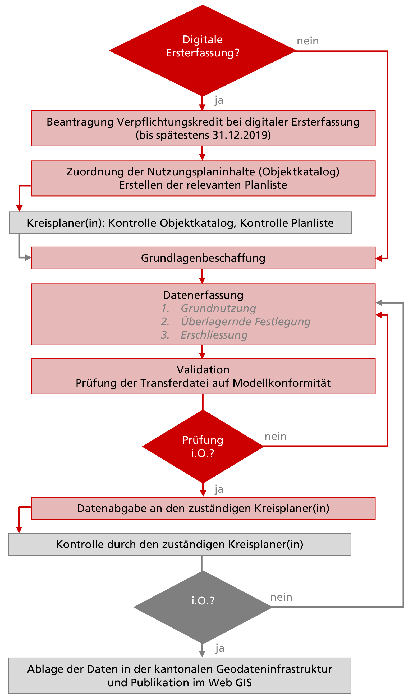

.. _ref_Erfassung:
.. _ref_AblaufErfassung:

Ablauf der Erfassung
====================
Eine Übersicht über den Ablauf der digitalen Erfassung der Nutzungsplanungsdaten

.. _img_erfassungsschema:

   Vorgehen bei der Erfassung. 

.. index:: Verpflichtungskredit 
.. _ref_BeantragungVerpflichtungskredit:
  
Beantragung Verpflichtungskredit bei digitaler Ersterfassung
------------------------------------------------------------
Die Gemeinden werden bei der digitalen Ersterfassung finanziell durch den Kanton unterstützt. Bis Ende 2019 übernimmt der Kanton max. 40% der Erfassungskosten mit einem Kostendach von maximal 18‘000.-- inkl. MwSt.
Beitragsgesuche sind einzureichen beim:

	.. line-block::
		Amt für Raumplanung
		Werkhofstrasse 59
		4509 Solothurn
		
Beitragsgesuche sind durch die jeweilige Gemeinde einzureichen. Sie haben minimal eine Offerte des ausführenden Planungs-, Ingenieur oder Vermessungsbüros sowie die Bezeichnung einer Ansprechperson des ausführenden Büros zu beinhalten. 

Voraussetzung für die Auszahlung des Kantonsbeitrages ist Abgabe von verifizierten, fehlerfreien Daten.

.. _ref_ZuordnungNutzungsplaninhalte:

Zuordnung der Nutzungsplaninhalte
---------------------------------
Bevor mit der Erfassung begonnen wird, sind die zu digitalisierenden Planinhalte zu inventarisieren. Das heisst alle vorkommenden Planinhalte einer Gemeinde werden im Objektkatalog den jeweiligen passenden kantonalen Codes zugeordnet. Die Ersterfassung erfolgt in der Regel gestützt auf die rechtsgültige Ortsplanung – auch bei einer bereits laufenden Ortsplanungsrevision. Ab der öffentlichen Auflage der laufenden Ortsplanung sollen nicht mehr die rechtsgültigen Daten digitalisiert werden. Nur so kann sichergestellt werden, dass die Daten für alle Gemeinden flächendeckend bis Ende 2019 verfügbar sind. 

Dazu ist die `Excel-Tabelle Objektkatalog <https://www.so.ch/fileadmin/internet/bjd/bjd-arp/Nutzungsplanung/xls/Objektkatalog.xlsx>`_  zu verwenden und gemäss dem folgenden Beispiel zu ergänzen (nicht vorkommende Planinhalte können zur besseren Übersicht ausgeblendet werden (nicht löschen!). In der Spalte **Bezeichnung Gemeinde** ist die exakte Bezeichnung der Zone oder des Planinhaltes gemäss Plan oder Reglement der Gemeinde aufzuführen:

.. _img_objektkatalog:

.. figure:: _static/objektkatalog.jpg
   :width: 80%
   :align: center   

   Objektkatalog.

.. index:: Kreisplaner(in)
   
**Fett** dargestellte Codes sind unverändert zu übernehmen, weil die Gemeinde für diese Planinhalte keinen Spielraum resp. nur eine abschliessend definierte Zuteilungmöglichkeit besitzt. 
Die Zuordnung ist mit dem für die jeweilige Gemeinde zuständigen `Kreisplaner(in) <https://www.so.ch/fileadmin/internet/bjd/bjd-arp/Nutzungsplanung/img/Karte_Kreisplaner.jpg>`_ im Amt für Raumplanung abzusprechen. So wird die korrekte Codezuweisung bei der Digitalisierung früh im Ablauf sichergestellt. 
 

.. index:: Grundlagen
.. _ref_Grundlagenbeschaffung:

Grundlagenbeschaffung
---------------------

.. _ref_Planliste:
.. index:: Planliste

Planliste
^^^^^^^^^
.. _img_planliste:

.. figure:: _static/Zuweisung_Dokumente_Plandokumente.jpg
   :width: 80%
   :align: center   

   Planliste für die Zuweisung der Dokumente.
   
Analog zur Objektliste wird die Planliste gesichtet und die zu verwendenden Dokumente hervorgehoben (um die Planliste als Excelfile zu erhalten meldet beim zuständigen `Kreisplaner(in) <https://www.so.ch/fileadmin/internet/bjd/bjd-arp/Nutzungsplanung/img/Karte_Kreisplaner.jpg>`_).   So ist klar, welche Dokumente erfasst und verknüpft werden müssen und welche nicht. Diese Liste ist wiederum  dem/der `Kreisplaner(in) <https://www.so.ch/fileadmin/internet/bjd/bjd-arp/Nutzungsplanung/img/Karte_Kreisplaner.jpg>`_ zur Kontrolle vorzulegen. So könne potentielle Fehler frühzeitig vermieden werden.

.. _img_planlisteindex:

.. figure:: _static/planlisteindex.png
   :width: 80%
   :align: center   

   Zuweisung der Farben für die Planliste.
   
Wir empfehlen die Pläne (Bauzonenplan, Gesamtplan, Erschliessungspläne, Gestaltungspläne, Waldfeststellungsplan) gemäss obiger Farbcodierung einzufärben.

.. index:: Planregister
.. _ref_Planregister:

Planregister
^^^^^^^^^^^^
Basis für die Erfassung der Nutzungsplanungsdaten sind die analogen, rechtsgültigen Dokumente der jeweiligen Ortsplanung. Unter dem kantonalen `Planregister <https://www.so.ch/planregister>`_ sind die eingescannten Plandokumente gemeindeweise abgelegt. 

.. _img_planregister:

.. figure:: _static/planregister.jpg               
   :width: 80%
   :align: center               

   Planregister des Kanton Solothurn. 

.. index :: Entscheide, Pläne, Reglemente, Sonderbauvorschriften

Über die Gemeindebezeichnung (linke Spalte) lässt sich das Inhaltsverzeichnis aller Pläne und Dokumente aufrufen; über den Link gelangt man in die Ablage der Dateien. Pro Gemeinde sind vier Unterverzeichnisse anwählbar:

* Das Verzeichnis **Entscheide** enthält die Regierungsratsbeschlüsse (Genehmigungsbeschlüsse) zu jeder Nutzungsplanung
* Das Verzeichnis **Plaene** enthält die Plandokumente
* Das Verzeichnis **Sonderbauvorschriften** enthält die Bestimmungen zu ausgewählten Plänen (dort, wo solche erforderlich und somit vorhanden sind).
* Das Verzeichnis **Reglemente** enthält die jeweils rechtsgültige Version der Bau- und Zonenvorschriften. 

Nachträgliche Mutationen einzelner Paragraphen werden dem Reglement chronologisch vorangestellt. 
Die Bezeichnung der Dokumente im Planregister setzt sich zusammen aus der BJD-Gemeindenummer, einer Laufnummer (nach dem Datum der Genehmigung aufsteigend) und einem Kürzel für die Dokumentart (**E** für Entschied, **P** für Plan und **S** für Sonderbauvorschrift).

.. index:: Bauzonenplan, Gesamtplan, Lärmempfindlichkeitsstufen, Erschliessungspläne, Waldfeststellungspläne

Folgende Pläne sind für die Erfassung der digitalen Nutzungsplandaten zu berücksichtigen:

* Bauzonenplan und Gesamtplan (im Inhaltsverzeichnis unter https://so.ch/planregister jeweils gelb hervorgehoben) 
* die Lärmempfindlichkeitsstufen (in der Regel in den Bauzonenplan integriert)
* Erschliessungspläne (meist mit demselben RRB genehmigt, wie der Bauzonen- und Gesamtplan, fallweise auch mehrere Teilerschliessungspläne mit unterschiedlichem Genehmigungsdatum)
* Waldfeststellungspläne

Neben den genannten Plänen zur Ortsplanung enthält das Planverzeichnis weitere Einträge unterschiedlicher Kategorien. Einige dieser Pläne sind als Plandokumente auf die entsprechenden Nutzungsplaninhalte zu referenzieren (Gestaltungspläne und kant. Erschliessungspläne auf die der Grundnutzung :ref:`überlagerten flächenbezogenen Festlegungen mit dem kant. Zonencode 611<ref_PKNP>`; kantonale Nutzungspläne (insbesondere kantonale Erschliessungspläne) auf die :ref:`überlagerten flächenbezogenen Festlegungen mit dem Zonencode 610<ref_PKGP>`). Andere Pläne (z.B. Landwirtschaftsinventare, oder Fruchtfolgeflächenpläne bilden als Grundlagepläne eine Momentaufnahme zum Zeitpunkt einer Ortsplanungsrevision ab und sind bei der Datenerfassung nicht weiter zu berücksichtigen. Bei Unklarheiten zur Planliste hilft der `Kreisplaner(in) <https://www.so.ch/fileadmin/internet/bjd/bjd-arp/Nutzungsplanung/img/Karte_Kreisplaner.jpg>`_ weiter.

.. index:: georeferenziert, TIFF
.. _ref_TIFF:

TIFF Dateien, georeferenzieren
^^^^^^^^^^^^^^^^^^^^^^^^^^^^^^
Die Pläne sind als PDF, aber auch als TIFF vorhanden. TIFF Pläne können im GIS importiert werden. Georeferenziert sind sie eine ausgezeichnete visuelle Hilfestellung bei der Ersterfassung der Daten. 

Das Verzeichnis kann unter https://geoweb.so.ch/zonenplaene/Zonenplaene_tif/ aufgerufen werden.

.. index:: kantonale Daten, ARP, Amt für Raumplanung, AFU, Amt für Umwelt, AVT, Amt für Verkehr und Tiefbau, AWJF, Amt für Wald, Jagd und Fischerei, ADA, Amt für Denkmalpflege und Archäologie

.. _ref_KantonaleDaten:

Kantonale Daten
^^^^^^^^^^^^^^^

Kantonale Daten werden vom zuständigen Amt (Datenherr) erhoben und zur Verfügung gestellt. 

.. _ref_Datenherr:

Datenherr
^^^^^^^^^
Der Datenherr ist verantwortlich für die Erfassung und Nachführung der Daten. 

Beim Amt für Geoinformation agi@bd.so.ch können die Daten zu den Objekten, welche im :ref:`Objektkatalog <ref_Objektkatalog>` gekennzeichnet sind, modellkonform bezogen werden. Folgende kantonale Objekte müssen `nicht` erfasst werden:

.. _ref_ARP:

ARP - Amt für Raumplanung
	*	520 BLN Gebiete
	*	522 Naturreservat (inkl. Geotope)
	*	524 Siedlungstrenngürtel von kommunaler Bedeutung
	*	525 Siedlungstrenngürtel von kantonaler Bedeutung
	*	526 kantonale Landwirtschafts- und Schutzzone Witi	
	*	527 kantonale Uferschutzzone
	*	690 kantonales Vorranggebiet Natur und Landschaft
	*	790 Wanderweg 
	*	791 historischer Verkehrsweg

.. _ref_AFU:
	
AFU - Amt für Umwelt
	*	593 - 596 Grundwasserschutzzonen (S1, S2, S3 und Areal)
	*	530 - 533 Naturgefahren
	*	812 geologisches Objekt

.. _ref_AVT:
	
AVT - Amt für Verkehr und Tiefbau
	*	799 Velorouten (Weitere linienbezogene Festlegungen NP)

.. _ref_AWJF:
	
AWJF - Amt für Wald, Jagd und Fischerei
	*	792 Waldgrenze
	*	793 Negative Waldfeststellung

.. _ref_ADA:
	
ADA - Amt für Denkmalpflege und Archäologie
	*	6999 Geschützte archäologische Fundstellen
	*	820 kantonal geschütztes Kulturobjekt

Kantonale Objekte welche erfasst werden müssen:
	*	610 Perimeter kantonaler Nutzungsplan
	*	711 kantonale Baulinie (Strasse, Vorbaulinie, Gestaltungsbaulinie, Rückwärtige, Infrastruktur und weitere)
	

Die oben aufgeführten Bemerkungen beziehen sich auf die Ersterfassung. Sobald die Nutzungsplanungsdaten digital in der kantonalen Geodateninfrastruktur vorliegen, können diese ebenfalls beim Amt für Geoinformation bezogen werden. 
.. Unter ``Verzeichnis existiert noch nicht`` sehen sie eine Übersicht über die Verfügbarkeit der digitalen Nutzungsplanungsdaten.

.. index:: Amtliche Vermessung (AV), AV - Bodenbedeckung, AV - Liegenschaften, AV - WMS schwarz-weiss
.. _ref_AV:
.. _ref_AV-B:
.. _ref_AV-L:
.. _ref_AV-WMS:
.. _ref_Datenerfassung:

Datenerfassung
--------------

.. _ref_DatenVermessung:

Daten der amtlichen Vermessung (AV) als Basis
^^^^^^^^^^^^^^^^^^^^^^^^^^^^^^^^^^^^^^^^^^^^^
Basis zur Erfassung der Geometriedaten bilden die Daten der amtlichen Vermessung (vorab die Liegenschaftsgrenzen, fallweise auch Abgrenzungen, die sich aus der Bodenbedeckung oder Einzelobjekten ergeben). D.h. Nutzungsplanungsobjekte sind auf bestehenden Geometrien der amtlichen Vermessung der Ebenen Liegenschaften, Bodenbedeckung und Einzelobjekte durch exakte Kopie der Geometrien oder Geometrieteile zu konstruieren. Nur wo solche Abgrenzungen nicht zur Verfügung stehen, sind die Planinhalte neu zu digitalisieren.

*	AV - Bodenbedeckung
*	AV - Liegenschaften
*	AV - WMS schwarz-weiss

.. index:: Reihenfolge der Erfassung
.. _ref_EmpfohleneReihenfolge:

Empfohlene Reihenfolge der Erfassung
^^^^^^^^^^^^^^^^^^^^^^^^^^^^^^^^^^^^
Die Geometrie der Planinhalte ist in der Reihenfolge des :ref:`Objektkataloges <ref_Objektkatalog>` zu erfassen; das heisst: 
zuerst die :ref:`Grundnutzung <ref_Gn>`, dann die :ref:`überlagernden Festlegungen <ref_Ueb>` (beide zusammen bilden die Nutzungsplanung) und schliesslich die :ref:`Erschliessungsplanung <ref_Er>`. Die Erfassung und separate Prüfung in dieser Reihenfolge ist sinnvoll, weil Lage und/oder Abgrenzung von überlagerten Planinhalten teilweise von der Grundnutzung abhängig sind. Die Erschliessungsflächen sind kongruent mit den Flächen der Verkehrszonen. Sie stellen eine genauere Untersteilung der Strassenflächen der Grundnutzung dar. Eine Strassenbaulinie zu einer projektierten Strasse ist beispielsweise von der korrekten Erfassung der Verkehrsfläche in der Grundnutzung abhängig; oder die Abgrenzung von Lärmempfindlichkeitsstufen von der Lage der entsprechenden Bauzonengrenzen.

.. index:: Genauigkeit
.. _ref_Bereinigungsarbeiten:

Bereinigungsarbeiten
^^^^^^^^^^^^^^^^^^^^
Mit der digitalen Ersterfassung dürfen im Grundsatz keine inhaltlichen Veränderungen oder Bereinigungsarbeiten vorgenommen werden. Wenn inhaltlicher Bereinigungs- oder Anpassungsbedarf besteht, so sind solche Arbeiten nach dem Abschluss der Ersterfassung in einem eigenständigen Arbeitsschritt umzusetzen und zu dokumentieren. Kleine Abweichungen zwischen analogen Planwerken und den Geometrien der amtlichen Vermessung sind als Zusammenfallen zu interpretieren, wenn dies klar und eindeutig als Absicht aus dem Plan hervorgeht. Bei Fragen zu diesem Thema kann der zuständige `Kreisplaner(in) <https://www.so.ch/fileadmin/internet/bjd/bjd-arp/Nutzungsplanung/img/Karte_Kreisplaner.jpg>`_ kontaktiert werden. 

.. index:: Fehler, Offensichtliche Fehler
.. _ref_OffensichtlilcheFehler:

Offensichtliche Fehler
^^^^^^^^^^^^^^^^^^^^^^
Tritt ein offensichtlicher Fehler auf so ist die neue Situation zu erfassen und zu vermerken. Der `Kreisplaner(in) <https://www.so.ch/fileadmin/internet/bjd/bjd-arp/Nutzungsplanung/img/Karte_Kreisplaner.jpg>`_  wird in solchen Fällen das Vorgehen bestimmen.

.. _img_fehler:

.. figure:: _static/fehler_halten_wald.jpg
   :width: 850px
   :align: center   

   Beispiel Halten, ist die Parzelle 147 Wald?: links - rechtskräfitger Bauzonenplan (Landwirschaftszone), mitte - `Amtliche Vermessung <https://geoweb.so.ch/rest/qgis/webgisLauncher.wsgi?uuid=3314616b-06d0-4471-9474-c6246f62a828>`_ (Wald), rechts - `Orthophoto <https://geoweb.so.ch/rest/qgis/webgisLauncher.wsgi?uuid=d499a0c6-241e-45b9-8f3c-fa6d99f33f45>`_ (Wald).

.. index:: Bemerkungen, Bemerkung
.. _ref_Bemerkungen:

Bemerkungen
^^^^^^^^^^^
Bemerkungen werden verwendet um getroffene Entscheide festzuhalten, Fragen zu stellen oder um vorgreifende Bemerkungen für eine OPR anzubringen (z.B. "Abweichung zum rechtsgültigen Plan. In OPR bereinigen"). Die Bemerkungen werden nicht im WebGIS Client angezeigt und dienen ausschliesslich den Planenden. Für allgemeine Bemerkungen (überall gleichlaufende Kommentare) ist dieses Feld nicht angedacht. Diese sollen per Mail bei jeweiliger Datenlieferung mitgeteilt werden.     

.. index:: Bezugsrahmensystem LV 95 (EPSG:2056), LV 95, EPSG:2056
.. _ref_AllgemeineVorgaben:

Allgemeine technische Vorgaben
^^^^^^^^^^^^^^^^^^^^^^^^^^^^^^
*	Die Datenerfassung Nachführung erfolgt im Bezugsrahmensystem LV 95 (EPSG:2056).
*	Multipart-Geometrien sind nicht zulässig und werden von INTERLIS 2 nicht unterstützt.
*	Kreisbogen dürfen als Geraden segmentiert sein. Es sind die segmentieren Kreisbogen der AV, wie sie vom Amt für Geoinformation bereitgestellt werden zu übernehmen.
*	Die zu erfassenden Daten liegen auf der Gemeindegrenze oder innerhalb der Gemeinde. D.h. die Geometrien dürften die Gemeindegrenze nicht überlappen.

.. index:: Validator, Modellkonformität
.. _ref_PrüfungTransferdatei:

Prüfung der Transferdatei auf Modellkonformität
-----------------------------------------------
Bevor die erfassten Daten abgegeben werden, ist die Transferdatei (XTF) auf modellkonformität zu prüfen. Die Prüfung ist über den `Validator <https://geo.so.ch/ilivalidator/>`_ durchzuführen. Das Resultat der Prüfung muss ``...validation done`` sein. Ist dies nicht der Fall, müssen die Daten gemäss Fehlermeldung bereinigt werden.

Die `Validator Dokumentation <https://github.com/sogis/ilivalidator-web-service/blob/master/docs/user-manual-de.rst>`_ finden sie hier .

.. index:: Datenabgabe, Tranferdatei (.xtf), xtf, XTF, Logfile Validator, log
.. _ref_DatenabgabeKreisplaner:

Datenabgabe an den zuständigen Kreisplaner(in)
----------------------------------------------
Folgende Daten sind dem zuständigen `Kreisplaner(in) <https://www.so.ch/fileadmin/internet/bjd/bjd-arp/Nutzungsplanung/img/Karte_Kreisplaner.jpg>`_ per Mail abzugeben:

*	Transferdatei (.xtf)
*	Logfile Validator (.log)
*	Bauzonenplan als .pdf
*	Gesamtplan als .pdf
*	Erschliessungsplan als .pdf

In der Transferdatei sind alle Daten vorhanden, auch die Daten, welche vom Kanton  bezogen und eingebunden wurden (z.B. Grundwasserschutzzonen).

Bei einer Ortsplanungsrevision ist der Zeitpunkt der Datenabgabe mit dem `Kreisplaner(in) <https://www.so.ch/fileadmin/internet/bjd/bjd-arp/Nutzungsplanung/img/Karte_Kreisplaner.jpg>`_ in Abhängigkeit von Verfahrensstand abzusprechen. In der Regel erfolgt die Datenabgabe erstmalig im Sinn einer Vorprüfung (bei einer Datenerhebung im Rahmen der Ortsplanungsrevision koordiniert mit der Vorprüfung nach `§ 15 PBG <http://bgs.so.ch/frontend/versions/4287>`_ ). Bei der Abgabe der Daten zur Vorprüfung kann den Daten ein Bericht oder eine Tabelle mit offenen Fragen und Erläuterungen beigelegt werden.

Zwingend erforderlich ist die Datenabgabe der bereinigten modellkonformen Daten zum Zeitpunkt der regierungsrätlichen Genehmigung einer Ortsplanung. Die Datenabgabe ist Voraussetzung für die Auszahlung des Kantonsbeitrages. Auch bei einer Datenerfassung ausserhalb der Ortsplanung ist die Abgabe fehlerfreier Daten Voraussetzung für die Auszahlung des Beitrags.

.. index:: Kontrolle, Checkliste
.. _ref_KontrolleKreisplaner:

Kontrolle durch den zuständigen Kreisplaner(in)
-----------------------------------------------
Der zuständige `Kreisplaner(in) <https://www.so.ch/fileadmin/internet/bjd/bjd-arp/Nutzungsplanung/img/Karte_Kreisplaner.jpg>`_ kontrolliert die digitalen Nutzungsplanungsdaten und gibt der Gemeinde resp. dem Planungs-, Ingenieur-, oder Vermessungsbüros Rückmeldung. Falls die Daten noch nicht in Ordnung sind, sind diese in der vereinbarten Frist zu korrigieren.

**Für Fragen der Ersterfassung im Kreis Olten, Gösgen, Gäu ist neu Vanessa Studer statt Stephan Schader verantwortlich.**

Die technische und fachliche Kontrolle wir anhand der folgenden `Checkliste <https://www.so.ch/fileadmin/internet/bjd/bjd-arp/Nutzungsplanung/pdf/Checkliste_v2.2.pdf>`_ durchgeführt.

.. index:: Geodateninfrastruktur, Web GIS
.. _ref_AblageDaten: 

Ablage der Daten in der kantonalen Geodateninfrastruktur und Publikation im Web GIS
-----------------------------------------------------------------------------------
Sobald die Daten vom zuständigen `Kreisplaner(in) <https://www.so.ch/fileadmin/internet/bjd/bjd-arp/Nutzungsplanung/img/Karte_Kreisplaner.jpg>`_ geprüft und in Ordnung sind, werden die Daten in die kantonalen Datenbank importiert und im `Web GIS <https://geoweb.so.ch/map>`_ publiziert. Die Planungsbüros werden informiert dass die Datenprüfuing abgeschlossen ist.  

* :ref:`genindex`