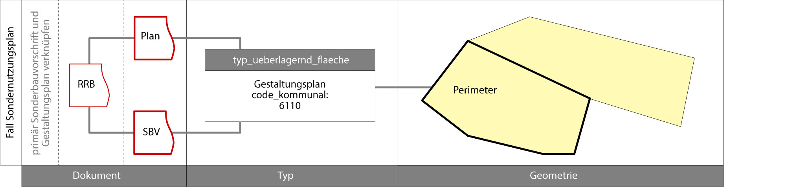
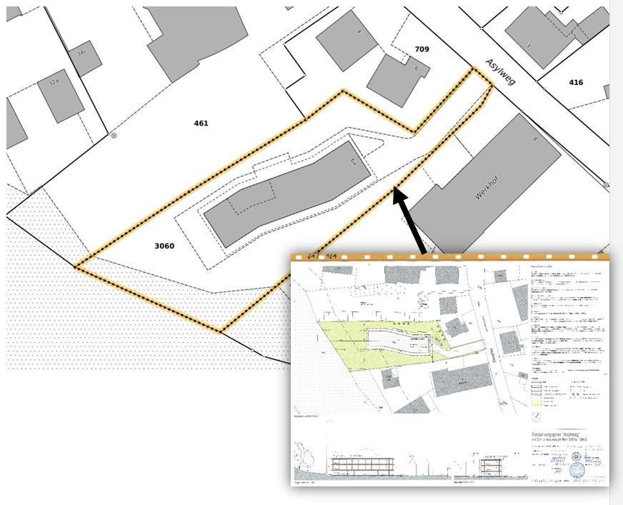

.. include:: .style.rst

.. _ref_NP:
.. _ref_Datenmodell:

Datenmodell
===========
Übersicht über das Topic Nutzungsplanung:

.. _img_ermodell:

   UML-Klassendiagramm Nutzungsplanung. 

.. _ref_Nutzungsplanung:
   
Nutzungsplanung, Grundnutzung
-----------------------------
Das gesamte Gemeindegebiet ist flächendeckend, lückenlos und ohne Überlappungen einer Grundnutzung zuzuordnen. 

.. _ref_AttributeGrundnutzung:

Attribute der Grundnutzung
^^^^^^^^^^^^^^^^^^^^^^^^^^
Folgende Attribute sind für die Grundnutzung zu erfassen:

:orange:`Orange markierte Attribute sind Pflicht`. D.h. diese Werte müssen immer erfasst werden.

:fuchsia:`Pink markierte Attribute müssen im Widerspruch zum Datenmodell ebenfalls ausgefüllt sein`. Diese Anpassungen sind jedoch nötig um die Durchlässigkeit der Daten für den ÖREB-Kataster gewährleisten zu können, ohne eine Anpassung am Datenmodell vorzunehmen. Bei folgenden Attributten der ``Klasse Dokument`` wurde der Validator angepasst und liefert eine Fehlermeldung wenn es nicht ausgefüllt ist.

*	Rechtsvorschrift
*	Kanton
*	Gemeinde
*	OffiziellerTitel

.. index:: Klasse Typ_Grundnutzung
.. _ref_KlasseTyp_Grundnutzung:

``Klasse Typ_Grundnutzung``
'''''''''''''''''''''''''''

.. rst-class:: typgrundnutzung

+--------------------+---------------------------------------------+-------------------------------------------------------------------------------------------------------------------------------------------------------------+----------------------------------------------------------------------------+
| **Bezeichnung**    | **Typ / Werte**                             | **Beschreibung**                                                                                                                                            | **Beispiel**                                                               |
|                    |                                             |                                                                                                                                                             |                                                                            |
+--------------------+---------------------------------------------+-------------------------------------------------------------------------------------------------------------------------------------------------------------+----------------------------------------------------------------------------+
| Bezeichnung        | Text mit max. 80 Zeichen                    | Name der Grundnutzung.                                                                                                                                      | Kernzone mit Einschränkung                                                 |
+--------------------+---------------------------------------------+-------------------------------------------------------------------------------------------------------------------------------------------------------------+----------------------------------------------------------------------------+
| Abkuerzung         | Text mit max. 12 Zeichen                    | Abkürzung der Grundnutzung. Kann von der Gemeinde vergeben werden. Falls keine Abkürzung vorhanden ist bleit das Feld leer.                                 | KE                                                                         |
+--------------------+---------------------------------------------+-------------------------------------------------------------------------------------------------------------------------------------------------------------+----------------------------------------------------------------------------+
| Verbindlichkeit    | .. _ref_NPFL:                               |                                                                                                                                                             |                                                                            |
|                    | .. _ref_ORIE:                               |                                                                                                                                                             |                                                                            |
|                    | .. _ref_HWD:                                |                                                                                                                                                             |                                                                            |
|                    | .. _ref_WLD:                                |                                                                                                                                                             |                                                                            |
|                    | .. _ref_NPFLORIE:                           |                                                                                                                                                             |                                                                            |
|                    | .. _ref_ALL:                                |                                                                                                                                                             |                                                                            |
|                    |                                             |                                                                                                                                                             |                                                                            |
|                    | Nutzungsplanfestlegung                      | eigentümerverbindlich, im Verfahren der Nutzungsplanung festgelegt.                                                                                         | Nutzungsplanfestlegung                                                     |
|                    +---------------------------------------------+-------------------------------------------------------------------------------------------------------------------------------------------------------------+                                                                            |
|                    | orientierend                                | eigentümerverbindlich, in einem anderen Verfahren festgelegt.                                                                                               |                                                                            |
|                    +---------------------------------------------+-------------------------------------------------------------------------------------------------------------------------------------------------------------+                                                                            |
|                    | hinweisend                                  | nicht eigentümerverbindlich, Informationsinhalte.                                                                                                           |                                                                            |
|                    +---------------------------------------------+-------------------------------------------------------------------------------------------------------------------------------------------------------------+                                                                            |
|                    | wegleitend                                  | nicht eigentümerverbindlich, sie umfassen Qualitäten, Standards und dergleichen, die zu berücksichtigen sind.                                               |                                                                            |
+--------------------+---------------------------------------------+-------------------------------------------------------------------------------------------------------------------------------------------------------------+----------------------------------------------------------------------------+
| Bemerkungen        | Text mit max. 240 Zeichen                   | Erläuternder Text zum Typ_Grundnutzung.                                                                                                                     | Spezialzonen (Zonencode 1901 und 1903 haben einen Wohnanteil von ca. 35%   |
+--------------------+---------------------------------------------+-------------------------------------------------------------------------------------------------------------------------------------------------------------+----------------------------------------------------------------------------+
| Typ_Kt             | Siehe Datenmodel NP_Typ_Kanton_Grundnutzung | Siehe :ref:`Objektkatalog <ref_Objektkatalog>`                                                                                                              | N140_Kernzone                                                              |
+--------------------+---------------------------------------------+-------------------------------------------------------------------------------------------------------------------------------------------------------------+----------------------------------------------------------------------------+
| Code_kommunal      | Text mit max. 12 Zeichen                    | 4-stelliger kommunaler Code. Wird durch die Gemeinde vergeben. Stelle 1-3 ist identisch zum kantonalen Code (Ausnahme: Spezialzone,                         | 1401                                                                       |
|                    |                                             | Code 190 mit 19 möglichen kommunalen Codes). Im :ref:`Objektkatalog <ref_Objektkatalog>`                                                                    |                                                                            | 
|                    |                                             | ist definiert, welche Werte des kommunalen Codes erlaubt sind. Falls kommunale Werte zugelassen sind, beginnt die 4. Stelle jeweils bei 1.                  |                                                                            |
+--------------------+---------------------------------------------+-------------------------------------------------------------------------------------------------------------------------------------------------------------+----------------------------------------------------------------------------+
| Nutzungsziffer     | Wert zwischen 0.00 und 9.00.                | Zahlenwert nach Zonenreglement der Gemeinde (0.05 = 5%)                                                                                                     | 0.4                                                                        |
+--------------------+---------------------------------------------+-------------------------------------------------------------------------------------------------------------------------------------------------------------+----------------------------------------------------------------------------+
| Nutzungsziffer_Art | Baumassenziffer                             | Bauvolumen über massgebendem Terrain / anrechenbare Grundstücksfläche (§37ter PBG)                                                                          | Überbauungsziffer                                                          |
|                    +---------------------------------------------+-------------------------------------------------------------------------------------------------------------------------------------------------------------+                                                                            |
|                    | Geschossflächenziffer                       | Summe aller Geschossflächen / anrechenbare Grundstücksfläche (§37bis PBG)                                                                                   |                                                                            |
|                    +---------------------------------------------+-------------------------------------------------------------------------------------------------------------------------------------------------------------+                                                                            |
|                    | Überbauungsziffer                           | anrechenbare Gebäudefläche / anrechenbare Grundstücksfläche (§35 PBG)                                                                                       |                                                                            |
|                    +---------------------------------------------+-------------------------------------------------------------------------------------------------------------------------------------------------------------+                                                                            |
|                    | Ausnützungsziffer                           | anrechenbare Bruttogeschossfläche / anrechenbare Grundstücksfläche ((§37 PBG, wurde gestrichen)                                                             |                                                                            |
+--------------------+---------------------------------------------+-------------------------------------------------------------------------------------------------------------------------------------------------------------+----------------------------------------------------------------------------+
| Geschosszahl       | Wert zwischen 1 und 50                      | Maximal zulässige Anzahl Geschosse                                                                                                                          | z.B. 2                                                                     |
+--------------------+---------------------------------------------+-------------------------------------------------------------------------------------------------------------------------------------------------------------+----------------------------------------------------------------------------+
	
Ein ``Typ_Grundnutzung`` kann mehrere Grundnutzungsgeometrien haben (siehe :ref:`Beziehung in der Übersicht <img_ermodell>`).

.. index :: Klasse Grundnutzung
.. _ref_KlasseGrundnutzung:

``Klasse Grundnutzung``
'''''''''''''''''''''''

.. rst-class:: grundnutzung
	
+-----------------+---------------------------+---------------------------------------------------------------------------+---------------------------------------------------------+
| **Bezeichnung** | **Typ / Werte**           | **Beschreibung**                                                          | **Beispiel**                                            |
+-----------------+---------------------------+---------------------------------------------------------------------------+---------------------------------------------------------+
| Geometrie       | Polygon (AREA)            | Geometrie als Gebietseinteilung. Überlappungen bei Radien mit einer       |                                                         |
|                 |                           | Pfeilhöhe <1 mm werden toleriert.                                         |                                                         |
+-----------------+---------------------------+---------------------------------------------------------------------------+---------------------------------------------------------+
| Name_Nummer     | Text mit max. 20 Zeichen  | Leer lassen                                                               |                                                         |
+-----------------+---------------------------+---------------------------------------------------------------------------+---------------------------------------------------------+
| Rechtsstatus    | inKraft                   | Die Festlegung ist in Kraft.                                              | inKraft                                                 |
|                 +---------------------------+---------------------------------------------------------------------------+                                                         |
|                 | laufende_Aenderung        | Die Festlegung ist noch nicht in Kraft, eine Änderung ist in Vorbereitung |                                                         |
+-----------------+---------------------------+---------------------------------------------------------------------------+---------------------------------------------------------+
| publiziertAb    | Datum                     | Datum des Regierungsratsbeschlusses                                       | 2002-04-23                                              |
+-----------------+---------------------------+---------------------------------------------------------------------------+---------------------------------------------------------+
| Bemerkungen     | Text mit max. 240 Zeichen | Bemerkung zu der einzelnen Grundnutzungsgeometrie.                        | “Dieses Zonenschild (Zonencode 190, Spezialzone) sollte |
|                 |                           |                                                                           | im Rahmen der nächsten OP in eine Wohnzone (Zonencode   |
|                 |                           |                                                                           | 11) umgezont werden.“                                   |
+-----------------+---------------------------+---------------------------------------------------------------------------+---------------------------------------------------------+
| Erfasser        | Text mit max. 80 Zeichen  | Name der Firma, welche die Daten erfasst hat                              | SutterAG                                                |
+-----------------+---------------------------+---------------------------------------------------------------------------+---------------------------------------------------------+
| Datum           | Datum                     | Datum der Erfassung                                                       | 2017-06-14                                              |
+-----------------+---------------------------+---------------------------------------------------------------------------+---------------------------------------------------------+
	
Eine Grundnutzung ist immer einem ``Typ_Grundnutzung`` zugewiesen (siehe :ref:`Beziehung in der Übersicht <img_ermodell>`).
Nebeneinanderliegende Grundnutzungsgeometrien mit demselben kommunalen Code dürfen nicht unterteilt werden, sondern sind als ein Polygon zu erfassen (Siehe :ref:`Bild <img_grundnutzung>`).

.. _img_grundnutzung:

 
.. index:: Klasse Grundnutzung_Pos
.. _ref_KlasseGrundnutzung_Pos:

``Klasse Grundnutzung_Pos``
'''''''''''''''''''''''''''

.. rst-class:: grundnutzungpos

+-----------------+------------------------------+----------------------------------------------------------------------------------------------+--------------+
| **Bezeichnung** | **Typ / Werte**              | **Beschreibung**                                                                             | **Beispiel** |
+-----------------+------------------------------+----------------------------------------------------------------------------------------------+--------------+
| Pos             | Punkt                        | Position für die Beschriftung                                                                |              |
+-----------------+------------------------------+----------------------------------------------------------------------------------------------+--------------+
| Ori             | Wert zwischen 0 und 399      | Orientierung der Beschriftung in Gon. 0 gon = Horizontal                                     | 45           |
+-----------------+------------------------------+----------------------------------------------------------------------------------------------+--------------+
| HAli            | left, center, right          | Mit dem horizontalen Alignment wird festgelegt, ob die Position auf dem linken oder rechten  | left         |
|                 |                              | Rand des Textes oder in der Textmitte liegt (siehe                                           |              |
|                 |                              | `Interlis 2 Referenzhandbuch <https://www.interlis.ch/content/index.php?language=d>`_).      |              |
+-----------------+------------------------------+----------------------------------------------------------------------------------------------+--------------+
| VAli            | top, cap, half, base, bottom | Das vertikale Alignment legt die Position in Richtung der Texthöhe fest (siehe               |              |
|                 |                              | `Interlis 2 Referenzhandbuch <https://www.interlis.ch/content/index.php?language=d>`_).      | bottom       |
|                 |                              |                                                                                              |              |
+-----------------+------------------------------+----------------------------------------------------------------------------------------------+--------------+
| Grösse          | klein, mittel, gross         | Grösse der Beschriftung                                                                      | mittel       |
+-----------------+------------------------------+----------------------------------------------------------------------------------------------+--------------+
	
Beschriftet wird die Abkürzung welche in der ``Klasse Typ_Grundnutzung`` erfasst wird. Eine Beschriftung der Grundnutzungsgeometrie macht nur Sinn, wenn eine Abkürzung unter der ``Klasse Typ_Grundnutzung`` erfasst ist. Eine Beschriftung der Grundnutzungsgeometrie ist nicht zwingend (siehe :ref:`Beziehung in der Übersicht <img_ermodell>`), wird aber dringend empfohlen. 
Die Ausrichtung (Ori, HAli und VAli) und die Textgrösse kann frei gewählt werden.
Falls eine Beschriftung erfasst wird, muss diese innerhalb der zugewiesen  Grundnutzungsgeometrie liegen.

.. index:: Klasse Dokument
.. _ref_KlasseDokument:

``Klasse Dokument``
'''''''''''''''''''

.. rst-class:: dokument

+------------------+---------------------------+-----------------------------------------------------------------------------------------------------------------+-----------------------------------------------+
| **Bezeichnung**  | **Typ / Wert**            | **Beschreibung**                                                                                                | **Beispiel**                                  |
+------------------+---------------------------+-----------------------------------------------------------------------------------------------------------------+-----------------------------------------------+
| DokumentID       | Text mit max. 16 Zeichen  | leer lassen                                                                                                     |                                               |
+------------------+---------------------------+-----------------------------------------------------------------------------------------------------------------+-----------------------------------------------+
| Titel            | Text mit max. 80 Zeichen  | Dokumentart z.B. Regiereungsratsbeschluss, Zonenreglement, Sonderbauvorschriften                                | Sonderbauvorschriften                         |
|                  |                           | Erschliessungsplan, Gestaltungsplan                                                                             |                                               |
+------------------+---------------------------+-----------------------------------------------------------------------------------------------------------------+-----------------------------------------------+
| OffiziellerTitel | Text mit max. 240 Zeichen | Vollständiger Titel des Dokuments, wenn der OffiziellerTitel gleich lautet wie der Titel, so ist die            | Gemeinde Oekingen Bau- und Zonenreglement     |
|                  |                           | Planbezeichnung aus der Planliste zu übernehmen.                                                                |                                               |
|                  |                           |                                                                                                                 |                                               |
+------------------+---------------------------+-----------------------------------------------------------------------------------------------------------------+-----------------------------------------------+
| Abkuerzung       | Text mit max. 10 Zeichen  | Abkürzung der Dokumentkategorie (Regierungsratsbeschluss, Sonderbauvorschrift, Zonenreglement)                  | RRB, SBV, ZR                                  |
+------------------+---------------------------+-----------------------------------------------------------------------------------------------------------------+-----------------------------------------------+
| OffizielleNr     | Text mit max. 20 Zeichen  | Eindeutiger Identifikator gemäss `Planregister <https://www.so.ch/planregister>`_.                              |                                               |
|                  |                           | Die ID setzt sich folgendermassen zusammen:                                                                     |                                               |
|                  |                           |                                                                                                                 |                                               |			
|                  |                           | Sonderbauvorschriften: Gemeindennummer "-" Plannummer nach Planregister "-" S (für Sonderbauvorschriften)       | 109-31-S                                      |
|                  |                           |                                                                                                                 |                                               |
|                  |                           | Reglemente: Gemeindenummer "-" und Kürzel Reglementart (ZR Zonenereglement, BR Baureglement und                 | 109-BR                                        |
|                  |                           | BZR Bau- und Zonenreglement                                                                                     |                                               |
|                  |                           |                                                                                                                 |                                               |
|                  |                           | Gestaltungsplan: Gemeindennummer "-" Plannummer nach Planregister "-" P (für Plan)                              | 109-31-P                                      |
|                  |                           |                                                                                                                 |                                               |
|                  |                           |                                                                                                                 |                                               |
|                  |                           | Bei `RRB <https://rrb.so.ch/>`_ ist die RRB Nr. aufzuführen (YYYY/RRB Nr.)                                      | 2001/1585                                     |
+------------------+---------------------------+-----------------------------------------------------------------------------------------------------------------+-----------------------------------------------+
| Kanton           | CHCantonCode              | Abkürzung Kanton                                                                                                | SO                                            |
+------------------+---------------------------+-----------------------------------------------------------------------------------------------------------------+-----------------------------------------------+
| Gemeinde         | CHMunicipalityCode        | Gemeindenummer vom schweizerischen Bundesamt für Statistik (BFS-Nr.)                                            | 2502                                          |
+------------------+---------------------------+-----------------------------------------------------------------------------------------------------------------+-----------------------------------------------+
| publiziertAb     | Datum                     | Datum des Regierungsratsbeschlusses                                                                             | 2002-04-23                                    |
+------------------+---------------------------+-----------------------------------------------------------------------------------------------------------------+-----------------------------------------------+
| Rechtsstatus     | inKraft                   | Rechtsstatus des Dokuments. Das Dokument ist in Kraft                                                           | inKraft                                       |
|                  +---------------------------+-----------------------------------------------------------------------------------------------------------------+                                               |
|                  | laufende_Aenderung        | Rechtsstatus des Dokuments. Das Dokument ist noch nicht in Kraft, eine Änderung ist in Vorbereitung.            |                                               |
+------------------+---------------------------+-----------------------------------------------------------------------------------------------------------------+-----------------------------------------------+
| TextImWeb        | URI                       | Relative Internetadresse des Dokuments auf `Planregister <https://www.so.ch/planregister>`_.                    | 109-Wisen/Entscheide/109-31-E.pdf             |
|                  |                           | D.h. stabiler Teil, ohne "http://www.so.ch.../"                                                                 |                                               |
+------------------+---------------------------+-----------------------------------------------------------------------------------------------------------------+-----------------------------------------------+
| Bemerkung        | Text mit max. 240 Zeichen | Erläuternder Text oder Bemerkungen zum Dokument                                                                 | ersetzt den RRB vom 13.12.2001                |
+------------------+---------------------------+-----------------------------------------------------------------------------------------------------------------+-----------------------------------------------+
| Rechtsvorschrift | ja                        | RRB, Zonenreglement, Baureglement, Bauzonenreglement, Sonderbauvorschrift, Gestaltungsplan                      | 1                                             |
|                  +---------------------------+-----------------------------------------------------------------------------------------------------------------+                                               |
|                  | nein                      | Raumplanungsbericht, Umweltverträglichkeitsbericht                                                              |                                               |
+------------------+---------------------------+-----------------------------------------------------------------------------------------------------------------+-----------------------------------------------+

	
Die zu referenzierenden Dokumente stehen im `Planregister <https://www.so.ch/planregister>`_ zur Verfügung. Im Ordner **Entscheide** sind die Genehmigungsbeschlüsse des Regierungsrats abgelegt, im Ordner **Plaene** die Plandokumente, im Ordner **Sonderbauvorschriften** – dort wo vorhanden - die spezifischen Regelungen zum jeweiligen Sondernutzungsplan, fallweise auch Schutzonenreglemente zu Grundwasserschutzzonenplänen und im Ordner **Reglemente** die rechtskräftigen Baureglemente und Zonenreglemente.

Die Dokumente werden mit dem ``Typ_Grundnutzung`` verknüpft. Dies sind in der Regel:

*	Baureglemente und Zonenreglemente
*	(RRB - werden an Baureglemente oder Zonenreglemente verknüpft)

Auf die Erfassung der folgenden Rechtsgrundlagen des Bundes und des Kantons im Bereich der Nutzungsplanung wird verzichtet.

*	Bundesgesetz über die Raumplanung `RPG, SR 700 <https://www.admin.ch/ch/d/sr/c700.html>`_
*	Raumplanungsverordnung `RPV, SR 700.1 <https://www.admin.ch/ch/d/sr/c700_1.html>`_ 
*	Kantonales Planungs- und Baugesetz `PBG, BGS 711.1 <http://bgs.so.ch/frontend/versions/4116>`_)
*	Kantonale Bauverordnung `KBV, BGS 711.61 <http://bgs.so.ch/frontend/versions/4169>`_

Gemäss Datenmodell kann für die Dokumente eine Hierarchie erfasst werden. Als primäres Dokument (Ursprung) gilt immer die Rechtsvorschrift (Baureglement, Zonenreglement, Sonderbauvorschrift, Gestaltungsplan etc.), dort wo die eigentumsbeschränktenden Informationen festgehalten sind. Die RRBs (Hinweis) werden diesen Rechtsvorschriften zugewiesen. Ist keine Rechtsvorschrift vorhanden, so wird der ``Typ_Grundnutzung`` direkt mit dem RRB verknüpft.

.. _img_hierarchie_np:

   Hierarchie der Dokumente, sowie Beispiel einer Zuweisung des Dokuments zur Geometrie Grundnutzung.
	
Weil ein Teil der zu verknüpfenden Dokumente erst nach der Genehmigung der Ortsplanung vorliegt (der Genehmigungsbeschluss selber und die Reglemente) wird der Zeitpunkt der endgültigen Datenabgabe im Genehmigungsbeschluss festgelegt.

Falls die Grundnutzungsgeometrien angepasst werden z.B. bei einer Teilrevision ist ein neuer ``Typ_Grundnutzung`` zu erstellen, welcher mit dem Zonenreglement Verknüpft ist und sich auf den neuen RRB bezieht (siehe :ref:`Beispiel <img_hierarchie_np>`).

Für den ``Typ_Grundnutzung`` mit Verbindlichkeit gleich orientierend oder hinweisend sind keine Dokumente zu erfassen. 

.. _ref_ÜberlagerndeObjekte:
.. _ref_NutzungsplanungüberlagerndeObjekte:

Nutzungsplanung, überlagernde Objekte
-------------------------------------

.. _ref_AttributeüberlagerndeObjekte:

Attribute der überlagenden Objekte
^^^^^^^^^^^^^^^^^^^^^^^^^^^^^^^^^^
Folgende Attribute sind für die überlagernden Objekte zu erfassen:

:orange:`Orange markierte Attribute sind Pflicht`. D.h. diese Werte müssen immer erfasst werden.

.. index:: Klasse Typ_Ueberlagernd_Flaeche, Klasse Typ_Ueberlagernd_Linie, KlasseTyp_Ueberlagernd_Punkt 
.. _ref_KlasseTyp_Ueberlagernd:

``Klasse Typ_Ueberlagernd_Flaeche`` / ``Klasse Typ_Ueberlagernd_Linie`` / ``KlasseTyp_Ueberlagernd_Punkt``
''''''''''''''''''''''''''''''''''''''''''''''''''''''''''''''''''''''''''''''''''''''''''''''''''''''''''

.. rst-class:: typueberlagerndflp
	
+--------------------+---------------------------------------------+-------------------------------------------------------------------------------------------------------------------------------------------------------------+----------------------------------------------------------------------------+
| **Bezeichnung**    | **Typ / Werte**                             | **Beschreibung**                                                                                                                                            | **Beispiel**                                                               |
+--------------------+---------------------------------------------+-------------------------------------------------------------------------------------------------------------------------------------------------------------+----------------------------------------------------------------------------+
| Bezeichnung        | Text mit max. 80 Zeichen                    | Name des überlagernden Objekts / Wird von der Gemeinde definiert.                                                                                           | Landschaftsschutzzone                                                      |
+--------------------+---------------------------------------------+-------------------------------------------------------------------------------------------------------------------------------------------------------------+----------------------------------------------------------------------------+
| Abkuerzung         | Text mit max. 12 Zeichen                    | Abkürzung des überlagernden Objekts. Kann von der Gemeinde vergeben werden. Falls keine Abkürzungen verhanden ist bleibt das Feld leer.                     | LS                                                                         |
+--------------------+---------------------------------------------+-------------------------------------------------------------------------------------------------------------------------------------------------------------+----------------------------------------------------------------------------+
| Verbindlichkeit    | Nutzungsplanfestlegung                      | eigentümerverbindlich, im Verfahren der Nutzungsplanung festgelegt.                                                                                         | Nutzungsplanfestlegung                                                     |
|                    +---------------------------------------------+-------------------------------------------------------------------------------------------------------------------------------------------------------------+                                                                            |
|                    | orientierend                                | eigentümerverbindlich, in einem anderen Verfahren festgelegt.                                                                                               |                                                                            |
|                    +---------------------------------------------+-------------------------------------------------------------------------------------------------------------------------------------------------------------+                                                                            |
|                    | hinweisend                                  | nicht eigentümerverbindlich, Informationsinhalte.                                                                                                           |                                                                            |
|                    +---------------------------------------------+-------------------------------------------------------------------------------------------------------------------------------------------------------------+                                                                            |
|                    | wegleitend                                  | nicht eigentümerverbindlich, sie umfassen Qualitäten, Standards und dergleichen, die zu berücksichtigen sind.                                               |                                                                            |
+--------------------+---------------------------------------------+-------------------------------------------------------------------------------------------------------------------------------------------------------------+----------------------------------------------------------------------------+
| Bemerkungen        | Text mit max. 240 Zeichen                   | Erläuternder Text zum Typ_Ueberlagernd.                                                                                                                     | Daten von extern übernommen                                                |
+--------------------+---------------------------------------------+-------------------------------------------------------------------------------------------------------------------------------------------------------------+----------------------------------------------------------------------------+
| Typ_Kt             | Siehe Datenmodell                           | Siehe :ref:`Objektkatalog <ref_Objektkatalog>`                                                                                                              | N523_Landschaftsschutzzone                                                 |
|                    | NP_Typ_Kanton_Ueberlagernd_Flaeche          |                                                                                                                                                             |                                                                            |      
|                    | NP_Typ_Kanton_Ueberlagernd_Linie            |                                                                                                                                                             |                                                                            |
|                    | NP_Typ_Kanton_Ueberlagernd_Punkt            |                                                                                                                                                             |                                                                            |
+--------------------+---------------------------------------------+-------------------------------------------------------------------------------------------------------------------------------------------------------------+----------------------------------------------------------------------------+
| Code_kommunal      | Text mit max. 12 Zeichen                    | 4-stelliger kommunaler Code. Wird durch die Gemeinde vergeben. Stelle 1-3 ist identisch zum kantonalen Code                                                 | 5231                                                                       |
|                    |                                             | Im :ref:`Objektkatalog <ref_Objektkatalog>`                                                                                                                 |                                                                            | 
|                    |                                             | ist definiert, welche Werte des kommunalen Codes erlaubt sind. Falls kommunale Werte zugelassen sind, beginnt die 4. Stelle jeweils bei 1.                  |                                                                            |
+--------------------+---------------------------------------------+-------------------------------------------------------------------------------------------------------------------------------------------------------------+----------------------------------------------------------------------------+
	
Ein ``Typ_Ueberlagernd_Flaeche`` / ``Typ_Ueberlagernd_Linie`` / ``Typ_Ueberlagernd_Punkt`` kann mehrere überlagernde Geometrien haben ( siehe :ref:`Beziehung in der Übersicht <img_ermodell>`).

.. index:: Klasse Ueberlagernd_Flaeche, Klasse Ueberlagernd_Linie, Klasse Ueberlagernd_Punkt
.. _ref_KlasseUeberlagernd:

``Klasse Ueberlagernd_Flaeche`` / ``Klasse Ueberlagernd_Linie`` / ``Klasse Ueberlagernd_Punkt``
'''''''''''''''''''''''''''''''''''''''''''''''''''''''''''''''''''''''''''''''''''''''''''''''

.. rst-class:: ueberlagerndflp

+-----------------+---------------------------+---------------------------------------------------------------------------+---------------------------------------------------------+
| **Bezeichnung** | **Typ / Werte**           | **Beschreibung**                                                          | **Beispiel**                                            |
+-----------------+---------------------------+---------------------------------------------------------------------------+---------------------------------------------------------+
| Geometrie       | Polygon (surface)         | Fläche, Linie oder Punkt, welche die Grundnutzung überlagern.             |                                                         |
|                 | Linie                     |                                                                           |                                                         |
|                 | Punkt                     |                                                                           |                                                         |
+-----------------+---------------------------+---------------------------------------------------------------------------+---------------------------------------------------------+
| Name_Nummer     | Text mit max. 20 Zeichen  | Leer lassen                                                               |                                                         |
+-----------------+---------------------------+---------------------------------------------------------------------------+---------------------------------------------------------+
| Rechtsstatus    | inKraft                   | Die Festlegung ist in Kraft.                                              | inKraft                                                 |
|                 +---------------------------+---------------------------------------------------------------------------+                                                         |
|                 | laufende_Aenderung        | Die Festlegung ist noch nicht in Kraft, eine Änderung ist in Vorbereitung |                                                         |
+-----------------+---------------------------+---------------------------------------------------------------------------+---------------------------------------------------------+
| publiziertAb    | Datum                     | Datum des Regierungsratsbeschlusses                                       | 2002-04-23                                              |
+-----------------+---------------------------+---------------------------------------------------------------------------+---------------------------------------------------------+
| Bemerkungen     | Text mit max. 240 Zeichen | Bemerkung zu der einzelnen überlagernden Objekte.                         | (z.B. zu 5240): Perimeter den lokalen Gegebenheiten     |
|                 |                           |                                                                           | angepasst                                               |
|                 |                           |                                                                           |                                                         |
+-----------------+---------------------------+---------------------------------------------------------------------------+---------------------------------------------------------+
| Erfasser        | Text mit max. 80 Zeichen  | Name der Firma, welche die Daten erfasst hat                              | Lerch Weber AG                                          |
+-----------------+---------------------------+---------------------------------------------------------------------------+---------------------------------------------------------+
| Datum           | Datum                     | Datum der Erfassung                                                       | 2017-06-14                                              |
+-----------------+---------------------------+---------------------------------------------------------------------------+---------------------------------------------------------+
	
Eine überlagernde Fläche, Linie oder ein überlagernder Punkt ist immer einem Typ (``Typ_Ueberlagernd_Flaeche`` / ``Typ_Ueberlagernd_Linie`` / ``Typ_Ueberlagernd_Punkt``) zugewiesen ( :ref:`siehe Beziehung in der Übersicht <img_ermodell>`).

.. index:: Klasse Ueberlagernd_Flaeche_Pos, Klasse Ueberlagernd_Linie_Pos, Klasse Ueberlagernd_Punkt_Pos 
.. _ref_KlasseUeberlagernd_Pos:

``Klasse Ueberlagernd_Flaeche_Pos`` / ``Klasse Ueberlagernd_Linie_Pos`` / ``Klasse Ueberlagernd_Punkt_Pos``
'''''''''''''''''''''''''''''''''''''''''''''''''''''''''''''''''''''''''''''''''''''''''''''''''''''''''''

.. rst-class:: ueberlagerndflppos

+-----------------+------------------------------+----------------------------------------------------------------------------------------------+--------------+
| **Bezeichnung** | **Typ / Werte**              | **Beschreibung**                                                                             | **Beispiel** |
+-----------------+------------------------------+----------------------------------------------------------------------------------------------+--------------+
| Pos             | Punkt                        | Position für die Beschriftung                                                                | -            |
+-----------------+------------------------------+----------------------------------------------------------------------------------------------+--------------+
| Ori             | Wert zwischen 0 und 399      | Orientierung der Beschriftung in Gon. 0 gon = Horizontal                                     | 37           |
+-----------------+------------------------------+----------------------------------------------------------------------------------------------+--------------+
| HAli            | left, center, right          | Mit dem horizontalen Alignment wird festgelegt, ob die Position auf dem linken oder rechten  | left         |
|                 |                              | Rand des Textes oder in der Textmitte liegt (siehe                                           |              |
|                 |                              | `Interlis 2 Referenzhandbuch <https://www.interlis.ch/content/index.php?language=d>`_).      |              |
+-----------------+------------------------------+----------------------------------------------------------------------------------------------+--------------+
| VAli            | top, cap, half, base, bottom | Das vertikale Alignment legt die Position in Richtung der Texthöhe fest (siehe               |              |
|                 |                              | `Interlis 2 Referenzhandbuch <https://www.interlis.ch/content/index.php?language=d>`_)       | bottom       |
+-----------------+------------------------------+----------------------------------------------------------------------------------------------+--------------+
| Grösse          | klein, mittel, gross         | Grösse der Beschriftung                                                                      | mittel       |
+-----------------+------------------------------+----------------------------------------------------------------------------------------------+--------------+
		
Beschriftet wird die Abkürzung, welche in der ``Klasse Ueberlagernd_Flaeche`` / ``Klasse Ueberlagernd_Linie`` / ``Klasse Ueberlagernd_Punkt`` erfasst wird. Eine Beschriftung der überlagernden Geometrie macht nur Sinn, wenn eine Abkürzung unter der ``Klasse Ueberlagernd_Flaeche`` / ``Klasse Ueberlagernd_Linie`` / ``Klasse Ueberlagernd_Punkt`` erfasst ist. Eine Beschriftung ist nicht zwingend ( :ref:`siehe Beziehung in der Übersicht <img_ermodell>`). 
Die Ausrichtung (Ori, HAli und VAli) und die Textgrösse kann frei gewählt werden.

.. index:: Klasse Dokument
.. _ref_KlasseDomument2:

``Klasse Dokument``
'''''''''''''''''''

Analog zur :ref:`Klasse Dokument <ref_KlasseDokument>` der Grundnutzung.

.. _img_hierarchie_snp:

   
   Beispiel Perimeter Gestaltungsplan - setzt sich aus der Sonderbauvorschrift und dem Gestaltungsplan mit zugehörigen RRB zusammen (Typ wird mit mehreren Dokumenten [SBV, GP] verknüpft).  

.. .. index:: Klasse Plandokument
.. 
.. ``Klasse Plandokument``
.. '''''''''''''''''''''''
.. 
.. .. rst-class:: plandokument
.. 
.. +------------------+---------------------------+-----------------------------------------------------------------------------------------------------------------+-----------------------------------------------+
.. | **Bezeichnung**  | **Typ / Wert**            | **Beschreibung**                                                                                                | **Beispiel**                                  |
.. +------------------+---------------------------+-----------------------------------------------------------------------------------------------------------------+-----------------------------------------------+
.. | PlandokumentID   | Text mit max. 16 Zeichen  | leer lassen                                                                                                     |                                               |
.. +------------------+---------------------------+-----------------------------------------------------------------------------------------------------------------+-----------------------------------------------+
.. | Titel            | Text mit max. 80 Zeichen  | Dokumentart z.B. Erschliessungsplan, Gestaltungsplan                                                            | Gestaltungsplan                               |
.. +------------------+---------------------------+-----------------------------------------------------------------------------------------------------------------+-----------------------------------------------+
.. | OffiziellerTitel | Text mit max. 240 Zeichen | Vollständiger Titel des Dokuments                                                                               | Gestaltungsplan Asylweg mit                   |
.. |                  |                           |                                                                                                                 | Sonderbauvorschriften (GB Nr.3060)            |
.. +------------------+---------------------------+-----------------------------------------------------------------------------------------------------------------+-----------------------------------------------+
.. | OffizielleNr     | Text mit max. 20 Zeichen  | Eindeutiger Identifikator gemäss `Planregister <https://www.so.ch/planregister>`_. Die ID setzt sich            |                                               |
.. |                  |                           | folgendermassen zusammen:                                                                                       |                                               |
.. |                  |                           |                                                                                                                 | 64-164-P                                      |			
.. |                  |                           | Gemeindennummer "-" Plannummer nach Planregister "-" P (für Plan)                                               |                                               |
.. |                  |                           |                                                                                                                 |                                               |
.. |                  |                           |                                                                                                                 |                                               |
.. |                  |                           |                                                                                                                 |                                               |
.. |                  |                           |                                                                                                                 |                                               |
.. |                  |                           |                                                                                                                 |                                               |
.. +------------------+---------------------------+-----------------------------------------------------------------------------------------------------------------+-----------------------------------------------+
.. | Kanton           | CHCantonCode              | Abkürzung Kanton                                                                                                | SO                                            |
.. +------------------+---------------------------+-----------------------------------------------------------------------------------------------------------------+-----------------------------------------------+
.. | Gemeinde         | CHMunicipalityCode        | Gemeindenummer vom schweizerischen Bundesamt für Statistik (BFS-Nr.)                                            | 2534                                          |
.. +------------------+---------------------------+-----------------------------------------------------------------------------------------------------------------+-----------------------------------------------+
.. | publiziertAb     | Datum                     | Datum des Regierungsratsbeschlusses                                                                             | 2002-04-23                                    |
.. +------------------+---------------------------+-----------------------------------------------------------------------------------------------------------------+-----------------------------------------------+
.. | Rechtsstatus     | inKraft                   | Rechtsstatus des Dokuments. Das Dokument ist in Kraft                                                           | inKraft                                       |
.. |                  +---------------------------+-----------------------------------------------------------------------------------------------------------------+                                               |
.. |                  | laufende_Aenderung        | Rechtsstatus des Plandokuments. Das Plandokument ist noch nicht in Kraft, eine Änderung ist in Vorbereitung.    |                                               |
.. +------------------+---------------------------+-----------------------------------------------------------------------------------------------------------------+-----------------------------------------------+
.. | PlanImWeb        | URI                       | Relative Internetadresse des Plandokuments auf `Planregister <https://www.so.ch/planregister>`_.                | 64-Zuchwil/Plaene/64-165-P.pdf                |
.. |                  |                           | D.h. stabiler Teil, ohne "http://www.so.ch.../"                                                                 |                                               |
.. +------------------+---------------------------+-----------------------------------------------------------------------------------------------------------------+-----------------------------------------------+
.. 
	
Bei folgenden Plänen wird nur der Perimeter unter der ``Klasse Ueberlagernd_Flaeche`` erfasst und auf das Dokument verwiesen:

*	:ref:`Kantonaler Nutzungsplan (Typ_Kt: N610_Perimeter_kantonaler_Nutzungsplan)<ref_PKNP>`
*	:ref:`Kommunaler Gestaltungsplan (Typ_Kt: N611_Perimeter_kommunaler_Gestaltungsplan)<ref_PKGP>`
*	:ref:`Kantonaler Erschliessungsplan (Typ_Kt: N610_Permimeter_kantonaler_Nutzungsplan)<ref_PKNP>`

Diese Lösung wurde gewählt, weil die Planinhalte der kantonalen Nutzungspläne und die Gestaltungspläne derart unterschiedlich ausfallen, dass sie nicht im Datenmodell modelliert werden können. Der Perimeter ist nach Möglichkeit an vorhanden Geometrieen aus der Grundnutzung zu verknüpfen (Liegenschaftsgrenzen, Strassen).

.. _img_gestaltungsplan:

   Beispiel Gestaltungsplan Asylweg mit Sonderbauvorschriften (GB Nr. 3060).  

.. _ref_Erschliessung:
.. index:: Erschliessung

Erschliessungsplanung
---------------------
Übersicht über die Erschliessungsplanung:

.. _img_erschliessung:

.. figure:: _static/Klassendiagramm_Erschliessung.jpg               
   :width: 650px                                      
   :align: center

   UML-Klassendiagramm Erschliessungsplanung.

.. _ref_AttributeErschliessungsplanung:
   
Attribute der Erschliessungsplanung
^^^^^^^^^^^^^^^^^^^^^^^^^^^^^^^^^^^
:orange:`Orange markierte Attribute sind Pflicht`. D.h. diese Werte müssen immer erfasst werden.

.. index:: Klasse Typ_Erschliessung_Flaecheobjekt, Klasse Typ_Erschliessung_Linienobjekt, Klasse Typ_Erschliessung_Punktobjekt
.. _ref_KlasseTyp_Erschliessung:

``Klasse Typ_Erschliessung_Flaecheobjekt`` / ``Klasse Typ_Erschliessung_Linienobjekt`` / ``Klasse Typ_Erschliessung_Punktobjekt``
'''''''''''''''''''''''''''''''''''''''''''''''''''''''''''''''''''''''''''''''''''''''''''''''''''''''''''''''''''''''''''''''''

.. rst-class:: typerschliessungflp

+--------------------+---------------------------------------------+-------------------------------------------------------------------------------------------------------------------------------------------------------------+----------------------------------------------------------------------------+
| **Bezeichnung**    | **Typ / Werte**                             | **Beschreibung**                                                                                                                                            | **Beispiel**                                                               |
+--------------------+---------------------------------------------+-------------------------------------------------------------------------------------------------------------------------------------------------------------+----------------------------------------------------------------------------+
| Bezeichnung        | Text mit max. 80 Zeichen                    | Name des Objekts / Wird von der Gemeinde definiert.                                                                                                         | Sammelstrasse kommunal                                                     |
+--------------------+---------------------------------------------+-------------------------------------------------------------------------------------------------------------------------------------------------------------+----------------------------------------------------------------------------+
| Abkuerzung         | Text mit max. 12 Zeichen                    | Abkürzung des überlagernden Objekts. Kann von der Gemeinde vergeben werden. Falls keine Abkürzungen verhanden ist bleibt das Feld leer.                     |                                                                            |
+--------------------+---------------------------------------------+-------------------------------------------------------------------------------------------------------------------------------------------------------------+----------------------------------------------------------------------------+
| Verbindlichkeit    | .. _ref_NPF2:                               |                                                                                                                                                             |                                                                            |
|                    | .. _ref_ORI2:                               |                                                                                                                                                             |                                                                            |
|                    | .. _ref_HW2:                                |                                                                                                                                                             |                                                                            |
|                    | .. _ref_WL2:                                |                                                                                                                                                             |                                                                            |
|                    | .. _ref_NPF2ORIE:                           |                                                                                                                                                             |                                                                            |
|                    | .. _ref_AL2:                                |                                                                                                                                                             |                                                                            |
|                    |                                             |                                                                                                                                                             |                                                                            |
|                    | Nutzungsplanfestlegung                      | eigentümerverbindlich, im Verfahren der Nutzungsplanung festgelegt.                                                                                         | Nutzungsplanfestlegung                                                     |
|                    +---------------------------------------------+-------------------------------------------------------------------------------------------------------------------------------------------------------------+                                                                            |
|                    | orientierend                                | eigentümerverbindlich, in einem anderen Verfahren festgelegt.                                                                                               |                                                                            |
|                    +---------------------------------------------+-------------------------------------------------------------------------------------------------------------------------------------------------------------+                                                                            |
|                    | hinweisend                                  | nicht eigentümerverbindlich, Informationsinhalte.                                                                                                           |                                                                            |
|                    +---------------------------------------------+-------------------------------------------------------------------------------------------------------------------------------------------------------------+                                                                            |
|                    | wegleitend                                  | nicht eigentümerverbindlich, sie umfassen Qualitäten, Standards und dergleichen, die zu berücksichtigen sind.                                               |                                                                            |
+--------------------+---------------------------------------------+-------------------------------------------------------------------------------------------------------------------------------------------------------------+----------------------------------------------------------------------------+
| Bemerkungen        | Text mit max. 240 Zeichen                   | Erläuternder Text oder Bemerkung zum Typ_Ueberlagernd.                                                                                                      |                                                                            |
+--------------------+---------------------------------------------+-------------------------------------------------------------------------------------------------------------------------------------------------------------+----------------------------------------------------------------------------+
| Typ_Kt             | Siehe Datenmodel                            | Siehe :ref:`Objektkatalog <ref_Objektkatalog>`                                                                                                              | E562                                                                       |
|                    | EP_Typ_Kanton_Erschliessung_Flaechenobjekt  |                                                                                                                                                             |                                                                            |      
|                    | EP_Typ_Kanton_Erschliessung_Linienobjekt    |                                                                                                                                                             |                                                                            |
|                    | EP_Typ_Kanton_Erschliessung_Punktobjekt     |                                                                                                                                                             |                                                                            |
+--------------------+---------------------------------------------+-------------------------------------------------------------------------------------------------------------------------------------------------------------+----------------------------------------------------------------------------+
| Code_kommunal      | Text mit max. 12 Zeichen                    | 4-stelliger kommunaler Code. Wird durch die Gemeinde vergeben. Stelle 1-3 ist identisch zum kantonalen Code                                                 | 5620                                                                       |
|                    |                                             | Im :ref:`Objektkatalog <ref_Objektkatalog>`                                                                                                                 |                                                                            | 
|                    |                                             | ist definiert, welche Werte des kommunalen Codes erlaubt sind. Falls kommunale Werte zugelassen sind, beginnt die 4. Stelle jeweils bei 1.                  |                                                                            |
+--------------------+---------------------------------------------+-------------------------------------------------------------------------------------------------------------------------------------------------------------+----------------------------------------------------------------------------+
	
Ein ``Klasse Erschliessung_Flaecheobjekt`` / ``Klasse Erschliessung_Linienobjekt`` / ``Klasse Erschliessung_Punktobjekt`` kann mehrere Geometrien haben.

.. index:: Klasse Erschliessung_Flaecheobjekt, Klasse Erschliessung_Linienobjekt, Klasse Erschliessung_Punktobjekt
.. _ref_KlasseErschliessung:

``Klasse Erschliessung_Flaecheobjekt`` / ``Klasse Erschliessung_Linienobjekt`` / ``Klasse Erschliessung_Punktobjekt``
'''''''''''''''''''''''''''''''''''''''''''''''''''''''''''''''''''''''''''''''''''''''''''''''''''''''''''''''''''''

.. rst-class:: erschliessungflp

+-----------------+---------------------------+---------------------------------------------------------------------------+---------------------------------------------------------+
| **Bezeichnung** | **Typ / Werte**           | **Beschreibung**                                                          | **Beispiel**                                            |
+-----------------+---------------------------+---------------------------------------------------------------------------+---------------------------------------------------------+
| Geometrie       | Polygon (AREA)            | Fläche, Linie oder Punkt                                                  |                                                         |
|                 | Linie                     |                                                                           |                                                         |
|                 | Punkt                     |                                                                           |                                                         |
+-----------------+---------------------------+---------------------------------------------------------------------------+---------------------------------------------------------+
| Name_Nummer     | Text mit max. 20 Zeichen  | Leer lassen                                                               |                                                         |
+-----------------+---------------------------+---------------------------------------------------------------------------+---------------------------------------------------------+
| Rechtsstatus    | inKraft                   | Die Festlegung ist in Kraft.                                              | inKraft                                                 |
|                 +---------------------------+---------------------------------------------------------------------------+                                                         |
|                 | laufende_Aenderung        | Die Festlegung ist noch nicht in Kraft, eine Änderung ist in Vorbereitung |                                                         |
+-----------------+---------------------------+---------------------------------------------------------------------------+---------------------------------------------------------+
| publiziertAb    | Datum                     | Datum des Regierungsratsbeschlusses                                       | 2002-04-23                                              |
+-----------------+---------------------------+---------------------------------------------------------------------------+---------------------------------------------------------+
| Bemerkungen     | Text mit max. 240 Zeichen | Bemerkung zu der einzelnen Erschliessungsobjekten.                        | Fläche bei nächster OP zu prüfen                        |
|                 |                           |                                                                           |                                                         |
|                 |                           |                                                                           |                                                         |
+-----------------+---------------------------+---------------------------------------------------------------------------+---------------------------------------------------------+
| Erfasser        | Text mit max. 80 Zeichen  | Name der Firma, welche die Daten erfasst hat                              | Planteam S                                              |
+-----------------+---------------------------+---------------------------------------------------------------------------+---------------------------------------------------------+
| Datum           | Datum                     | Datum der Erfassung                                                       | 2017-07-12                                              |
+-----------------+---------------------------+---------------------------------------------------------------------------+---------------------------------------------------------+
	
Eine Erschliessungsgeometrie (Fläche, Linie oder Punkt) ist immer einem Typ (``Typ_Erschliessung_Flaecheobjekt`` / ``Typ_Erschliessung_Linienobjekt`` / ``Typ_Erschliessung_Punktobjekt``) zugewiesen (siehe :ref:`Beziehung in der Übersicht <img_erschliessung>`).

.. index:: Klasse Erschliessung_Flaecheobjekt_Pos, Klasse Erschliessung_Flaecheobjekt_Pos, Klasse Erschliessung_Flaecheobjekt_Pos
.. _ref_KlasserErschliessung_Pos:

``Klasse Erschliessung_Flaecheobjekt_Pos`` / ``Klasse Erschliessung_Flaecheobjekt_Pos`` / ``Klasse Erschliessung_Flaecheobjekt_Pos``
''''''''''''''''''''''''''''''''''''''''''''''''''''''''''''''''''''''''''''''''''''''''''''''''''''''''''''''''''''''''''''''''''''

.. rst-class:: erschliessungflppos

+-----------------+------------------------------+----------------------------------------------------------------------------------------------+--------------+
| **Bezeichnung** | **Typ / Werte**              | **Beschreibung**                                                                             | **Beispiel** |
+-----------------+------------------------------+----------------------------------------------------------------------------------------------+--------------+
| Pos             | Punkt                        | Position für die Beschriftung                                                                | -            |
+-----------------+------------------------------+----------------------------------------------------------------------------------------------+--------------+
| Ori             | Wert zwischen 0 und 399      | Orientierung der Beschriftung in Gon. 0 gon = Horizontal                                     | 37           |
+-----------------+------------------------------+----------------------------------------------------------------------------------------------+--------------+
| HAli            | left, center, right          | Mit dem horizontalen Alignment wird festgelegt, ob die Position auf dem linken oder rechten  | left         |
|                 |                              | Rand des Textes oder in der Textmitte liegt (siehe                                           |              |
|                 |                              | `Interlis 2 Referenzhandbuch <https://www.interlis.ch/content/index.php?language=d>`_).      |              |
+-----------------+------------------------------+----------------------------------------------------------------------------------------------+--------------+
| VAli            | top, cap, half, base, bottom | Das vertikale Alignment legt die Position in Richtung der Texthöhe fest  (siehe              |              |
|                 |                              | `Interlis 2 Referenzhandbuch <https://www.interlis.ch/content/index.php?language=d>`_).      | bottom       |
+-----------------+------------------------------+----------------------------------------------------------------------------------------------+--------------+
| Grösse          | klein, mittel, gross         | Grösse der Beschriftung                                                                      | mittel       |
+-----------------+------------------------------+----------------------------------------------------------------------------------------------+--------------+

Beschriftet wir die Abkürzung, welche in der ``Klasse Typ_Erschliessung_Flaecheobjekt`` / ``Klasse Typ_Erschliessung_Linienobjekt`` / ``Klasse Typ_Erschliessung_Punktobjekt`` erfasst wird. Eine Beschriftung macht nur Sinn, wenn eine Abkürzung unter der ``Klasse Typ_Erschliessung_Flaecheobjekt / Typ_Erschliessung_Linienobjekt / Typ_Erschliessung_Punktobjekt`` erfasst ist. Eine Beschriftung ist nicht zwingend (siehe :ref:`Beziehung in der Übersicht <img_erschliessung>`). 
Die Ausrichtung (Ori, HAli und VAli) und die Textgrösse kann frei gewählt werden.

.. index:: Klasse Dokument
.. _ref_KlasseDokument3:

``Klasse Dokument``
'''''''''''''''''''

Analog zur :ref:`Klasse Dokument <ref_KlasseDokument>` der Grundnutzung.	

.. _img_hierarchie_es:

.. figure:: _static/hierarchie_es.jpg               
   :scale: 100%                                         
   :align: center
   
   Beispiel Erschliessungsplan-Teilrevision. Sammelstrassen setzen sich aus mehreren Plänen mit zugehörigen RRBs zusammen (Typ wird mit mehreren Dokumenten [RRB 1, 2, ..] verknüpft).  

.. _ref_TransferMetadaten:
.. index:: TransferMetadaten

TransferMetadaten
-----------------
Übersicht über die TransferMetadaten:

.. _img_transfermetadaten:

   UML-Klassendiagramm TransferMetadaten. 

Datenabgabe
^^^^^^^^^^^
Das Topic „TransferMetadaten“ muss bei jedem Datentransfer mitgeliefert werden.

Folgende Attribute sind für die TransferMetadaten zu erfassen:
Hinweis: :orange:`Orange markierte Attribute sind Pflicht`. D.h. diese Werte müssen immer erfasst werden.

.. index:: Klasse Amt
.. _ref_KlasseAmt:

``Klasse Amt``
''''''''''''''

.. rst-class:: amt

+-----------------+--------------------------+--------------------------+---------------------+
| **Bezeichnung** | **Typ / Werte**          | **Beschreibung**         | **Beispiel**        |
+-----------------+--------------------------+--------------------------+---------------------+
| Name            | Text mit max. 80 Zeichen | Firmenname des Erfassers | Lerch Weber AG      |
+-----------------+--------------------------+--------------------------+---------------------+
| AmtImWeb        | URI                      | Verweis auf die Webseite | www.lerch-weber.ch/ |
+-----------------+--------------------------+--------------------------+---------------------+
	
Diese Klasse enthält Angaben zur zuständigen Stelle resp. zum Planungsbüro, das die Geobasisdaten in deren Auftrag bearbeitet hat.

.. index:: Klasse Datenbestand
.. _ref_Klasse Datenbestand:

``Klasse Datenbestand``
'''''''''''''''''''''''

.. rst-class:: datenbestand

+-----------------+---------------------------+-----------------------------------------------------------------------------------+-------------------------------------------------------------------+
| **Bezeichnung** | **Typ / Werte**           | **Beschreibung**                                                                  | **Beispiel**                                                      |
+-----------------+---------------------------+-----------------------------------------------------------------------------------+-------------------------------------------------------------------+
| Stand           | Datum                     | Datum des Datenstandes, z.B. Gemeinderatsbeschluss oder bereinigte Daten nach RRB | 2017-06-01                                                        |
+-----------------+---------------------------+-----------------------------------------------------------------------------------+-------------------------------------------------------------------+
| Lieferdatum     | Datum                     | Datum der Datenlieferung                                                          | 2017-07-14                                                        |
+-----------------+---------------------------+-----------------------------------------------------------------------------------+-------------------------------------------------------------------+
| Bemerkungen     | Text mit max. 240 Zeichen | Erläuternder Text oder Bemerkungen zum Datenbestand.                              | Amtliche Vermessung als shp bezogen. Kreisbogen sind segmentiert. |
+-----------------+---------------------------+-----------------------------------------------------------------------------------+-------------------------------------------------------------------+

Diese Klasse enthält Angaben zum gelieferten Datensatz. Einem Amt (Firma) können mehrere Datenbestände zugewiesen werden (siehe :ref:`Beziehung in der Übersicht <img_transfermetadaten>`).

.. _ref_Verfahrensstand:
.. index:: Verfahrensstand

Verfahrensstand
---------------
Übersicht über das Topic Verfahrensstand:

.. _img_verfahrensstand:

.. figure:: _static/verfahrensstand.jpg               
   :width: 650px   
   :align: center            

   UML-Klassendiagramm Verfahrensstand. 

Folgende Attribute sind für die Verfahrensstand zu erfassen
^^^^^^^^^^^^^^^^^^^^^^^^^^^^^^^^^^^^^^^^^^^^^^^^^^^^^^^^^^^
:orange:`Orange markierte Attribute sind Pflicht`. D.h. diese Werte müssen immer erfasst werden.

.. index:: Klasse VS_Perimeter_Verfahrensstand
.. _ref_KlasseVS_Perimeter_Verfahrensstand:

``Klasse VS_Perimeter_Verfahrensstand``
'''''''''''''''''''''''''''''''''''''''

.. rst-class:: vsperimeterverfahrensstand
	
+-----------------+------------------------------+--------------------------------------------------------+--------------------------------+
| **Bezeichnung** | **Typ / Werte**              | **Beschreibung**                                       | **Beispiel**                   |
+-----------------+------------------------------+--------------------------------------------------------+--------------------------------+
| Geometrie       | Polygon (Surface)            | Geltungsbereich für die Mutation                       | z.B. Perimeter Gestaltungsplan |
+-----------------+------------------------------+--------------------------------------------------------+--------------------------------+
| Planungsart     | Nutzungsplanung              |                                                        | Nutzungsplanung                |
+                 +------------------------------+--------------------------------------------------------+                                +
|                 | Erschliessungsplanung        |                                                        |                                |
+                 +------------------------------+--------------------------------------------------------+                                +
|                 | Waldfeststellung             |                                                        |                                |
+-----------------+------------------------------+--------------------------------------------------------+--------------------------------+
| Verfahrensstufe | Vorpruefung                  |                                                        | Vorpruefung                    |
+                 +------------------------------+--------------------------------------------------------+                                +
|                 | Planauflage                  |                                                        |                                |
+                 +------------------------------+--------------------------------------------------------+                                +
|                 | zur_Genehmigung_beantragt    |                                                        |                                |
+                 +------------------------------+--------------------------------------------------------+                                +
|                 | genehmigt_Beschwerde_haengig |                                                        |                                |
+                 +------------------------------+--------------------------------------------------------+                                +
|                 | rechtskraeftig               |                                                        |                                |
+                 +------------------------------+--------------------------------------------------------+                                +
|                 | von_Genehmigung_ausgenommen  |                                                        |                                |
+-----------------+------------------------------+--------------------------------------------------------+--------------------------------+
| Name_Nummer     | Text mit max. 20 Zeichen     | Leer lassen                                            |                                |
+-----------------+------------------------------+--------------------------------------------------------+--------------------------------+
| Bemerkungen     | Text mit max. 240 Zeichen    | Erläuternder Text oder Bemerkungen zum Verfahrenstand. | 1. Vorprüfung                  |
+-----------------+------------------------------+--------------------------------------------------------+--------------------------------+
| Erfasser        | Text mit max. 80 Zeichen     | Name des der Firma                                     | BSB + Partner                  |
+-----------------+------------------------------+--------------------------------------------------------+--------------------------------+
| Datum           | Datum                        | Datum Verfahrensbeginn                                 | 2017-08-25                     |
+-----------------+------------------------------+--------------------------------------------------------+--------------------------------+	
	
.. index:: VS_Perimeter_Pos
.. _ref_KlasseVS_Perimeter_Pos:
	
``Klasse VS_Perimeter_Pos``
'''''''''''''''''''''''''''

.. rst-class:: vsperimeterpos

+-----------------+------------------------------+----------------------------------------------------------------------------------------------+--------------+
| **Bezeichnung** | **Typ / Werte**              | **Beschreibung**                                                                             | **Beispiel** |
+-----------------+------------------------------+----------------------------------------------------------------------------------------------+--------------+
| Pos             | Punkt                        | Position für die Beschriftung                                                                |              |
+-----------------+------------------------------+----------------------------------------------------------------------------------------------+--------------+
| Ori             | Wert zwischen 0 und 399      | Orientierung der Beschriftung in Gon. 0 gon = Horizontal                                     | 37           |
+-----------------+------------------------------+----------------------------------------------------------------------------------------------+--------------+
| HAli            | left, center, right          | Mit dem horizontalen Alignment wird festgelegt, ob die Position auf dem linken oder rechten  | left         |
|                 |                              | Rand des Textes oder in der Textmitte liegt  (siehe                                          |              |
|                 |                              | `Interlis 2 Referenzhandbuch <https://www.interlis.ch/content/index.php?language=d>`_).      |              |
+-----------------+------------------------------+----------------------------------------------------------------------------------------------+--------------+
| VAli            | top, cap, half, base, bottom | Das vertikale Alignment legt die Position in Richtung der Texthöhe fest (siehe               |              |
|                 |                              | `Interlis 2 Referenzhandbuch <https://www.interlis.ch/content/index.php?language=d>`_).      | bottom       |
+-----------------+------------------------------+----------------------------------------------------------------------------------------------+--------------+
| Grösse          | klein, mittel, gross         | Grösse der Beschriftung                                                                      | mittel       |
+-----------------+------------------------------+----------------------------------------------------------------------------------------------+--------------+

* :ref:`genindex`